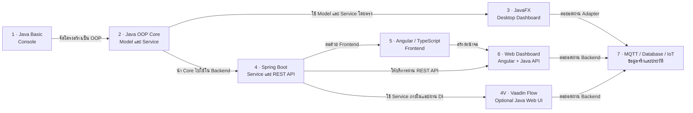
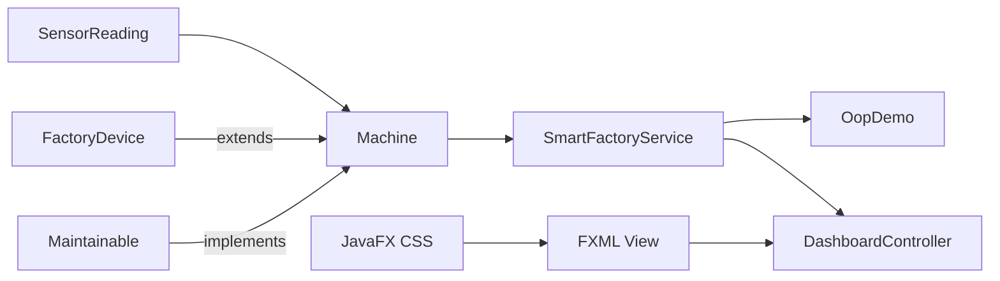

# Java Smart Solutions

## จาก Java Basic สู่ OOP และ Desktop App ผ่านโปรเจกต์จริง

เรียน Java ผ่าน Case Study **Smart Factory Machine Monitor** โดยพัฒนาโค้ดชุดเดียวอย่างต่อเนื่องจากโปรแกรม Console ไปสู่ Business Logic แบบ OOP และ Dashboard ด้วย JavaFX

เรียนโดยตั้งเป้าทีละเรื่อง **เข้าใจสิ่งที่จะทำ → เพิ่มโค้ดตรงจุด → รันดูผล** แล้วจึงต่อยอดหรือทำ Challenge ไม่จำเป็นต้องจบหลายความสามารถในคลิปเดียว ส่วนโค้ดฉบับเต็มเก็บไว้ในโฟลเดอร์ `src` สำหรับใช้ตรวจคำตอบและต่อยอด โปรเจกต์ใช้ JDK 21, Maven Wrapper และ JavaFX 21

## เส้นทางการเรียนรู้

เส้นทางเริ่มจาก Java Basic สร้าง OOP Core แล้วนำไปต่อยอดเป็น Desktop App, Web Application และระบบ IoT

**OOP Core เป็นพื้นฐานร่วม:** JavaFX ใช้ Model และ Service โดยตรง ส่วน Spring Boot นำ Core ไปให้บริการกับ Web และระบบภายนอก โดยไม่ย้ายกฎของเครื่องจักรไปไว้ในหน้าจอ



อ่านจากซ้ายไปขวา ลูกศรแสดงเส้นทางเรียนและการต่อยอด ไม่ใช่การสืบทอด Class หรือทิศทางส่งข้อมูลจริง เลือกต่อ IoT จาก Desktop หรือ Web ได้ โดยไม่ต้องเรียนทุกแขนงก่อน

| ระยะ | Track | สิ่งที่สร้างและการต่อยอด |
|---|---|---|
| 1 | Java Basic | สร้าง Console และพื้นฐานก่อนจัดโครงสร้างเป็น OOP |
| 2 | Java OOP | สร้าง Core: Model และ Service สำหรับตรวจ Sensor จัดการเครื่องจักร และสรุปผล |
| 3 | Java Desktop Application | นำ OOP Core มาใช้โดยตรงใน JavaFX Dashboard โดยไม่เขียนกฎของเครื่องจักรซ้ำใน UI |
| 4 | Spring Boot REST API | นำ OOP Core ไปใช้ใน Backend และเปิดความสามารถผ่าน HTTP และ JSON |
| 4V | Vaadin Flow Web UI — Optional | สร้าง Web UI ด้วย Java โดยใช้ Application Service ร่วมกับ REST API ภายใน Spring Boot |
| 5 | Angular และ TypeScript | เตรียม Frontend ด้วย Component, Service และ DI เพื่อเรียก Java API ในระยะที่ 6 |
| 6 | Smart Factory Web Dashboard | ประกอบ Angular จากระยะที่ 5 กับ API จากระยะที่ 4 โดยกฎของเครื่องจักรยังอยู่ใน Java Core ฝั่ง Backend |
| 7 | MQTT, Database และ IoT Device | เพิ่มช่องทางรับข้อมูลจริงและบันทึกประวัติผ่าน Interface/Adapter เพื่อต่อยอด Core กับ Desktop หรือ Backend |

Angular เป็นเส้นทางหลักสำหรับ Full-stack แบบแยก Frontend/Backend และใช้ Core **ผ่าน REST API ไม่ได้รันคลาส Java ใน Browser** ส่วน Vaadin เป็นทางเลือกหลังระยะที่ 4 โดยเรียก Application Service ผ่าน DI โดยตรงเมื่ออยู่ใน Spring Boot แอปเดียวกัน ไม่ต้องเรียก REST API ของตัวเองซ้ำ และไม่ต้องเรียน Vaadin ก่อนจึงจะไปต่อ Angular ได้

หัวข้อในอนาคตจะสอนด้วยแนวทาง **Modern OOP** โดยใช้ Composition เป็นหลัก ใช้ Inheritance เฉพาะความสัมพันธ์แบบ is-a แยก Business Rule ออกจาก Framework และใช้ Interface, Value Object, Dependency Injection รวมถึง Test เพื่อให้ระบบเปลี่ยน UI, Database หรือช่องทางรับข้อมูลได้โดยไม่ต้องรื้อ Domain Core

[ดูขอบเขต Future Roadmap และหลัก Modern OOP](docs/FUTURE_ROADMAP.md)

หัวข้อ Integration ในอนาคตจะใช้รูปแบบ **Core Lesson → Integration Lab → Production Guide**

## เลือก Playlist

[ดูร่างการแบ่งตอนถัดจาก EP3.10](#แผนแบ่งตอนถัดจาก-ep310)

<details open>
<summary><strong>Playlist 1 — Java Basic Lab: Smart Factory Console</strong></summary>

พื้นฐานที่จำเป็นสำหรับสร้างโปรแกรมตรวจอุณหภูมิเครื่องจักรจากไฟล์ Java เพียงไฟล์เดียว

| EP | เนื้อหา | เปิดบทเรียน |
|---|---|---|
| 1.1 | ติดตั้ง JDK และโปรแกรมแรก | [เริ่มโปรแกรม Java](docs/playlist-01-java-basic/ep01-setup-first-program.md) |
| 1.2 | Variable, Data Type และ Constant | [เก็บข้อมูลให้ถูกชนิด](docs/playlist-01-java-basic/ep02-variables-data-types.md) |
| 1.3 | Operator และ Type Casting | [คำนวณค่า Sensor](docs/playlist-01-java-basic/ep03-operators-casting.md) |
| 1.4 | String และ Output Formatting | [สร้างรายงาน Console](docs/playlist-01-java-basic/ep04-string-output-format.md) |
| 1.5 | รับข้อมูลด้วย Scanner | [รับค่าจากผู้ใช้](docs/playlist-01-java-basic/ep05-scanner-input.md) |
| 1.6 | if/else และ Logical Operator | [สร้างกฎแจ้งเตือน](docs/playlist-01-java-basic/ep06-condition-logical.md) |
| 1.7 | switch และเมนูคำสั่ง | [สร้าง Console Menu](docs/playlist-01-java-basic/ep07-switch-menu.md) |
| 1.8 | for, while และ do-while | [ทำงานซ้ำด้วย Loop](docs/playlist-01-java-basic/ep08-loop.md) |
| 1.9 | Array และ Enhanced for | [เก็บเครื่องจักรหลายเครื่อง](docs/playlist-01-java-basic/ep09-array.md) |
| 1.10 | Method และ Console Capstone | [รวมเป็น Mini Project](docs/playlist-01-java-basic/ep10-method-console-capstone.md) |

**ผลลัพธ์ของ Playlist:** โปรแกรม Console แสดงเครื่องจักรและแจ้ง `WARNING` เมื่ออุณหภูมิสูง

</details>

<details>
<summary><strong>Playlist 2 — Java OOP in Action: Smart Factory Core</strong></summary>

เปลี่ยนข้อมูลแบบ Array เป็น Object และออกแบบ Business Logic ที่ Console กับ Desktop App ใช้ร่วมกันได้

| EP | เนื้อหา | เปิดบทเรียน |
|---|---|---|
| Demo | Smart Factory OOP Core ฉบับสมบูรณ์ | [รันดูผลลัพธ์ก่อนเริ่ม Playlist](docs/playlist-02-java-oop/demo-smart-factory-oop-core.md) |
| 2.1 | Class และ Object | [จาก Array สู่ Object](docs/playlist-02-java-oop/ep01-class-object.md) |
| 2.2 | Field, Method และ Constructor | [สร้าง Object ที่พร้อมใช้](docs/playlist-02-java-oop/ep02-field-method-constructor.md) |
| 2.3 | Encapsulation และ Validation | [รักษากติกาของ Object](docs/playlist-02-java-oop/ep03-encapsulation-validation.md) |
| 2.4 | Enum และ State | [จำกัดสถานะเครื่องจักร](docs/playlist-02-java-oop/ep04-enum-state.md) |
| 2.5 | Composition และ Value Object | [รวม SensorReading กับ Machine](docs/playlist-02-java-oop/ep05-composition-value-object.md) |
| 2.6 | Inheritance และ Abstract Class | [สร้าง FactoryDevice](docs/playlist-02-java-oop/ep06-inheritance-abstract.md) |
| 2.7 | Interface | [กำหนดสัญญา Maintainable](docs/playlist-02-java-oop/ep07-interface.md) |
| 2.8 | Polymorphism | [ใช้ Type กลางร่วมกัน](docs/playlist-02-java-oop/ep08-polymorphism.md) |
| 2.9 | Collection, Optional และ Stream | [ค้นหาและสรุปข้อมูล](docs/playlist-02-java-oop/ep09-collection-optional-stream.md) |
| 2.10 | Service, Exception และ Test | [จบ Smart Factory Core](docs/playlist-02-java-oop/ep10-service-exception-test.md) |

**ผลลัพธ์ของ Playlist:** โมเดล OOP ที่ตรวจ Sensor, เปลี่ยนสถานะ และวางแผนบำรุงรักษาได้

</details>

<details>
<summary><strong>Playlist 3 — Java Desktop Workshop: Smart Factory Dashboard</strong></summary>

นำ OOP Core มาสร้าง Desktop Window App ที่เพิ่มเครื่องจักร รับค่า Sensor และอัปเดต Dashboard ได้

| EP | เนื้อหา | เปิดบทเรียน |
|---|---|---|
| 3.1 | JavaFX, Maven, Stage และ Scene | [เปิดหน้าต่าง JavaFX แรก](docs/playlist-03-java-desktop/ep01-javafx-maven-stage-scene.md) |
| 3.2 | Layout Pane | [แบ่งพื้นที่หน้าจอ](docs/playlist-03-java-desktop/ep02-layout-pane.md) |
| 3.3 | JavaFX CSS | [สร้าง Theme](docs/playlist-03-java-desktop/ep03-css-theme.md) |
| 3.4 | Controls และ Form | [รับข้อมูลเครื่องจักร](docs/playlist-03-java-desktop/ep04-controls-form.md) |
| 3.5 | Event, Property และ Binding | [อัปเดต UI อัตโนมัติ](docs/playlist-03-java-desktop/ep05-event-binding.md) |
| 3.6 | Validation และ Alert | [ตรวจข้อมูลก่อนบันทึก](docs/playlist-03-java-desktop/ep06-validation-alert.md) |
| 3.7 | TableView และ ObservableList | [แสดงรายการเครื่องจักร](docs/playlist-03-java-desktop/ep07-tableview-observablelist.md) |
| 3.8 | CellFactory และ Summary Card | [แยกสีและสรุปสถานะ](docs/playlist-03-java-desktop/ep08-cellfactory-summary.md) |
| 3.9 ตอนที่ 1 | ทบทวนและเตรียม OOP Core | [สร้าง Model และ Service ทีละไฟล์](docs/playlist-03-java-desktop/ep09-preparation.md) |
| 3.9 ตอนที่ 2 | เชื่อม OOP Core กับตาราง | [อ่านข้อมูลจาก Service](docs/playlist-03-java-desktop/ep09a-service-table.md) |
| 3.9 ตอนที่ 3 | เพิ่มและลบเครื่องจักร | [เพิ่ม ลบ และตรวจรหัสซ้ำ](docs/playlist-03-java-desktop/ep09b-service-add-delete.md) |
| 3.9 ตอนที่ 4 | ชั่วโมงและการบำรุงรักษา | [อัปเดตสถานะและจำนวนที่ต้องบำรุง](docs/playlist-03-java-desktop/ep09c-service-maintenance.md) |
| 3.10 ตอนที่ 1 | ปุ่มจำลอง Sensor | [แสดงอุณหภูมิและแรงสั่น](docs/playlist-03-java-desktop/ep10a-sensor-button.md) |
| 3.10 ตอนที่ 2 | Task และ Thread | [ทดลองงานเบื้องหลัง](docs/playlist-03-java-desktop/ep10b-task-thread.md) |
| 3.10 ตอนที่ 3A | ผลลัพธ์จาก Sensor Task | [รับผลกลับมาอัปเดตหน้าจอ](docs/playlist-03-java-desktop/ep10c-sensor-task-result.md) |
| 3.10 ตอนที่ 3B | ป้องกันงานซ้อนและรับข้อผิดพลาด | [คืนสถานะปุ่มและข้ามผลของเครื่องที่ถูกลบ](docs/playlist-03-java-desktop/ep10c2-sensor-task-safety.md) |
| 3.10 ตอนที่ 4 | Auto Sensor ด้วย Timeline | [เริ่ม–หยุดการอัปเดตอัตโนมัติ](docs/playlist-03-java-desktop/ep10d-auto-sensor-timeline.md) |
| 3.11 | FXML และ Controller | [แยก View จาก Logic](docs/playlist-03-java-desktop/ep11-fxml-controller.md) |
| 3.12 | ภาษาไทย Runtime Image และ IoT | [เตรียมส่งมอบและต่อยอด](docs/playlist-03-java-desktop/ep12-thai-package-iot.md) |
| 3.13 | Search และ FilteredList | [ค้นหาข้อมูลแบบทันที](docs/playlist-03-java-desktop/ep13-search-filter.md) |
| 3.14 | Multi-filter และ SortedList | [กรองหลายเงื่อนไขและเรียงข้อมูล](docs/playlist-03-java-desktop/ep14-multi-filter-sort.md) |
| 3.15 | Edit Machine และ Complete CRUD | [แก้ไขชื่อและตำแหน่งเครื่องจักร](docs/playlist-03-java-desktop/ep15-edit-machine-crud.md) |
| 3.16 Optional | Scene Builder Workflow | [จัด Form แบบ Drag & Drop](docs/playlist-03-java-desktop/ep16-scene-builder-optional.md) |
| Case Study | STM32F3 Motion Dashboard | [รับข้อมูลเข็มทิศและ Motion 9 แกนผ่าน USB Serial](docs/playlist-03-java-desktop/case-study-stm32-motion-dashboard.md) |

**ผลลัพธ์ของ Playlist:** Smart Factory Desktop Dashboard ที่ใช้งานและต่อยอดได้ พร้อมพื้นฐาน JavaFX สำหรับนำไปเชื่อม RTSP, IoT และระบบภายนอกในโปรเจกต์แยก

</details>

## แผนแบ่งตอนถัดจาก EP3.10

เริ่มเรื่องใหม่ทีละอย่าง ให้แต่ละตอนรันเห็นผลได้ก่อนเพิ่มเรื่องถัดไป EP3.10 เรียนตามลำดับ 1 → 2 → 3A → 3B → 4 โดยแบ่งเฉพาะตอนที่ 3 ให้ค่อย ๆ เข้าใจ ไม่เปลี่ยนเนื้อหาคลิปตอนที่ 1–2 ที่อัดแล้ว ส่วนด้านล่างเป็นแผนของ EP ถัดไป

<details>
<summary><strong>ดูร่าง EP3.11–3.16 แบบค่อยเป็นค่อยไป</strong></summary>

นี่คือร่างการจัดตอนก่อนเริ่มอัด ไม่ใช่บทพาทำตอนย่อยที่เสร็จแล้ว ลิงก์ในตารางยังเป็นเอกสารเดิมสำหรับตรวจขอบเขต เมื่อเริ่มแต่ละ EP จึงค่อยปรับขั้นตอนและทดสอบจากโค้ดจบตอนก่อนหน้า โดยไม่บังคับโหลดหน้าจอสำเร็จรูปมาแทนงานที่ทำอยู่

| EP เดิม | ร่างตอนย่อยตามลำดับ | ผลที่ต้องเห็นเมื่อจบแต่ละตอน |
|---|---|---|
| [3.11 — FXML และ Controller](docs/playlist-03-java-desktop/ep11-fxml-controller.md) | 1) โหลด FXML เล็ก ๆ โดยเก็บ Dashboard เดิมไว้; 2) เชื่อม `fx:id` และปุ่มกับ Controller; 3) ส่ง Service เข้า Controller แล้วแสดงตาราง; 4) ย้าย Form และการจัดการเครื่องจักรเดิม; 5) ย้ายงาน Sensor และการปิดงาน | เปิด View ได้ → กดปุ่มแล้วข้อความเปลี่ยน → เห็นข้อมูลจาก Service → เพิ่ม/ลบ/บำรุงได้ → Auto Sensor ทำงานและปิดได้ ก่อนเปลี่ยนจุดเริ่มไปใช้ Dashboard แบบ FXML |
| [3.12 — เตรียมส่งมอบ](docs/playlist-03-java-desktop/ep12-thai-package-iot.md) | 1) ตรวจภาษาไทยและรัน Test ที่มีอยู่; 2) เพิ่ม Module และเปิดแอป; 3) สร้างและเปิด Runtime Image | อ่านภาษาไทยได้และ Test ผ่าน → แอปรันแบบ Module → เปิดจาก Runtime Image ได้ ส่วน IoT แยกเป็นแผนต่อยอด ไม่พาเชื่อมในตอนแพ็กโปรแกรม |
| [3.13 — Search](docs/playlist-03-java-desktop/ep13-search-filter.md) | 1) ช่องค้นหาและ FilteredList จากรหัส; 2) ขยายเป็นชื่อ/ตำแหน่ง พร้อมจำนวนผลลัพธ์และ Refresh | พิมพ์รหัสแล้วเหลือแถวที่ตรง → ค้นหาได้หลายช่องและจำนวนถูกต้องหลังข้อมูลเปลี่ยน |
| [3.14 — Filter และ Sort](docs/playlist-03-java-desktop/ep14-multi-filter-sort.md) | 1) กรองสถานะร่วมกับข้อความ; 2) เพิ่มเงื่อนไขบำรุงและปุ่มล้าง; 3) เพิ่ม SortedList และการเรียงหัวตาราง | ตัวกรองสถานะทำงาน → รวม/ล้างเงื่อนไขได้ → เรียงข้อมูลได้โดยยังคงตัวกรอง |
| [3.15 — Edit Machine](docs/playlist-03-java-desktop/ep15-edit-machine-crud.md) | 1) แก้ Model/Service และทดสอบโดยยังไม่แก้ UI; 2) เลือกแถวแล้วบันทึกชื่อ/ตำแหน่งโดยล็อกรหัส; 3) ยกเลิกและตรวจร่วมกับ Search/Auto Sensor | Test พิสูจน์การแก้ข้อมูล → แก้ผ่าน Form ได้ → สลับโหมดและกรองข้อมูลแล้วไม่เสียสถานะ |
| [3.16 — Scene Builder, Optional](docs/playlist-03-java-desktop/ep16-scene-builder-optional.md) | คงเป็น Mini Lab เดียว เน้นปรับ Layout ของ Form เดิม ไม่เพิ่ม Logic ใหม่ | Preview ได้ อ่าน FXML ที่เปลี่ยน และรันแล้วปุ่มเดิมยังทำงาน |

ชื่อและจำนวนตอนย่อยยืนยันอีกครั้งก่อนเริ่มอัดแต่ละ EP ไม่สร้างไฟล์บทใหม่หรือเปลี่ยนลิงก์เดิมล่วงหน้า รายละเอียดที่ต้องอ่านเพิ่มแยกจากทางทำหลัก เพื่อให้เปิดบทมาแล้วรู้ว่าจะเริ่มตรงไหน

</details>

สำหรับ Spring Boot, Angular, Vaadin และ IoT ให้เริ่มจากผลเล็ก ๆ เช่น อ่าน JSON หนึ่งรายการ หรือรับข้อความหนึ่ง Topic ก่อนประกอบเป็น Dashboard ดู[ร่างลำดับของ Track อนาคต](docs/FUTURE_ROADMAP.md#จังหวะการเรียนของ-track-ถัดไป)

<details>
<summary><strong>ดูภาพรวมโปรเจกต์และหัวข้อ Java ที่ใช้</strong></summary>

## สิ่งที่จะได้สร้าง

ระบบติดตามเครื่องจักรในโรงงานที่ทำได้ดังนี้

- แสดงรหัส ชื่อ ตำแหน่ง และสถานะของเครื่องจักร
- รับค่าอุณหภูมิและแรงสั่นสะเทือนจากเซนเซอร์จำลอง
- เปลี่ยนสถานะเป็น `WARNING` เมื่อค่าผิดปกติ และเป็น `EMERGENCY_STOP` เมื่ออุณหภูมิตั้งแต่ 100 °C
- แยกจำนวน Sensor ผิดปกติออกจากจำนวนเครื่องที่ต้องบำรุงรักษา
- แจ้งเตือนบำรุงรักษาเมื่อทำงานครบ 500 ชั่วโมงหรือมีสถานะผิดปกติ
- เพิ่ม แก้ไข ลบ และบำรุงรักษาเครื่องจักรผ่านหน้าต่าง Desktop
- ค้นหาจากรหัส ชื่อ หรือตำแหน่ง และกรองตามสถานะหรือการบำรุงรักษา
- จำลองค่าเซนเซอร์ครั้งเดียวหรืออัปเดตอัตโนมัติทุก 2 วินาที
- ทดสอบ Business Logic ด้วยสคริปต์เดียว โดย Maven Wrapper จัดการ Dependency ให้

## หัวข้อ Java ที่ใช้

| ระดับ | หัวข้อ | สิ่งที่เห็นในโครงการ |
|---|---|---|
| Basic | ตัวแปร, Data Type, Array | ชื่อเครื่องและค่าอุณหภูมิ |
| Basic | `if/else`, `switch`, loop | ตรวจค่าเตือน เลือกเครื่อง วนแสดงข้อมูล |
| Basic | Method | แยกกฎตรวจอุณหภูมิออกจาก `main` |
| OOP | Class และ Object | `Machine`, `SensorReading` |
| OOP | Encapsulation | field เป็น `private` และแก้ค่าผ่าน method |
| OOP | Inheritance | `Machine extends FactoryDevice` |
| OOP | Interface | `Machine implements Maintainable` |
| OOP | Polymorphism | รับ `Machine` เป็น `FactoryDevice` หรือ `Maintainable` |
| Java API | Enum, List, Optional, Stream | สถานะ คลังข้อมูล การค้นหา และสรุปผล |
| Desktop | JavaFX, FXML, CSS | Stage, Scene, TableView, Binding, Task และ Timeline |
| Quality | Exception และ Test | ตรวจข้อมูลผิด กรณีรหัสซ้ำ และกฎแจ้งเตือน |

</details>

<details>
<summary><strong>ดูวิธีติดตั้ง โครงสร้างไฟล์ และคำสั่งรัน</strong></summary>

## เครื่องมือที่ต้องมี

- JDK 21 LTS
- Terminal หรือ PowerShell
- Editor ใดก็ได้ เช่น VS Code, IntelliJ IDEA หรือ Apache NetBeans

ไม่ต้องติดตั้ง Maven แยก เพราะ `mvnw.cmd` จะดาวน์โหลด Apache Maven รุ่นที่โครงการกำหนดและตรวจ Checksum ก่อนใช้งานครั้งแรก

ตรวจสอบว่า Java พร้อมใช้งาน:

```powershell
java -version
javac -version
```

ถ้าคำสั่ง `javac` หาไม่เจอ แสดงว่าติดตั้งเฉพาะ Java Runtime หรือยังไม่ได้เพิ่มโฟลเดอร์ `bin` ของ JDK ลงใน `PATH`

## โครงสร้างโปรเจกต์

```text
Java_OOP_DesktopApp/
├─ README.md
├─ docs/
│  ├─ FUTURE_ROADMAP.md             # ขอบเขตระยะที่ 4–7 และ Optional Track 4V
│  ├─ playlist-01-java-basic/       # EP 1.1–1.10
│  ├─ playlist-02-java-oop/         # EP 2.1–2.10
│  └─ playlist-03-java-desktop/     # EP 3.1–3.16 และ Optional Integration Guide
├─ mvnw.cmd                         # Maven Wrapper สำหรับ Windows
├─ pom.xml                          # JavaFX และ Build Configuration
├─ scripts/
│  ├─ build.ps1
│  ├─ check-encoding.ps1
│  ├─ run-basic.ps1
│  ├─ run-oop.ps1
│  ├─ run-desktop.ps1
│  └─ test.ps1
└─ src/
   ├─ main/java/
   │  ├─ module-info.java
   │  └─ smartfactory/
   │     ├─ basic/BasicDemo.java
   │     ├─ model/
   │     ├─ oop/OopDemo.java
   │     ├─ service/SmartFactoryService.java
   │     └─ ui/
   ├─ main/resources/smartfactory/ui/  # FXML และ CSS
   └─ test/java/smartfactory/SmartFactoryTest.java
```

## เริ่มแบบเร็วบน Windows

เปิด PowerShell ที่โฟลเดอร์โปรเจกต์ แล้วเลือกคำสั่งตามตอนที่ต้องการ

### 1. Java Basic

```powershell
powershell -ExecutionPolicy Bypass -File .\scripts\run-basic.ps1
```

โปรแกรมจะให้เลือกเครื่องจักรหมายเลข 1–3 ตัวอย่างผลลัพธ์:

```text
=== KOPES Smart Factory ===
1. Mixer        อุณหภูมิ  65.5 °C -> NORMAL
2. Conveyor     อุณหภูมิ  82.3 °C -> WARNING
3. Water Pump   อุณหภูมิ  58.0 °C -> NORMAL

เลือกเครื่องจักรที่ต้องการดู (1-3): 2
คุณเลือก: Conveyor
```

### 2. Java OOP

```powershell
powershell -ExecutionPolicy Bypass -File .\scripts\run-oop.ps1
```

โปรแกรมจะแสดง Final Demo ผ่านเหตุการณ์ต่อเนื่องใน Smart Factory:

```text
สถานะโรงงานก่อนเริ่มกะ
ตรวจสอบเครื่องจักรที่ควรวางแผนบำรุงรักษา
จำลองเหตุการณ์: M-001 มีอุณหภูมิสูง 105.0 °C
บันทึกการบำรุงรักษา M-001
ทดลองเพิ่มเครื่องจักรรหัส m-001 ซ้ำ
OOP Core พร้อมนำไปใช้ต่อกับ Console, JavaFX, REST API และ IoT
```

### 3. Desktop Window App

```powershell
powershell -ExecutionPolicy Bypass -File .\scripts\run-desktop.ps1
```

หน้าต่าง Dashboard จะเปิดขึ้นมา จากนั้นทดลองตามลำดับนี้:

1. สังเกต Summary **สถานะปกติ = 2** จาก `M-001` กับ `M-003`, **Sensor ผิดปกติ = 1** จาก `M-002` และ **ต้องบำรุงทั้งหมด = 2** จาก `M-002` กับ `M-003`
2. เลือก `M-002` เปลี่ยนชื่อจาก `สายพาน` เป็น `สายพานลำเลียง` แล้วกด **บันทึกแก้ไข**
3. ค้นหา `ลำเลียง` ต้องพบ `M-002` จากนั้นล้างตัวกรอง
4. เลือก `M-002` แล้วกด **บำรุงเสร็จแล้ว** ตัวเลขต้องลดเหลือ `1`
5. ใส่อุณหภูมิ `65` และแรงสั่น `3` แล้วกด **อัปเดต Sensor** ตัวเลขยังเป็น `1` เพราะ `M-003` ยังเกิน 500 ชั่วโมง
6. เลือก `M-003` แล้วกด **บำรุงเสร็จแล้ว** ตัวเลขต้องลดเป็น `0`
7. อัปเดต Sensor ของ `M-003` ด้วยค่าปกติ ตัวเลขต้องคงเป็น `0`
8. ทดลองกรองสถานะหรือกำหนดบำรุงรักษา
9. กด **เริ่ม Auto Sensor** เพื่อดูข้อมูลเปลี่ยนทุก 2 วินาที

### 4. Run Test

```powershell
powershell -ExecutionPolicy Bypass -File .\scripts\test.ps1
```

ผลลัพธ์ที่ถูกต้อง:

```text
PASS: 7 tests
```

## รัน Maven โดยตรง

โปรเจกต์ JavaFX มี Module และ Dependency จึงใช้ Maven แทนการต่อ `--module-path` ด้วยตนเอง:

```powershell
.\mvnw.cmd clean compile
.\mvnw.cmd javafx:run
.\mvnw.cmd -Dexec.mainClass=smartfactory.SmartFactoryTest -Dexec.classpathScope=test exec:java
```

</details>

<details>
<summary><strong>ดูแผนที่บทเรียนและซอร์สโค้ด</strong></summary>

## แผนที่บทเรียนและซอร์สโค้ด

### Playlist 1 — Java Basic Lab

เริ่มจากไฟล์เดียวและเห็นผลทันที ครอบคลุมตัวแปร `String`, `double`, array, loop, method, `if/else`, `switch` และ `Scanner`

- สารบัญ 10 EP: [playlist-01-java-basic](docs/playlist-01-java-basic/README.md)
- โค้ด: [BasicDemo.java](src/main/java/smartfactory/basic/BasicDemo.java)

### Playlist 2 — Java OOP in Action

แก้ปัญหา array หลายชุดที่ต้องจำ index ให้ตรงกันด้วย `Machine` และ `SensorReading` แล้วต่อยอด Encapsulation, Inheritance, Interface, Polymorphism, Collection และ Exception

- Final Demo: [Smart Factory OOP Core ฉบับสมบูรณ์](docs/playlist-02-java-oop/demo-smart-factory-oop-core.md)
- สารบัญ 10 EP: [playlist-02-java-oop](docs/playlist-02-java-oop/README.md)
- จุดเริ่มรัน: [OopDemo.java](src/main/java/smartfactory/oop/OopDemo.java)

### Playlist 3 — Java Desktop Workshop

ใช้ OOP และ Service ชุดเดิม สร้าง UI ด้วย JavaFX `Stage`, `Scene`, Layout Pane, TableView, Property Binding, CSS, FXML, FilteredList, SortedList และ Background Task พร้อม Optional Lab สำหรับ Scene Builder และแนวทางนำความรู้ไปเชื่อมระบบภายนอก

- สารบัญ EP 3.1–3.16 และ Optional Integration Guide: [playlist-03-java-desktop](docs/playlist-03-java-desktop/README.md)
- จุดเริ่มรัน: [DesktopApp.java](src/main/java/smartfactory/ui/DesktopApp.java)
- View: [dashboard-view.fxml](src/main/resources/smartfactory/ui/dashboard-view.fxml)
- Theme: [smart-factory.css](src/main/resources/smartfactory/ui/smart-factory.css)

### บทสรุปของทั้งสาม Playlist

ทดสอบกฎที่สำคัญ ได้แก่ ค่าปลอดภัย ค่าอุณหภูมิสูง การบำรุงรักษา และรหัสซ้ำ จากนั้นต่อยอดเป็นฐานข้อมูลหรือรับข้อมูลจริงจาก IoT

- Test: [SmartFactoryTest.java](src/test/java/smartfactory/SmartFactoryTest.java)
- บท Test: [EP 2.10](docs/playlist-02-java-oop/ep10-service-exception-test.md)
- บทส่งมอบและ IoT: [EP 3.12](docs/playlist-03-java-desktop/ep12-thai-package-iot.md)

</details>

<details>
<summary><strong>ดู Architecture กติกา และแนวทางต่อยอด</strong></summary>

## ภาพรวมการออกแบบ



แนวคิดสำคัญคือ **หน้าจอไม่ควรเป็นเจ้าของกฎธุรกิจ** กฎว่าอุณหภูมิเท่าไรจึงเตือนอยู่ใน `Machine` ส่วนการค้นหา เพิ่ม แก้ไข ลบ และสรุปผลอยู่ใน `SmartFactoryService` ดังนั้น Console และ Desktop App จึงใช้ logic ชุดเดียวกันได้

## กติกาของ Case Study

| เงื่อนไข | ผลลัพธ์ |
|---|---|
| อุณหภูมิต่ำกว่า 80 °C และแรงสั่นต่ำกว่า 7 mm/s | `RUNNING` |
| อุณหภูมิตั้งแต่ 80 °C แต่ต่ำกว่า 100 °C | `WARNING` |
| อุณหภูมิตั้งแต่ 100 °C | `EMERGENCY_STOP` |
| แรงสั่นตั้งแต่ 7 mm/s โดยอุณหภูมิต่ำกว่า 100 °C | `WARNING` |
| ชั่วโมงทำงานตั้งแต่ 500 | ควรบำรุงรักษา |
| บำรุงรักษาเสร็จ | ชั่วโมงกลับเป็น 0 และสถานะ `OFFLINE` |
| เพิ่มรหัสเดิมซ้ำ แม้ตัวพิมพ์เล็ก/ใหญ่ต่างกัน | แสดงข้อผิดพลาด |

กติกาเหล่านี้เป็นค่าจำลองสำหรับการเรียน ไม่ใช่มาตรฐานความปลอดภัยของเครื่องจักรจริง

`MachineStatus` กับ `requiresMaintenance()` เป็นคนละข้อมูล เครื่องจักรจึงสามารถเป็น `RUNNING` เพราะ Sensor ปกติ แต่ยังต้องบำรุงรักษาเพราะทำงานครบ 500 ชั่วโมงได้

## จะเปลี่ยนเป็น Case Study อื่นได้อย่างไร

โครงสร้างเดิมสามารถเปลี่ยนชื่อและกฎได้โดยไม่ต้องเปลี่ยนแนวคิด Java

| Smart Factory | Smart Farm | Smart Home | IoT Environment |
|---|---|---|---|
| `Machine` | `Greenhouse` | `RoomDevice` | `MonitoringStation` |
| อุณหภูมิ/แรงสั่น | ความชื้นดิน/แสง | อุณหภูมิ/พลังงาน | PM2.5/CO₂ |
| `WARNING` | ต้องรดน้ำ | ใช้พลังงานสูง | คุณภาพอากาศอันตราย |
| Maintenance | เติมน้ำ/ปุ๋ย | ตรวจอุปกรณ์ | เปลี่ยน Sensor |

ตัวอย่างโจทย์ต่อยอด:

1. เพิ่ม `EnergyMeter extends FactoryDevice`
2. ให้ `EnergyMeter implements Maintainable`
3. เพิ่มค่า power consumption และกฎแจ้งเตือนของตัวเอง
4. เก็บ `FactoryDevice` หลายชนิดใน collection เดียวกัน
5. ใช้ Polymorphism วนแสดงข้อมูลโดยไม่ต้องถามชนิดทุกครั้ง

## Checklist หลังเรียนครบทั้งสาม Playlist

- [ ] รัน Basic Demo และอธิบายทุก Data Type ได้
- [ ] เปลี่ยนค่าอุณหภูมิแล้วทำนายผลก่อนรันได้
- [ ] อธิบายความต่างระหว่าง Class กับ Object ได้
- [ ] บอกได้ว่า field ใดถูก Encapsulation และเพราะอะไร
- [ ] อธิบาย `extends` กับ `implements` ได้
- [ ] เพิ่มและแก้ไขข้อมูลเครื่องจักรจากหน้าจอได้
- [ ] ทำให้เกิดสถานะ WARNING ด้วยตนเองได้
- [ ] รัน Test ผ่านทั้ง 7 กรณี
- [ ] เพิ่มกฎธุรกิจใหม่พร้อม Test อย่างน้อย 1 ข้อ

</details>

<details>
<summary><strong>ดูวิธีแก้ปัญหาที่พบบ่อย</strong></summary>

## ปัญหาที่พบบ่อย

### `javac` is not recognized

ติดตั้ง JDK และเพิ่ม `<ตำแหน่ง JDK>\bin` ลงใน `PATH` จากนั้นปิดและเปิด Terminal ใหม่

### PowerShell ไม่อนุญาตให้รัน Script

ใช้รูปแบบนี้ ซึ่งเปลี่ยนนโยบายเฉพาะ process ที่กำลังรัน:

```powershell
powershell -ExecutionPolicy Bypass -File .\scripts\run-desktop.ps1
```

### ภาษาไทยใน Terminal เป็นเครื่องหมายคำถาม

```powershell
chcp 65001
[Console]::OutputEncoding = [System.Text.UTF8Encoding]::new()
```

แล้วรันคำสั่งอีกครั้ง ไฟล์ script ในโปรเจกต์ตั้งค่านี้ให้อัตโนมัติแล้ว

### ตัวอักษรไทยใน Popup เป็นสี่เหลี่ยมหรืออ่านไม่ออก

โปรเจกต์ตั้ง Locale เป็น `th-TH` และเลือกฟอนต์ภาษาไทยให้อัตโนมัติ โดยตรวจตามลำดับ `Leelawadee UI`, `Tahoma`, `Noto Sans Thai` และฟอนต์สำรองของ Java

ตรวจ Encoding ของไฟล์ทั้งหมดก่อน Build:

```powershell
powershell -ExecutionPolicy Bypass -File .\scripts\check-encoding.ps1
```

ถ้ายังไม่แสดงภาษาไทย ให้ติดตั้งฟอนต์ภาษาไทยอย่างน้อยหนึ่งชุดแล้วเปิดโปรแกรมใหม่ ห้ามแก้ข้อความไทยที่อ่านไม่ออกด้วยการเปลี่ยนเป็น Unicode escape เพราะจะทำให้โค้ดในบทเรียนอ่านยาก

### เปิด Desktop App ไม่ได้บน Server หรือ Container

JavaFX ต้องใช้ระบบที่มีหน้าจอ Desktop ถ้าทำงานบนเครื่องแบบ headless ให้รันเฉพาะ Basic, OOP, Build และ Test

</details>

## License และการนำไปใช้

สามารถนำโค้ดไปใช้เรียน ทำ Workshop และต่อยอดเป็นโครงการส่วนตัวได้ ปรับชื่อโครงการ เกณฑ์แจ้งเตือน และรูปแบบหน้าจอให้เข้ากับงานได้ตามต้องการ
