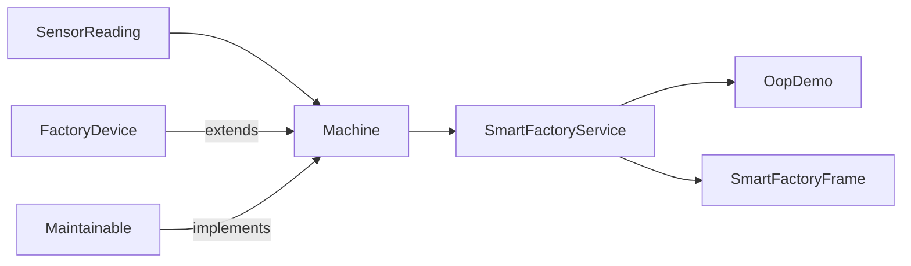

# Java Smart Solutions

## จาก Java Basic สู่ OOP และ Desktop App ผ่านโปรเจกต์จริง

เรียน Java ผ่าน Case Study **Smart Factory Machine Monitor** โดยพัฒนาโค้ดชุดเดียวอย่างต่อเนื่องจากโปรแกรม Console ไปสู่ Business Logic แบบ OOP และ Dashboard ด้วย Java Swing

ทุกบทใช้รูปแบบ **สร้างโครงไฟล์ → เพิ่มโค้ดทีละช่วง → รันดูผล → ทำ Challenge** จึงไม่ต้องคัดลอกโค้ดก้อนใหญ่ในครั้งเดียว ส่วนโค้ดฉบับเต็มเก็บไว้ในโฟลเดอร์ `src` สำหรับใช้ตรวจคำตอบและต่อยอด โปรเจกต์ใช้ได้ตั้งแต่ JDK 17 ขึ้นไปโดยไม่ต้องติดตั้ง Library ภายนอก

## เส้นทางการเรียนรู้

Repo นี้วางเส้นทางจาก Java Console ไปสู่ระบบ Smart Factory แบบ Full Stack และ IoT โดยสามระยะแรกมีบทเรียนแล้ว ส่วนระยะที่ 4–7 เป็น Roadmap สำหรับพัฒนาในอนาคต ยังไม่มี EP หรือ Source Code ให้ทำตาม

| ระยะ | Track | ผลลัพธ์ปลายทาง | สถานะ |
|---|---|---|---|
| 1 | Java Basic | Smart Factory Console | มีบทเรียนแล้ว |
| 2 | Java OOP | Smart Factory Core | มีบทเรียนแล้ว |
| 3 | Java Desktop Application | Swing Dashboard | มีบทเรียนแล้ว |
| 4 | Spring Boot REST API | นำ OOP Core ให้บริการผ่าน HTTP และ JSON | Roadmap — ยังไม่มีบทเรียน |
| 5 | Angular และ TypeScript | สร้าง Frontend ที่มี Component, Service และ DI | Roadmap — ยังไม่มีบทเรียน |
| 6 | Smart Factory Web Dashboard | เชื่อม Angular กับ Java API เป็นระบบเดียว | Roadmap — ยังไม่มีบทเรียน |
| 7 | MQTT, Database และ IoT Device | รับข้อมูลจริง บันทึกประวัติ และอัปเดต Dashboard | Roadmap — ยังไม่มีบทเรียน |

หัวข้อในอนาคตจะสอนด้วยแนวทาง **Modern OOP** โดยใช้ Composition เป็นหลัก ใช้ Inheritance เฉพาะความสัมพันธ์แบบ is-a แยก Business Rule ออกจาก Framework และใช้ Interface, Value Object, Dependency Injection รวมถึง Test เพื่อให้ระบบเปลี่ยน UI, Database หรือช่องทางรับข้อมูลได้โดยไม่ต้องรื้อ Domain Core

[ดูขอบเขต Future Roadmap และหลัก Modern OOP](docs/FUTURE_ROADMAP.md)

## เลือก Playlist

<details open>
<summary><strong>Playlist 1 — Java Basic Lab: Smart Factory Console</strong></summary>

พื้นฐานที่จำเป็นสำหรับสร้างโปรแกรมตรวจอุณหภูมิเครื่องจักรจากไฟล์ Java เพียงไฟล์เดียว

| EP | เนื้อหา | เปิดบทเรียน |
|---|---|---|
| 1.1 | ติดตั้ง JDK และโปรแกรมแรก | [เริ่มโปรแกรม Java](docs/playlist-01-java-basic/ep01-setup-first-program.md) |
| 1.2 | Variable, Data Type และ Constant | [เก็บข้อมูลให้ถูกชนิด](docs/playlist-01-java-basic/ep02-variables-data-types.md) |
| 1.3 | Operator และ Type Casting | [คำนวณค่า Sensor](docs/playlist-01-java-basic/ep03-operators-casting.md) |
| 1.4 | String และ Output Formatting | [สร้างรายงาน Console](docs/playlist-01-java-basic/ep04-string-output-format.md) |
| 1.5 | รับข้อมูลด้วย Scanner | [รับค่าจากผู้ใช้](docs/playlist-01-java-basic/ep05-scanner-input.md) |
| 1.6 | if/else และ Logical Operator | [สร้างกฎแจ้งเตือน](docs/playlist-01-java-basic/ep06-condition-logical.md) |
| 1.7 | switch และเมนูคำสั่ง | [สร้าง Console Menu](docs/playlist-01-java-basic/ep07-switch-menu.md) |
| 1.8 | for, while และ do-while | [ทำงานซ้ำด้วย Loop](docs/playlist-01-java-basic/ep08-loop.md) |
| 1.9 | Array และ Enhanced for | [เก็บเครื่องจักรหลายเครื่อง](docs/playlist-01-java-basic/ep09-array.md) |
| 1.10 | Method และ Console Capstone | [รวมเป็น Mini Project](docs/playlist-01-java-basic/ep10-method-console-capstone.md) |

**ผลลัพธ์ของ Playlist:** โปรแกรม Console แสดงเครื่องจักรและแจ้ง `WARNING` เมื่ออุณหภูมิสูง

</details>

<details>
<summary><strong>Playlist 2 — Java OOP in Action: Smart Factory Core</strong></summary>

เปลี่ยนข้อมูลแบบ Array เป็น Object และออกแบบ Business Logic ที่ Console กับ Desktop App ใช้ร่วมกันได้

| EP | เนื้อหา | เปิดบทเรียน |
|---|---|---|
| 2.1 | Class และ Object | [จาก Array สู่ Object](docs/playlist-02-java-oop/ep01-class-object.md) |
| 2.2 | Field, Method และ Constructor | [สร้าง Object ที่พร้อมใช้](docs/playlist-02-java-oop/ep02-field-method-constructor.md) |
| 2.3 | Encapsulation และ Validation | [รักษากติกาของ Object](docs/playlist-02-java-oop/ep03-encapsulation-validation.md) |
| 2.4 | Enum และ State | [จำกัดสถานะเครื่องจักร](docs/playlist-02-java-oop/ep04-enum-state.md) |
| 2.5 | Composition และ Value Object | [รวม SensorReading กับ Machine](docs/playlist-02-java-oop/ep05-composition-value-object.md) |
| 2.6 | Inheritance และ Abstract Class | [สร้าง FactoryDevice](docs/playlist-02-java-oop/ep06-inheritance-abstract.md) |
| 2.7 | Interface | [กำหนดสัญญา Maintainable](docs/playlist-02-java-oop/ep07-interface.md) |
| 2.8 | Polymorphism | [ใช้ Type กลางร่วมกัน](docs/playlist-02-java-oop/ep08-polymorphism.md) |
| 2.9 | Collection, Optional และ Stream | [ค้นหาและสรุปข้อมูล](docs/playlist-02-java-oop/ep09-collection-optional-stream.md) |
| 2.10 | Service, Exception และ Test | [จบ Smart Factory Core](docs/playlist-02-java-oop/ep10-service-exception-test.md) |

**ผลลัพธ์ของ Playlist:** โมเดล OOP ที่ตรวจ Sensor, เปลี่ยนสถานะ และวางแผนบำรุงรักษาได้

</details>

<details>
<summary><strong>Playlist 3 — Java Desktop Workshop: Smart Factory Dashboard</strong></summary>

นำ OOP Core มาสร้าง Desktop Window App ที่เพิ่มเครื่องจักร รับค่า Sensor และอัปเดต Dashboard ได้

| EP | เนื้อหา | เปิดบทเรียน |
|---|---|---|
| 3.1 | Swing, JFrame และ EDT | [เปิดหน้าต่างแรก](docs/playlist-03-java-desktop/ep01-swing-jframe-edt.md) |
| 3.2 | JPanel และ Layout Manager | [แบ่งพื้นที่หน้าจอ](docs/playlist-03-java-desktop/ep02-jpanel-layout.md) |
| 3.3 | Label, TextField และ Button | [สร้าง Form](docs/playlist-03-java-desktop/ep03-form-components.md) |
| 3.4 | Event และ Listener | [ตอบสนองต่อผู้ใช้](docs/playlist-03-java-desktop/ep04-event-listener.md) |
| 3.5 | JOptionPane และ Validation | [รับข้อมูลผ่าน Popup](docs/playlist-03-java-desktop/ep05-dialog-validation.md) |
| 3.6 | JTable และ TableModel | [แสดงรายการเครื่องจักร](docs/playlist-03-java-desktop/ep06-jtable.md) |
| 3.7 | Renderer และ Summary Card | [สร้าง Dashboard](docs/playlist-03-java-desktop/ep07-renderer-summary.md) |
| 3.8 | เชื่อม Service และ CRUD | [เพิ่ม ลบ และอัปเดต](docs/playlist-03-java-desktop/ep08-service-crud.md) |
| 3.9 | Timer และ UI Thread | [จำลอง Sensor แบบ Live](docs/playlist-03-java-desktop/ep09-timer-thread.md) |
| 3.10 | ภาษาไทย Packaging และ IoT | [เตรียมส่งมอบและต่อยอด](docs/playlist-03-java-desktop/ep10-thai-package-iot.md) |

**ผลลัพธ์ของ Playlist:** Smart Factory Desktop Dashboard ที่ใช้งานและต่อยอดได้

</details>

<details>
<summary><strong>ดูภาพรวมโปรเจกต์และหัวข้อ Java ที่ใช้</strong></summary>

## สิ่งที่จะได้สร้าง

ระบบติดตามเครื่องจักรในโรงงานที่ทำได้ดังนี้

- แสดงรหัส ชื่อ ตำแหน่ง และสถานะของเครื่องจักร
- รับค่าอุณหภูมิและแรงสั่นสะเทือนจากเซนเซอร์จำลอง
- เปลี่ยนสถานะเป็น `WARNING` เมื่ออุณหภูมิตั้งแต่ 80 °C หรือแรงสั่นตั้งแต่ 7 mm/s
- แจ้งเตือนบำรุงรักษาเมื่อทำงานครบ 500 ชั่วโมงหรือมีสถานะผิดปกติ
- เพิ่ม ลบ และบำรุงรักษาเครื่องจักรผ่านหน้าต่าง Desktop
- จำลองค่าเซนเซอร์ครั้งเดียวหรืออัปเดตอัตโนมัติทุก 2 วินาที
- ทดสอบ Business Logic ด้วย Java ล้วน โดยไม่ต้องติดตั้ง Maven หรือ Library เพิ่ม

## หัวข้อ Java ที่ใช้

| ระดับ | หัวข้อ | สิ่งที่เห็นในโครงการ |
|---|---|---|
| Basic | ตัวแปร, Data Type, Array | ชื่อเครื่องและค่าอุณหภูมิ |
| Basic | `if/else`, `switch`, loop | ตรวจค่าเตือน เลือกเครื่อง วนแสดงข้อมูล |
| Basic | Method | แยกกฎตรวจอุณหภูมิออกจาก `main` |
| OOP | Class และ Object | `Machine`, `SensorReading` |
| OOP | Encapsulation | field เป็น `private` และแก้ค่าผ่าน method |
| OOP | Inheritance | `Machine extends FactoryDevice` |
| OOP | Interface | `Machine implements Maintainable` |
| OOP | Polymorphism | รับ `Machine` เป็น `FactoryDevice` หรือ `Maintainable` |
| Java API | Enum, List, Optional, Stream | สถานะ คลังข้อมูล การค้นหา และสรุปผล |
| Desktop | Swing, Layout, Event | `JFrame`, `JTable`, `JButton`, dialog และ listener |
| Quality | Exception และ Test | ตรวจข้อมูลผิด กรณีรหัสซ้ำ และกฎแจ้งเตือน |

</details>

<details>
<summary><strong>ดูวิธีติดตั้ง โครงสร้างไฟล์ และคำสั่งรัน</strong></summary>

## เครื่องมือที่ต้องมี

- JDK 17 ขึ้นไป (แนะนำรุ่น LTS)
- Terminal หรือ PowerShell
- Editor ใดก็ได้ เช่น VS Code, IntelliJ IDEA หรือ Apache NetBeans

ตรวจสอบว่า Java พร้อมใช้งาน:

```powershell
java -version
javac -version
```

ถ้าคำสั่ง `javac` หาไม่เจอ แสดงว่าติดตั้งเฉพาะ Java Runtime หรือยังไม่ได้เพิ่มโฟลเดอร์ `bin` ของ JDK ลงใน `PATH`

## โครงสร้างโปรเจกต์

```text
Java_OOP_DesktopApp/
├─ README.md
├─ docs/
│  ├─ FUTURE_ROADMAP.md             # ขอบเขตระยะที่ 4–7 ยังไม่มีบทเรียน
│  ├─ playlist-01-java-basic/       # EP 1.1–1.10
│  ├─ playlist-02-java-oop/         # EP 2.1–2.10
│  └─ playlist-03-java-desktop/     # EP 3.1–3.10
├─ scripts/
│  ├─ build.ps1
│  ├─ check-encoding.ps1
│  ├─ run-basic.ps1
│  ├─ run-oop.ps1
│  ├─ run-desktop.ps1
│  └─ test.ps1
└─ src/
   ├─ main/java/smartfactory/
   │  ├─ basic/BasicDemo.java
   │  ├─ model/
   │  ├─ oop/OopDemo.java
   │  ├─ service/SmartFactoryService.java
   │  └─ ui/
   └─ test/java/smartfactory/SmartFactoryTest.java
```

## เริ่มแบบเร็วบน Windows

เปิด PowerShell ที่โฟลเดอร์โปรเจกต์ แล้วเลือกคำสั่งตามตอนที่ต้องการ

### 1. Java Basic

```powershell
powershell -ExecutionPolicy Bypass -File .\scripts\run-basic.ps1
```

โปรแกรมจะให้เลือกเครื่องจักรหมายเลข 1–3 ตัวอย่างผลลัพธ์:

```text
=== KOPES Smart Factory ===
1. Mixer        อุณหภูมิ  65.5 °C -> NORMAL
2. Conveyor     อุณหภูมิ  82.3 °C -> WARNING
3. Water Pump   อุณหภูมิ  58.0 °C -> NORMAL

เลือกเครื่องจักรที่ต้องการดู (1-3): 2
คุณเลือก: Conveyor
```

### 2. Java OOP

```powershell
powershell -ExecutionPolicy Bypass -File .\scripts\run-oop.ps1
```

ผลลัพธ์ส่วนท้ายควรเป็น:

```text
ทั้งหมด 3 เครื่อง | ต้องตรวจ/บำรุงรักษา 2 เครื่อง
```

### 3. Desktop Window App

```powershell
powershell -ExecutionPolicy Bypass -File .\scripts\run-desktop.ps1
```

หน้าต่าง Dashboard จะเปิดขึ้นมา จากนั้นทดลองตามลำดับนี้:

1. เลือก `M-001` แล้วกด **กรอกค่าเซนเซอร์**
2. ใส่อุณหภูมิ `85` และแรงสั่น `3`
3. สังเกตสถานะเปลี่ยนเป็น **ต้องตรวจสอบ**
4. กด **บำรุงรักษาเสร็จแล้ว** แล้วสถานะจะเป็น **ปิดเครื่อง**
5. กด **เริ่มจำลองอัตโนมัติ** เพื่อดูข้อมูลเปลี่ยนทุก 2 วินาที

### 4. Run Test

```powershell
powershell -ExecutionPolicy Bypass -File .\scripts\test.ps1
```

ผลลัพธ์ที่ถูกต้อง:

```text
PASS: 5 tests
```

## คอมไพล์ด้วยตนเอง

คำสั่งนี้แสดงขั้นตอนที่ Java เปลี่ยนไฟล์ `.java` เป็น `.class` โดยตรง

```powershell
New-Item -ItemType Directory -Force out | Out-Null
$sourceFiles = @(
    Get-ChildItem .\src\main\java -Recurse -Filter *.java
    Get-ChildItem .\src\test\java -Recurse -Filter *.java
)
javac -encoding UTF-8 -d out $sourceFiles.FullName
```

เลือกโปรแกรมที่จะรัน:

```powershell
java -Dfile.encoding=UTF-8 -cp out smartfactory.basic.BasicDemo
java -Dfile.encoding=UTF-8 -cp out smartfactory.oop.OopDemo
java -Dfile.encoding=UTF-8 -cp out smartfactory.ui.DesktopApp
java -Dfile.encoding=UTF-8 -ea -cp out smartfactory.SmartFactoryTest
```

</details>

<details>
<summary><strong>ดูแผนที่บทเรียนและซอร์สโค้ด</strong></summary>

## แผนที่บทเรียนและซอร์สโค้ด

### Playlist 1 — Java Basic Lab

เริ่มจากไฟล์เดียวและเห็นผลทันที ครอบคลุมตัวแปร `String`, `double`, array, loop, method, `if/else`, `switch` และ `Scanner`

- สารบัญ 10 EP: [playlist-01-java-basic](docs/playlist-01-java-basic/README.md)
- โค้ด: [BasicDemo.java](src/main/java/smartfactory/basic/BasicDemo.java)

### Playlist 2 — Java OOP in Action

แก้ปัญหา array หลายชุดที่ต้องจำ index ให้ตรงกันด้วย `Machine` และ `SensorReading` แล้วต่อยอด Encapsulation, Inheritance, Interface, Polymorphism, Collection และ Exception

- สารบัญ 10 EP: [playlist-02-java-oop](docs/playlist-02-java-oop/README.md)
- จุดเริ่มรัน: [OopDemo.java](src/main/java/smartfactory/oop/OopDemo.java)

### Playlist 3 — Java Desktop Workshop

ใช้ OOP และ Service ชุดเดิม สร้าง UI ด้วย `JFrame`, `JPanel`, `JTable`, `JButton`, Layout Manager, dialog และ event listener

- สารบัญ 10 EP: [playlist-03-java-desktop](docs/playlist-03-java-desktop/README.md)
- จุดเริ่มรัน: [DesktopApp.java](src/main/java/smartfactory/ui/DesktopApp.java)

### บทสรุปของทั้งสาม Playlist

ทดสอบกฎที่สำคัญ ได้แก่ ค่าปลอดภัย ค่าอุณหภูมิสูง การบำรุงรักษา และรหัสซ้ำ จากนั้นต่อยอดเป็นฐานข้อมูลหรือรับข้อมูลจริงจาก IoT

- Test: [SmartFactoryTest.java](src/test/java/smartfactory/SmartFactoryTest.java)
- บท Test: [EP 2.10](docs/playlist-02-java-oop/ep10-service-exception-test.md)
- บทส่งมอบและ IoT: [EP 3.10](docs/playlist-03-java-desktop/ep10-thai-package-iot.md)

</details>

<details>
<summary><strong>ดู Architecture กติกา และแนวทางต่อยอด</strong></summary>

## ภาพรวมการออกแบบ



แนวคิดสำคัญคือ **หน้าจอไม่ควรเป็นเจ้าของกฎธุรกิจ** กฎว่าอุณหภูมิเท่าไรจึงเตือนอยู่ใน `Machine` ส่วนการค้นหา เพิ่ม ลบ และสรุปผลอยู่ใน `SmartFactoryService` ดังนั้น Console และ Desktop App จึงใช้ logic ชุดเดียวกันได้

## กติกาของ Case Study

| เงื่อนไข | ผลลัพธ์ |
|---|---|
| อุณหภูมิต่ำกว่า 80 °C และแรงสั่นต่ำกว่า 7 mm/s | `RUNNING` |
| อุณหภูมิตั้งแต่ 80 °C | `WARNING` |
| แรงสั่นตั้งแต่ 7 mm/s | `WARNING` |
| ชั่วโมงทำงานตั้งแต่ 500 | ควรบำรุงรักษา |
| บำรุงรักษาเสร็จ | ชั่วโมงกลับเป็น 0 และสถานะ `OFFLINE` |
| เพิ่มรหัสเดิมซ้ำ แม้ตัวพิมพ์เล็ก/ใหญ่ต่างกัน | แสดงข้อผิดพลาด |

กติกาเหล่านี้เป็นค่าจำลองสำหรับการเรียน ไม่ใช่มาตรฐานความปลอดภัยของเครื่องจักรจริง

## จะเปลี่ยนเป็น Case Study อื่นได้อย่างไร

โครงสร้างเดิมสามารถเปลี่ยนชื่อและกฎได้โดยไม่ต้องเปลี่ยนแนวคิด Java

| Smart Factory | Smart Farm | Smart Home | IoT Environment |
|---|---|---|---|
| `Machine` | `Greenhouse` | `RoomDevice` | `MonitoringStation` |
| อุณหภูมิ/แรงสั่น | ความชื้นดิน/แสง | อุณหภูมิ/พลังงาน | PM2.5/CO₂ |
| `WARNING` | ต้องรดน้ำ | ใช้พลังงานสูง | คุณภาพอากาศอันตราย |
| Maintenance | เติมน้ำ/ปุ๋ย | ตรวจอุปกรณ์ | เปลี่ยน Sensor |

ตัวอย่างโจทย์ต่อยอด:

1. เพิ่ม `EnergyMeter extends FactoryDevice`
2. ให้ `EnergyMeter implements Maintainable`
3. เพิ่มค่า power consumption และกฎแจ้งเตือนของตัวเอง
4. เก็บ `FactoryDevice` หลายชนิดใน collection เดียวกัน
5. ใช้ Polymorphism วนแสดงข้อมูลโดยไม่ต้องถามชนิดทุกครั้ง

## Checklist หลังเรียนครบทั้งสาม Playlist

- [ ] รัน Basic Demo และอธิบายทุก Data Type ได้
- [ ] เปลี่ยนค่าอุณหภูมิแล้วทำนายผลก่อนรันได้
- [ ] อธิบายความต่างระหว่าง Class กับ Object ได้
- [ ] บอกได้ว่า field ใดถูก Encapsulation และเพราะอะไร
- [ ] อธิบาย `extends` กับ `implements` ได้
- [ ] เพิ่มเครื่องจักรจากหน้าจอได้
- [ ] ทำให้เกิดสถานะ WARNING ด้วยตนเองได้
- [ ] รัน Test ผ่านทั้ง 5 กรณี
- [ ] เพิ่มกฎธุรกิจใหม่พร้อม Test อย่างน้อย 1 ข้อ

</details>

<details>
<summary><strong>ดูวิธีแก้ปัญหาที่พบบ่อย</strong></summary>

## ปัญหาที่พบบ่อย

### `javac` is not recognized

ติดตั้ง JDK และเพิ่ม `<ตำแหน่ง JDK>\bin` ลงใน `PATH` จากนั้นปิดและเปิด Terminal ใหม่

### PowerShell ไม่อนุญาตให้รัน Script

ใช้รูปแบบนี้ ซึ่งเปลี่ยนนโยบายเฉพาะ process ที่กำลังรัน:

```powershell
powershell -ExecutionPolicy Bypass -File .\scripts\run-desktop.ps1
```

### ภาษาไทยใน Terminal เป็นเครื่องหมายคำถาม

```powershell
chcp 65001
[Console]::OutputEncoding = [System.Text.UTF8Encoding]::new()
```

แล้วรันคำสั่งอีกครั้ง ไฟล์ script ในโปรเจกต์ตั้งค่านี้ให้อัตโนมัติแล้ว

### ตัวอักษรไทยใน Popup เป็นสี่เหลี่ยมหรืออ่านไม่ออก

โปรเจกต์ตั้ง Locale เป็น `th-TH` และเลือกฟอนต์ภาษาไทยให้อัตโนมัติ โดยตรวจตามลำดับ `Leelawadee UI`, `Tahoma`, `Noto Sans Thai` และฟอนต์สำรองของ Java

ตรวจ Encoding ของไฟล์ทั้งหมดก่อน Build:

```powershell
powershell -ExecutionPolicy Bypass -File .\scripts\check-encoding.ps1
```

ถ้ายังไม่แสดงภาษาไทย ให้ติดตั้งฟอนต์ภาษาไทยอย่างน้อยหนึ่งชุดแล้วเปิดโปรแกรมใหม่ ห้ามแก้ข้อความไทยที่อ่านไม่ออกด้วยการเปลี่ยนเป็น Unicode escape เพราะจะทำให้โค้ดในบทเรียนอ่านยาก

### เปิด Desktop App ไม่ได้บน Server หรือ Container

Swing ต้องใช้ระบบที่มีหน้าจอ Desktop ถ้าทำงานบนเครื่องแบบ headless ให้รันเฉพาะ Basic, OOP และ Test

</details>

## License และการนำไปใช้

สามารถนำโค้ดไปใช้เรียน ทำ Workshop และต่อยอดเป็นโครงการส่วนตัวได้ ปรับชื่อโครงการ เกณฑ์แจ้งเตือน และรูปแบบหน้าจอให้เข้ากับงานได้ตามต้องการ
