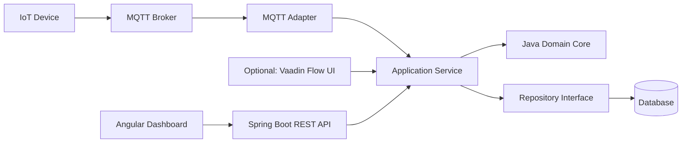

# Future Roadmap — Java Smart Solutions

> สถานะ: เอกสารนี้เป็นแผนสำหรับรองรับการพัฒนาในอนาคต ยังไม่มี Playlist, บทเรียน, Source Code หรือคำสั่งติดตั้งสำหรับระยะที่ 4–7 และ Optional Track 4V

Roadmap นี้ต่อยอด Case Study เดิมจาก Java Console, OOP Core และ Desktop Dashboard ไปสู่ระบบ Smart Factory แบบ Full Stack และ IoT โดยยังใช้ Business Rule ชุดเดิมเป็นศูนย์กลาง

## เส้นทางทั้งหมด

| ระยะ | Track | สถานะ |
|---|---|---|
| 1 | Java Basic | มีบทเรียนแล้ว |
| 2 | Java OOP | มีบทเรียนแล้ว |
| 3 | Java Desktop Application | มีบทเรียนแล้ว |
| 4 | Spring Boot REST API | วางแผนไว้ |
| 4V | Vaadin Flow Web UI | Optional Track — วางแผนไว้ |
| 5 | Angular และ TypeScript | วางแผนไว้ |
| 6 | Smart Factory Web Dashboard | วางแผนไว้ |
| 7 | MQTT, Database และ IoT Device | วางแผนไว้ |

หัวข้อด้านล่างเป็นเพียงขอบเขตเบื้องต้น ไม่ใช่ลำดับ EP ฉบับสุดท้าย

## รูปแบบการสอน Integration และ Production

หัวข้อที่เชื่อม Framework, Network, Hardware, AI หรือระบบภายนอกจะไม่พาทำ Production ทั้งระบบแบบบรรทัดต่อบรรทัด แต่แบ่งความลึกเป็นสามระดับเพื่อให้ผู้เรียนเห็นผลจริงและยังนำความรู้ไปออกแบบโครงการของตัวเองได้

| ระดับ | วิธีนำเสนอ | ผลลัพธ์สำหรับผู้เรียน |
|---|---|---|
| Core Lesson | พาทำละเอียดทีละส่วน เช่น UI, Thread, Service, Event, Validation และ Resource Lifecycle | เข้าใจแนวคิดที่นำกลับไปใช้กับ Integration อื่นได้ |
| Integration Lab | เลือกเส้นทางที่ทดสอบแล้วหนึ่งแบบและพาเชื่อมให้ทำงานได้จริงในขอบเขตขั้นต่ำ | ได้ระบบตัวอย่างที่รัน ตรวจสอบ และต่อยอดเองได้ |
| Production Guide | อธิบาย Architecture, Security, Deployment, Monitoring และข้อจำกัดของอุปกรณ์ | รู้ว่ายังต้องเพิ่มอะไร ก่อนนำ Demo ไปใช้ในระบบจริง |

แนวทางร่วมของทุก Integration Track:

1. เริ่มจาก Demo เพื่อให้เห็นเป้าหมาย แล้วแยกกลับมาเรียนองค์ประกอบที่จำเป็น
2. ระบุ Prerequisite, รุ่นอุปกรณ์ และช่องทางที่ผ่านการทดสอบให้ชัดเจน
3. มี Simulator, Mock หรือข้อมูลตัวอย่างเมื่อหัวข้อนั้นไม่จำเป็นต้องใช้อุปกรณ์จริง
4. ไม่ถือว่าพอร์ตเปิดหรือมีความสามารถใน Mobile App เท่ากับมี API สำหรับโปรแกรมภายนอก
5. แยก UI, Application Service, Protocol Adapter และ Device-specific Code ออกจากกัน
6. มีจุดตรวจผล, Error Handling, Resource Cleanup และ Final Challenge ในแต่ละ Lab
7. ไม่เก็บ Credential, Serial Number, License Key หรือข้อมูลระบบจริงไว้ใน Git และ Log
8. แสดง Production Readiness Checklist แทนการนำ Source Code ของผลิตภัณฑ์เชิงพาณิชย์มาเปิดทั้งหมด

Demo จึงเป็นภาพของปลายทาง ไม่ได้หมายความว่าทุกหน้าจอหรือความสามารถของ Production จะมีบทพาก๊อปวางครบทั้งหมด ผู้เรียนจะได้สร้าง Minimum Integration ที่พิสูจน์แนวคิดได้ แล้วใช้ความรู้จาก Core Lesson ประกอบเป็นระบบที่เหมาะกับโจทย์ของตัวเอง

## Applied Integration Track ที่รองรับในอนาคต

หัวข้อเหล่านี้เป็นแผนต่อยอดหลังพื้นฐานที่เกี่ยวข้องพร้อมแล้ว ยังไม่กำหนดหมายเลข EP และยังไม่สร้างบทเรียนล่วงหน้า

| Track | จุดเริ่มต้นสำหรับ Integration Lab | ส่วนที่เก็บไว้เป็น Advanced หรือ Production Guide |
|---|---|---|
| Camera และ Edge Vision | JavaFX แสดง RTSP, Snapshot และสถานะ Connection | กล้องหลายช่อง, Recording Policy, Hardware Decode และ Remote Deployment |
| PTZ และ Audio | Adapter ที่ผ่าน Capability Probe กับอุปกรณ์จริง | Vendor SDK, Audio Backchannel และข้อกำหนด License |
| MQTT และ MCU | ESP32 หรืออุปกรณ์จำลองส่ง Sensor Event เข้าระบบ | Certificate Provisioning, Broker Cluster, OTA และ Fleet Management |
| AI Service | ส่งผลตรวจจับตัวอย่างจาก AI Service กลับ JavaFX หรือ Web | Model Lifecycle, Accelerator Optimization, Privacy และ Production Monitoring |
| ROS 2 และ micro-ROS | แสดง Telemetry และส่งคำสั่งพื้นฐานให้ Mobile Robot | Navigation, Safety, Multi-robot และ Autonomous Operation |

ลำดับโดยรวมคือเรียน Core ของแต่ละเทคโนโลยีก่อน จากนั้นทำ Integration Lab ขนาดเล็ก และปิดท้ายด้วย Guide สำหรับประเมินความพร้อมก่อนใช้จริง

โปรแกรมตรวจ RTSP สำหรับช่างและรุ่นแจกพัฒนาแยกในโปรเจกต์ `kope-rtsp-camera-checker` ส่วน Repository นี้เก็บเฉพาะ Minimum Integration และแนวคิดที่ผู้เรียนควรนำไปต่อยอดเอง


## ระยะที่ 4 — Spring Boot REST API

เป้าหมายคือเปิดความสามารถของ `SmartFactoryService` ให้โปรแกรมภายนอกเรียกผ่าน HTTP และรับส่งข้อมูลแบบ JSON โดยไม่ย้าย Business Rule ไปไว้ใน Controller

ขอบเขตที่วางแผนไว้:

- เริ่มโครงการ Spring Boot และจัดการ Dependency ด้วย Maven หรือ Gradle
- แยก Controller, Application Service, Domain และ Repository
- สร้าง Request/Response DTO แยกจาก Domain Object
- ทำ REST API สำหรับดู เพิ่ม แก้ไข และลบเครื่องจักร
- ตรวจข้อมูลเข้าและจัดการ Exception ให้เป็น HTTP Response ที่เหมาะสม
- เขียน Unit Test และ Integration Test
- เตรียม API สำหรับ Angular และช่องทางรับข้อมูล IoT

ผลลัพธ์ที่คาดหวัง: Java Backend ที่เก็บกฎของ Smart Factory ไว้ใน Domain และให้บริการผ่าน REST API

## Optional Track 4V — Vaadin Flow: Smart Factory Web UI

Track นี้อยู่หลัง Spring Boot REST API สำหรับผู้เรียนที่ต้องการสร้าง Web UI ด้วย Java และแนวคิด OOP ต่อเนื่องจาก JavaFX โดยไม่ใช้แทน Angular ซึ่งยังเป็นเส้นทางหลักสำหรับ Full-stack แบบแยก Frontend และ Backend

ในระบบที่ Vaadin และ Spring Boot ทำงานอยู่ใน Application เดียวกัน Vaadin View จะเรียก Application Service ผ่าน Dependency Injection โดยตรง ไม่เรียก REST API ของระบบตัวเองซ้ำ ส่วน REST API ยังคงมีไว้สำหรับ Angular, Mobile App, IoT และระบบภายนอก

ลำดับหัวข้อที่วางแผนไว้:

1. รู้จัก Vaadin Flow และเริ่มโครงการร่วมกับ Spring Boot
2. Component, Layout และ Theme สำหรับ Smart Factory
3. Route และ Navigation ระหว่างหน้า
4. Grid และ DataProvider สำหรับรายการเครื่องจักร
5. Form, Binder และ Validation
6. เชื่อม Application Service และทำ CRUD
7. Background Task, Server Push และข้อมูล Sensor แบบ Real-time
8. Security, Test และ Production Build

ผลลัพธ์ที่คาดหวัง: Smart Factory Web UI แบบ Java-first สำหรับ Dashboard ภายในโรงงาน, Admin Tool และระบบ Enterprise โดยใช้ Domain และ Application Service ชุดเดียวกับ Spring Boot

หลังจบ Track นี้ ผู้เรียนสามารถไปต่อ Angular ตามเส้นทางหลัก หรือไปยัง MQTT, Database และ IoT ได้ โดยไม่บังคับว่าต้องเรียนทั้ง Vaadin และ Angular ก่อนจึงจะต่อยอดได้

## ระยะที่ 5 — Angular และ TypeScript

ใช้ Angular รุ่นที่ยังได้รับการสนับสนุนในช่วงที่เริ่มสร้างบทเรียน ไม่ใช้ AngularJS 1.x และไม่ผูก Roadmap ไว้กับหมายเลข Version ล่วงหน้า

ขอบเขตที่วางแผนไว้:

- เรียน TypeScript โดยเชื่อมกับพื้นฐาน Java เช่น Type, Class และ Interface
- สร้าง Angular Component และ Template
- แยกการเรียก API ไปไว้ใน Service
- ใช้ Dependency Injection แทนการสร้าง Dependency กระจายตาม Component
- จัดการ Form, Validation, Routing และ HTTP Client
- จัดการ State และข้อมูลแบบ Reactive ด้วยแนวทางที่ Angular แนะนำในช่วงเวลานั้น
- เขียน Test สำหรับ Component และ Service

ผลลัพธ์ที่คาดหวัง: Frontend ที่มีโครงสร้างชัดเจนและพร้อมเชื่อมกับ Spring Boot API

## ระยะที่ 6 — Smart Factory Web Dashboard

นำ Backend และ Frontend มาประกอบเป็นระบบเดียว โดยยังคงใช้ Domain Rule จาก Java OOP Core

ขอบเขตที่วางแผนไว้:

- แสดง Summary Card และตารางเครื่องจักร
- เพิ่ม แก้ไข ลบ และบันทึกการบำรุงรักษา
- แสดงสถานะ `RUNNING`, `WARNING` และ `OFFLINE`
- สร้างหน้ารายละเอียดและประวัติ Sensor
- แยก Loading, Empty State และ Error State ให้ชัดเจน
- เริ่มจากการ Refresh ผ่าน REST ก่อนเพิ่มข้อมูลแบบ Real-time
- ทดสอบการทำงานตั้งแต่ Angular ถึง Spring Boot

ผลลัพธ์ที่คาดหวัง: Smart Factory Web Dashboard ที่ใช้งาน Business Rule ชุดเดียวกับ Console และ Desktop App

## ระยะที่ 7 — MQTT, Database และ IoT Device

เชื่อมระบบกับข้อมูลจริงโดยแยก MQTT, Database และ Hardware ออกจาก Domain ผ่าน Interface และ Adapter

ขอบเขตที่วางแผนไว้:

- บันทึก Machine, SensorReading และ Maintenance History ลง Database
- ใช้ Repository เป็นขอบเขตระหว่าง Domain กับระบบจัดเก็บข้อมูล
- ออกแบบ MQTT Topic และ Payload สำหรับ Sensor
- รับข้อมูลผ่าน MQTT Client และแปลงเป็น Domain Command
- ตรวจ Payload ก่อนส่งเข้า Business Logic
- เชื่อมอุปกรณ์จำลองก่อนใช้งานกับ IoT Device จริง
- เพิ่มการอัปเดต Dashboard แบบ Real-time
- วางพื้นฐานเรื่อง Reconnect, Duplicate Message, Timestamp และ Error Handling

ผลลัพธ์ที่คาดหวัง: เส้นทางข้อมูลครบตั้งแต่ Sensor และ MQTT ไปยัง Java Domain, Database และ Web Dashboard

## Modern OOP ที่จะใช้ต่อจากนี้

ทุกระยะในอนาคตจะใช้หลักต่อไปนี้เป็นแนวทางร่วมกัน:

1. เก็บ Business Rule ไว้ใน Domain ไม่วางไว้ใน UI, Controller หรือ MQTT Callback
2. เลือก Composition เป็นค่าเริ่มต้น และใช้ Inheritance เมื่อมีความสัมพันธ์แบบ is-a ที่ชัดเจน
3. ใช้ Interface ที่ขอบเขตซึ่งอาจเปลี่ยน เช่น Repository, Message Publisher และ Clock
4. ใช้ Value Object หรือข้อมูลที่แก้ไขไม่ได้เมื่อค่าหลายตัวเป็นแนวคิดเดียวกัน
5. ส่ง Dependency เข้ามาจากภายนอกแทนการสร้าง Object สำคัญกระจายอยู่ภายใน Class
6. แยก Domain Model, API DTO, Database Entity และ MQTT Payload ออกจากกัน
7. ทำให้ Class มีหน้าที่หลักที่ชัดเจนและหลีกเลี่ยง Inheritance หลายชั้น
8. เขียน Test ให้ Business Rule ก่อนเชื่อม Framework หรือระบบภายนอก
9. ใช้ Lambda, Stream และแนวคิด Functional ในงานแปลงข้อมูลโดยไม่บังคับว่าทุกอย่างต้องเป็น Class
10. เลือก Pattern เท่าที่ช่วยแก้ปัญหาจริง ไม่เพิ่ม Abstraction ล่วงหน้าโดยยังไม่มีเหตุผล

## Architecture เป้าหมาย



จุดสำคัญคือ Angular ติดต่อระบบผ่าน REST API ตามสถาปัตยกรรมแบบแยก Frontend/Backend ส่วน Vaadin เป็น Optional Web UI ที่เรียก Application Service ภายใน Spring Boot โดยตรง ทั้งสองเส้นทางไม่ย้ายกฎตรวจ Sensor, สถานะเครื่องจักร หรือการบำรุงรักษาออกจาก Java Domain Core

## โครงสร้างโฟลเดอร์ที่สงวนไว้ใน Roadmap

ยังไม่สร้างโฟลเดอร์เหล่านี้จนกว่าจะเริ่มทำเนื้อหาจริง:

```text
docs/
├─ playlist-04-spring-boot-rest/
├─ optional-04v-vaadin-flow/
├─ playlist-05-angular-typescript/
├─ playlist-06-smart-factory-web/
└─ playlist-07-mqtt-database-iot/
```

เมื่อเริ่ม Playlist ใหม่ จึงค่อยกำหนดจำนวน EP, เครื่องมือ, Version, Source Code และคำสั่งรันจากเทคโนโลยีที่ยังได้รับการสนับสนุนในเวลานั้น
