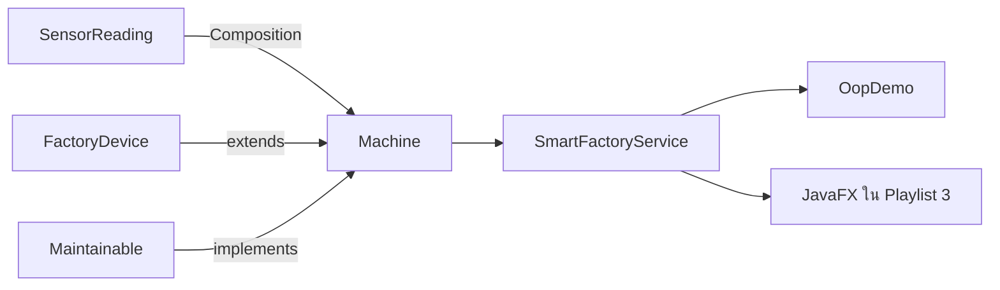

# Demo — Smart Factory OOP Core ฉบับสมบูรณ์

ทดลองผลลัพธ์ปลายทางของ Playlist ก่อนเริ่ม EP2.1 โปรแกรมจะรัน Case Study เดียวตั้งแต่ Object และ Composition ไปจนถึง Polymorphism, Service, Business Rule และ Exception

## รัน Demo

เปิด PowerShell ที่โฟลเดอร์หลักของ Repository แล้วรัน:

```powershell
powershell -ExecutionPolicy Bypass -File .\scripts\run-oop.ps1
```

Demo ทำงานใน Console เพราะเป้าหมายของ Playlist นี้คือสร้าง Domain และ Business Logic ที่ไม่ผูกกับหน้าจอ เมื่อถึง Playlist 3 จะนำ OOP Core ชุดเดิมไปใช้กับ JavaFX Dashboard

## สิ่งที่ Demo แสดง



### 1. Object, Encapsulation และ Composition

- สร้างเครื่องจักรสาม Object
- เก็บ Field เป็น `private` และเปลี่ยนสถานะผ่าน Method
- ให้ `Machine` มี `SensorReading` เป็นส่วนประกอบ
- แสดงสถานะ ชั่วโมงทำงาน และเงื่อนไขบำรุงรักษาของแต่ละเครื่อง

### 2. Inheritance, Interface และ Polymorphism

Object `Machine` เดียวกันถูกส่งเข้า Method ที่รับ Type ต่างกันได้:

```java
printAsDevice(machine);
printAsMaintainable(machine);
```

- `FactoryDevice` แสดงข้อมูลร่วมของอุปกรณ์
- `Maintainable` เรียกความสามารถด้านบำรุงรักษา
- `Machine` เป็น Object จริงที่ทำงานผ่าน Type กลางทั้งสองแบบ

### 3. Collection, Optional, Stream และ Service

- `SmartFactoryService` จัดการรายการเครื่องจักร
- ค้นหารหัสแบบไม่สนตัวพิมพ์เล็กหรือใหญ่ด้วย `Optional`
- สรุปจำนวนตามสถานะและจำนวนที่ต้องบำรุงรักษา
- Console ไม่ต้องรู้ว่า Collection ถูกค้นหาหรือนับอย่างไร

### 4. Business Rule อยู่ใน Object

Demo ส่งอุณหภูมิ `105.0 °C` ให้ `M-001` แล้วสถานะเปลี่ยนเป็น `หยุดฉุกเฉิน` โดย `OopDemo` ไม่ต้องเขียน `if/else` ซ้ำ

หลังเรียกบำรุงรักษา ชั่วโมงทำงานจะกลับเป็น `0` และสถานะเปลี่ยนเป็น `ปิดเครื่อง`

### 5. Validation และ Exception

Demo ทดลองเพิ่มรหัส `m-001` ซึ่งซ้ำกับ `M-001` ระบบจึงปฏิเสธข้อมูลและแสดงข้อความจาก `IllegalArgumentException`

## Source ที่ทำงานร่วมกัน

| หน้าที่ | Source |
|---|---|
| โปรแกรม Demo | [`OopDemo.java`](../../src/main/java/smartfactory/oop/OopDemo.java) |
| Abstract Class | [`FactoryDevice.java`](../../src/main/java/smartfactory/model/FactoryDevice.java) |
| Domain Object | [`Machine.java`](../../src/main/java/smartfactory/model/Machine.java) |
| Value Object | [`SensorReading.java`](../../src/main/java/smartfactory/model/SensorReading.java) |
| Interface | [`Maintainable.java`](../../src/main/java/smartfactory/model/Maintainable.java) |
| Service | [`SmartFactoryService.java`](../../src/main/java/smartfactory/service/SmartFactoryService.java) |

## ผลลัพธ์ปลายทาง

```text
[1] OBJECT + ENCAPSULATION + COMPOSITION
[2] INHERITANCE + INTERFACE + POLYMORPHISM
[3] COLLECTION + OPTIONAL + STREAM + SERVICE
[4] BUSINESS RULE อยู่ใน OBJECT
[5] VALIDATION + EXCEPTION
OOP Core พร้อมนำไปใช้ต่อกับ Console, JavaFX, REST API และ IoT
```

เริ่มบทเรียน: [EP 2.1 — Class และ Object](ep01-class-object.md)

กลับไป: [README ของ Playlist 2](README.md)
