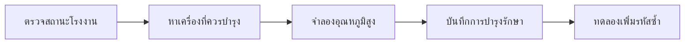

# Demo — Smart Factory OOP Core ฉบับสมบูรณ์

ทดลองผลลัพธ์ปลายทางของ Playlist ก่อนเริ่ม EP2.1 ผ่านเหตุการณ์หนึ่งกะการทำงานใน Smart Factory ตั้งแต่ตรวจสถานะเครื่องจักร รับมือค่า Sensor ผิดปกติ บันทึกการบำรุงรักษา ไปจนถึงป้องกันข้อมูลรหัสซ้ำ

## รัน Demo

เปิด PowerShell ที่โฟลเดอร์หลักของ Repository แล้วรัน:

```powershell
powershell -ExecutionPolicy Bypass -File .\scripts\run-oop.ps1
```

Demo ทำงานใน Console เพราะเป้าหมายของ Playlist นี้คือสร้าง Domain และเงื่อนไขการทำงานที่ไม่ผูกกับหน้าจอ เมื่อถึง Playlist 3 จะนำ OOP Core ชุดเดิมไปใช้กับ JavaFX Dashboard

## ลำดับเหตุการณ์



### สถานะโรงงานก่อนเริ่มกะ

- `M-001` ทำงานปกติ
- `M-002` มีค่า Sensor ผิดปกติ
- `M-003` มีค่า Sensor ปกติ แต่ทำงานเกิน 500 ชั่วโมง
- สรุปได้ว่า Sensor ผิดปกติ 1 เครื่อง และควรบำรุงรักษา 2 เครื่อง

### รับมือเหตุการณ์และป้องกันข้อมูล

- ค้นหาเครื่องจักรที่ควรบำรุงพร้อมแสดงเหตุผล
- ส่งอุณหภูมิ `105.0 °C` ให้ `M-001` แล้วสถานะเปลี่ยนเป็น `หยุดฉุกเฉิน`
- บันทึกการบำรุงรักษาแล้วชั่วโมงทำงานกลับเป็น `0` และสถานะเปลี่ยนเป็น `ปิดเครื่อง`
- ทดลองเพิ่ม `m-001` ซึ่งซ้ำกับ `M-001` แล้วระบบปฏิเสธข้อมูล

## OOP ที่ทำงานอยู่เบื้องหลัง

| เหตุการณ์ | แนวคิดที่ใช้ |
|---|---|
| เครื่องจักรแต่ละรายการเก็บข้อมูลและ Sensor ของตนเอง | Object, Encapsulation และ Composition |
| ตรวจเครื่องจักรผ่าน Type กลาง | Inheritance, Interface และ Polymorphism |
| ค้นหาและสรุปจำนวนเครื่องจักร | Collection, Optional, Stream และ Service |
| ค่า Sensor เปลี่ยนสถานะโดยอัตโนมัติ | Method และเงื่อนไขของระบบภายใน Object |
| ปฏิเสธรหัสเครื่องจักรซ้ำ | Validation และ Exception |

ตัวอย่าง Polymorphism อยู่ในขั้นตรวจแผนบำรุงรักษา `Machine` Object เดียวถูกส่งให้ Method ที่รับ `Maintainable` และ `FactoryDevice` ได้:

```java
requiresMaintenance(machine);
printMaintenanceCandidate(machine, maintenanceReason(machine));
```

`SmartFactoryService` เป็นจุดกลางสำหรับค้นหา อัปเดต Sensor บำรุงรักษา และเพิ่มเครื่องจักร ส่วน `Machine` เป็นผู้ดูแลสถานะและเงื่อนไขของตนเอง Console จึงมีหน้าที่เพียงส่งคำสั่งและแสดงผล

## Source ที่ทำงานร่วมกัน

| หน้าที่ | Source |
|---|---|
| โปรแกรม Demo | [`OopDemo.java`](../../src/main/java/smartfactory/oop/OopDemo.java) |
| Abstract Class | [`FactoryDevice.java`](../../src/main/java/smartfactory/model/FactoryDevice.java) |
| Domain Object | [`Machine.java`](../../src/main/java/smartfactory/model/Machine.java) |
| Value Object | [`SensorReading.java`](../../src/main/java/smartfactory/model/SensorReading.java) |
| Interface | [`Maintainable.java`](../../src/main/java/smartfactory/model/Maintainable.java) |
| Service | [`SmartFactoryService.java`](../../src/main/java/smartfactory/service/SmartFactoryService.java) |

## ผลลัพธ์ปลายทาง

```text
สถานะโรงงานก่อนเริ่มกะ
ตรวจสอบเครื่องจักรที่ควรวางแผนบำรุงรักษา
จำลองเหตุการณ์: M-001 มีอุณหภูมิสูง 105.0 °C
บันทึกการบำรุงรักษา M-001
ทดลองเพิ่มเครื่องจักรรหัส m-001 ซ้ำ
OOP Core พร้อมนำไปใช้ต่อกับ Console, JavaFX, REST API และ IoT
```

เริ่มบทเรียน: [EP 2.1 — Class และ Object](ep01-class-object.md)

กลับไป: [README ของ Playlist 2](README.md)
