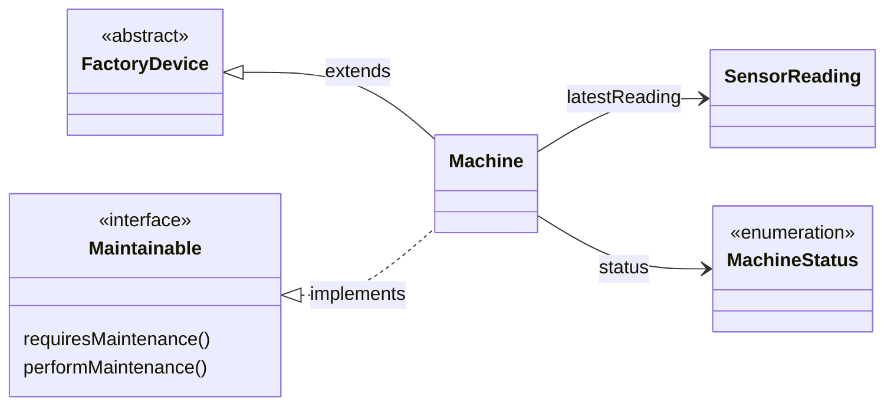
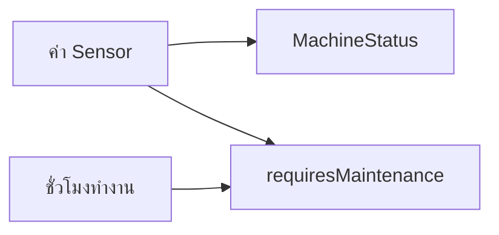

# EP 2.7 — Interface และสัญญาการทำงาน

## เป้าหมาย

- กำหนดความสามารถด้วย Interface
- ใช้ `implements` และ `@Override`
- ให้ Machine ตัดสินใจว่าควรบำรุงรักษาหรือไม่
- ทดลองเรียก Object ผ่าน Interface Type

EP นี้จะสร้างไฟล์ใหม่หนึ่งไฟล์และแก้ `Machine.java` ตามลำดับ

## ภาพรวมความสัมพันธ์



`extends` คือการสืบทอด ส่วน `implements` คือการทำตามสัญญา

## 1. สร้างไฟล์ Maintainable.java

สร้างไฟล์ใหม่ชื่อ `Maintainable.java` ในโฟลเดอร์เดียวกับ `Machine.java`:

```java
public interface Maintainable {
    boolean requiresMaintenance();
    void performMaintenance();
}
```

Interface เป็นสัญญาว่า Object ที่ `implements Maintainable` ต้องมีสองความสามารถนี้ แต่รายละเอียดภายในของแต่ละ Class สามารถต่างกันได้

## 2. ให้ Machine ใช้ Interface

เปิด `Machine.java` แล้วเปลี่ยนส่วนประกาศ Class จาก:

```java
public class Machine extends FactoryDevice {
```

เป็น:

```java
public class Machine extends FactoryDevice implements Maintainable {
```

## 3. เพิ่มข้อมูลสำหรับตัดสินการบำรุงรักษา

วาง Field ต่อไปนี้ไว้ด้านบนของ `Machine` ใกล้กับ `latestReading`:

```java
private static final double MAX_TEMPERATURE = 80.0;
private static final double MAX_VIBRATION = 7.0;
private static final int MAINTENANCE_HOURS = 500;

private MachineStatus status = MachineStatus.OFFLINE;
private int operatingHours = 0;
```

หากมี Field `operatingHours` อยู่แล้วจาก EP 2.3 ให้ใช้ Field เดิมโดยไม่ต้องประกาศซ้ำ และตรวจว่าค่าเริ่มต้นเป็น `0`

- `status` เก็บสถานะปัจจุบันด้วย Enum จาก EP 2.4
- `operatingHours` เก็บจำนวนรอบการทำงานที่จำลองเป็นชั่วโมง
- ค่าคงที่สามตัวเป็นเกณฑ์ที่ใช้ตัดสินสถานะและการบำรุงรักษา

## 4. ปรับ updateReading(...)

แทนที่ Method `updateReading(...)` เดิมทั้ง Method ด้วยโค้ดนี้:

```java
public void updateReading(SensorReading reading) {
    if (reading == null) {
        throw new IllegalArgumentException("reading must not be null");
    }

    this.latestReading = reading;
    this.operatingHours++;

    boolean unsafe = reading.getTemperature() >= MAX_TEMPERATURE
            || reading.getVibration() >= MAX_VIBRATION;

    this.status = unsafe
            ? MachineStatus.WARNING
            : MachineStatus.RUNNING;
}
```

ทุกครั้งที่รับค่า Sensor:

1. Machine เก็บค่าล่าสุด
2. ชั่วโมงทำงานเพิ่มขึ้นหนึ่ง
3. ถ้าค่าเกินเกณฑ์ สถานะเปลี่ยนเป็น `WARNING`
4. ถ้าค่าปลอดภัย สถานะเป็น `RUNNING`

## 5. ทำตามสัญญาของ Maintainable

วางสอง Method นี้ภายใน `Machine` ต่อจาก `updateReading(...)`:

```java
@Override
public boolean requiresMaintenance() {
    return operatingHours >= MAINTENANCE_HOURS
            || status == MachineStatus.WARNING;
}
```

สถานะการทำงานกับกำหนดบำรุงรักษาเป็นคนละข้อมูลกัน:



Machine จึงสามารถมีสถานะ `RUNNING` พร้อมกับ `requiresMaintenance() == true` ได้ เช่น ค่า Sensor ปกติแต่ทำงานครบ 500 ชั่วโมงแล้ว

```java
@Override
public void performMaintenance() {
    operatingHours = 0;
    status = MachineStatus.OFFLINE;
}
```

`@Override` ช่วยให้ Java ตรวจว่า Method ตรงกับสัญญาใน Interface จริง หากสะกดชื่อผิดจะ Compile ไม่ผ่านทันที

## 6. เพิ่ม Getter ที่ต้องใช้ใน EP ถัดไป

วางภายใน `Machine`:

```java
public MachineStatus getStatus() {
    return status;
}

public int getOperatingHours() {
    return operatingHours;
}
```

## 7. ทดลองใน ClassObjectDemo.java

แทนที่ส่วนทดลอง Machine ภายใน `main` ด้วย:

```java
Machine mixer = new Machine("M-001", "Mixer", "Line A");
mixer.updateReading(new SensorReading(85.0, 2.0));

Maintainable maintainable = mixer;

System.out.println("Status: " + mixer.getStatus());
System.out.println("Requires maintenance: " + maintainable.requiresMaintenance());

maintainable.performMaintenance();
System.out.println("After maintenance: " + mixer.getStatus());
```

อุณหภูมิ `85.0` สูงกว่าเกณฑ์ `80.0` จึงได้ `WARNING` และ `requiresMaintenance()` คืนค่า `true`

## 8. Compile และ Run

```powershell
javac -encoding UTF-8 MachineStatus.java SensorReading.java FactoryDevice.java Maintainable.java Machine.java ClassObjectDemo.java
java -Dfile.encoding=UTF-8 ClassObjectDemo
```

ตัวอย่างผลลัพธ์:

```text
Status: WARNING
Requires maintenance: true
After maintenance: OFFLINE
```

## ตรวจความพร้อมก่อนเข้า EP 2.8

- มีไฟล์ `Maintainable.java`
- `Machine implements Maintainable`
- `Machine` Override Method ทั้งสองของ Interface
- `updateReading(...)` อัปเดต Sensor ชั่วโมงทำงาน และสถานะ
- มี Getter ของ `status` และ `operatingHours`
- Compile และ Run ได้โดยไม่มี Error

ซอร์สฉบับเต็มสำหรับตรวจคำตอบ:

- [`Maintainable.java`](../../src/main/java/smartfactory/model/Maintainable.java)
- [`Machine.java`](../../src/main/java/smartfactory/model/Machine.java)

## Challenge

สร้างไฟล์ `SensorReadable.java`:

```java
public interface SensorReadable {
    void updateReading(SensorReading reading);
}
```

จากนั้นแก้ส่วนประกาศ Class เป็น:

```java
public class Machine extends FactoryDevice
        implements Maintainable, SensorReadable {
```

Machine มี `updateReading(...)` อยู่แล้ว จึงเพิ่มเพียง `@Override` เหนือ Method เดิมได้ ไม่ต้องสร้าง Method ซ้ำ

ถัดไป: [EP 2.8 — Polymorphism](ep08-polymorphism.md)
