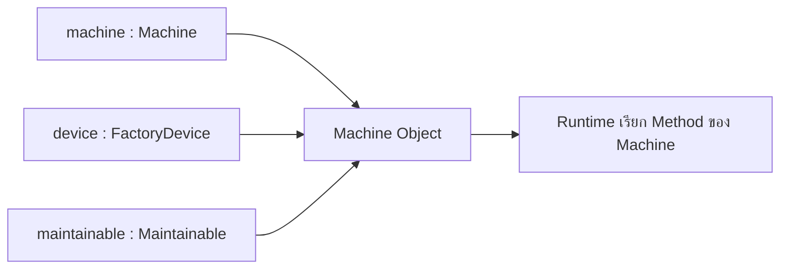

# EP 2.8 — Polymorphism

## เป้าหมาย

- อ้างถึง Object เดียวกันผ่าน Child Type, Parent Type และ Interface Type
- แยกให้ออกระหว่าง Upcasting กับ Runtime Polymorphism
- เข้าใจว่า Type ของตัวแปรกำหนด Method ที่เรียกได้
- ให้ Java เลือก Method ของ Object จริงขณะ Runtime
- ใช้ Method เดียวกับอุปกรณ์ต่าง Class

EP นี้ไม่ต้องแก้ `Machine.java` ให้สร้างไฟล์ทดลองใหม่เพื่อแยกจากตัวอย่างเดิม

## ภาพรวม Object เดียว หลาย Type



ตัวแปรทั้งสามชี้ไปยัง Object เดียวกัน ไม่ได้สร้าง Machine เพิ่ม

สิ่งสำคัญของ EP นี้มีสองชั้น:

1. ตัวแปร Parent หรือ Interface อ้างถึง Child Object ได้
2. เมื่อเรียก Method ที่ Override ไว้ Java จะเลือก Implementation จาก Class ของ Object จริงขณะ Runtime

ข้อ 1 ทำให้โค้ดรับ Object ได้หลายชนิด ส่วนข้อ 2 คือจุดที่เห็น **Runtime Polymorphism** ทำงาน

## 1. สร้างไฟล์ PolymorphismDemo.java

สร้างไฟล์ใหม่ชื่อ `PolymorphismDemo.java` ในโฟลเดอร์เดียวกับไฟล์อื่น แล้ววางโครงเริ่มต้น:

```java
public class PolymorphismDemo {
    public static void main(String[] args) {
        // เพิ่มตัวอย่างในส่วนถัดไป
    }
}
```

## 2. สร้าง Machine หนึ่ง Object

วางภายใน `main`:

```java
Machine machine = new Machine("M-001", "Mixer", "Line A");
machine.updateReading(new SensorReading(65.5, 3.1));
```

ตัวแปร `machine` มี Type เป็น `Machine` จึงเรียก Method ของ Machine, FactoryDevice และ Maintainable ได้

## 3. อ้างถึง Object เดิมผ่าน Type อื่น

วางต่อจากโค้ดส่วนก่อนหน้า:

```java
FactoryDevice device = machine;
Maintainable maintainable = machine;
```

ยังไม่มี Object ใหม่เกิดขึ้น ตัวแปรทั้งสามตัวอ้างถึง Machine Object ตัวเดียวกัน

- `FactoryDevice device = machine;` เรียกว่า **Upcasting** เพราะมอง Child Object ผ่าน Parent Type
- `Maintainable maintainable = machine;` คือการอ้าง Object ผ่าน **Interface Type**
- ทั้งสองบรรทัดเป็นพื้นฐานที่ทำให้เกิด Polymorphism แต่ยังไม่มีการเลือก Method จนกว่าจะเรียก Method ผ่านตัวแปรเหล่านี้

ทดลองเรียก Method ตาม Type ของตัวแปร:

```java
System.out.println("Machine: " + machine.getStatus());
System.out.println("Device type: " + device.getDeviceType());
System.out.println("Maintenance: " + maintainable.requiresMaintenance());
```

- `machine` เรียก `getStatus()` ได้ เพราะ Type เป็น Machine
- `device` เรียก Method ที่ประกาศใน FactoryDevice ได้
- `maintainable` เรียก Method ตามสัญญา Maintainable ได้

## 4. เพิ่ม Method ที่รับ Parent Type

วาง Method นี้ภายใน `PolymorphismDemo` แต่ให้อยู่นอก `main`:

```java
private static void printDevice(FactoryDevice device) {
    System.out.println(
            device.getDeviceType()
                    + " | " + device.getName()
                    + " | " + device.getLocation()
    );
}
```

กลับไปที่ `main` แล้วเรียก Method:

```java
printDevice(machine);
```

แม้ Parameter จะเป็น `FactoryDevice` แต่ Object จริงเป็น `Machine` ดังนั้น `getDeviceType()` จะเรียก Implementation ที่ Machine Override ไว้

จุดที่เป็น Runtime Polymorphism อยู่ที่บรรทัดนี้ภายใน Method:

```java
device.getDeviceType()
```

Java ดูว่า Object จริงที่ส่งเข้ามาเป็น Class ใด แล้วเรียก `getDeviceType()` ของ Class นั้น ไม่ได้ตัดสินจากชื่อ Type `FactoryDevice` เพียงอย่างเดียว

## 5. ทดลองกับ Object ต่าง Class

ถ้ายังไม่มี `EnergyMeter.java` จาก Challenge ของ EP2.6 ให้สร้างไฟล์นี้ในโฟลเดอร์เดียวกัน:

```java
public class EnergyMeter extends FactoryDevice {
    public EnergyMeter(String id, String name, String location) {
        super(id, name, location);
    }

    @Override
    public String getDeviceType() {
        return "Energy Meter";
    }
}
```

ถ้ามีไฟล์นี้แล้ว ไม่ต้องสร้างซ้ำ ให้ตรวจว่ามี `extends FactoryDevice` และ Override `getDeviceType()` ครบ

กลับไปที่ `main` แล้วแทนที่ `printDevice(machine);` จากส่วนก่อนหน้าด้วย:

```java
FactoryDevice[] devices = {
        machine,
        new EnergyMeter("E-001", "Main Meter", "Control Room")
};

for (FactoryDevice currentDevice : devices) {
    printDevice(currentDevice);
}
```

ตัวแปร `currentDevice` มี Type เป็น `FactoryDevice` เหมือนกันทุกรอบ แต่ Object จริงสลับระหว่าง `Machine` และ `EnergyMeter` จึงได้ผลจาก `getDeviceType()` คนละแบบโดยไม่ต้องแก้ `printDevice(...)`

นี่คือตัวอย่าง Polymorphism ที่เห็นชัดกว่า Machine สอง Object เพราะมี Child Class ต่างชนิดเข้า Method เดียวกัน

## 6. Compile และ Run

```powershell
javac -encoding UTF-8 MachineStatus.java SensorReading.java FactoryDevice.java Maintainable.java Machine.java EnergyMeter.java PolymorphismDemo.java
java "-Dfile.encoding=UTF-8" PolymorphismDemo
```

ตัวอย่างผลลัพธ์หลัก:

```text
Machine: RUNNING
Device type: Machine
Maintenance: false
Machine | Mixer | Line A
Energy Meter | Main Meter | Control Room
```

## สรุปว่าส่วนไหนเรียกว่าอะไร

| โค้ด | ชื่อแนวคิด | หน้าที่ |
|---|---|---|
| `FactoryDevice device = machine;` | Upcasting | มอง Machine ผ่าน Parent Type |
| `Maintainable maintainable = machine;` | Interface Polymorphism | มอง Machine ผ่านสัญญาที่ทำได้ |
| `printDevice(FactoryDevice device)` | Polymorphic Parameter | Method เดียวรับ Child Object หลายชนิด |
| `device.getDeviceType()` | Runtime Polymorphism | Java เลือก Method ที่ Override ตาม Object จริง |

ดังนั้น Polymorphism ไม่ได้อยู่ที่คำสั่ง `new` และไม่ได้หมายถึงการมี Machine หลาย Object แต่หมายถึงการใช้ Type กลางกับ Object ต่างชนิด แล้วแต่ละ Object ตอบสนองต่อ Method เดียวกันตาม Implementation ของตัวเอง

## จุดที่มักสับสน

โค้ดนี้ Compile ไม่ผ่าน:

```java
FactoryDevice device = machine;
device.getStatus();
```

เพราะตัวแปร `device` เปิดให้เรียกเฉพาะ Method ที่ FactoryDevice ประกาศ แม้ Object จริงจะเป็น Machine ก็ตาม หากต้องใช้ `getStatus()` ให้เรียกผ่านตัวแปร `machine`

จำเป็นประโยคเดียว:

- **Type ของตัวแปร** กำหนดว่า Compile Time เรียก Method ใดได้
- **Class ของ Object จริง** กำหนดว่า Runtime ใช้ Method ที่ Override จาก Class ใด

## ตรวจความพร้อมก่อนเข้า EP 2.9

- มีไฟล์ `PolymorphismDemo.java`
- Machine Object ถูกอ้างผ่าน `FactoryDevice` และ `Maintainable` ได้
- `printDevice(...)` รับ Parameter เป็น `FactoryDevice`
- ส่งทั้ง Machine และ EnergyMeter เข้า Method เดียวกันได้
- ผล `getDeviceType()` เปลี่ยนตาม Object จริง
- Compile และ Run ได้โดยไม่มี Error

ดูตัวอย่างฉบับเต็ม: [`OopDemo.java`](../../src/main/java/smartfactory/oop/OopDemo.java)

## Challenge

สร้าง `CameraSensor.java` ให้สืบทอด `FactoryDevice` และ Override `getDeviceType()` ให้คืน `"Camera Sensor"` จากนั้นเพิ่ม Object ลงใน Array เดิม:

```java
new CameraSensor("C-001", "Inspection Camera", "Line C")
```

ห้ามแก้ `printDevice(...)` หาก Class ใหม่แสดงผลได้ แปลว่า Method เดิมทำงานกับ FactoryDevice ชนิดใหม่ผ่าน Polymorphism ได้แล้ว

ถัดไป: [EP 2.9 — Collection, Optional และ Stream](ep09-collection-optional-stream.md)
