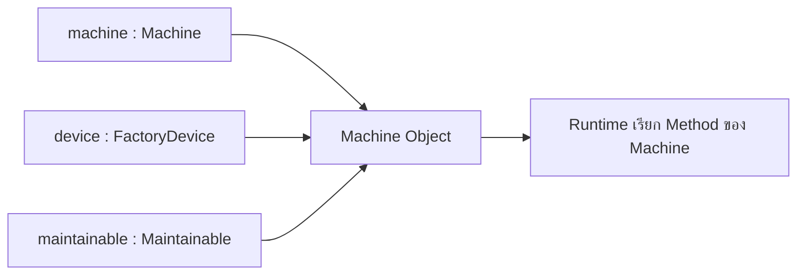

# EP 2.8 — Polymorphism

## เป้าหมาย

- อ้างถึง Object เดียวกันผ่าน Child Type, Parent Type และ Interface Type
- เข้าใจว่า Type ของตัวแปรกำหนด Method ที่เรียกได้
- ให้ Java เลือก Method ของ Object จริงขณะ Runtime
- ใช้ Method เดียวกับอุปกรณ์หลายชนิด

EP นี้ไม่ต้องแก้ `Machine.java` ให้สร้างไฟล์ทดลองใหม่เพื่อแยกจากตัวอย่างเดิม

## ภาพรวม Object เดียว หลาย Type



ตัวแปรทั้งสามชี้ไปยัง Object เดียวกัน ไม่ได้สร้าง Machine เพิ่ม

## 1. สร้างไฟล์ PolymorphismDemo.java

สร้างไฟล์ใหม่ชื่อ `PolymorphismDemo.java` ในโฟลเดอร์เดียวกับไฟล์อื่น แล้ววางโครงเริ่มต้น:

```java
public class PolymorphismDemo {
    public static void main(String[] args) {
        // เพิ่มตัวอย่างในส่วนถัดไป
    }
}
```

## 2. สร้าง Machine หนึ่ง Object

วางภายใน `main`:

```java
Machine machine = new Machine("M-001", "Mixer", "Line A");
machine.updateReading(new SensorReading(65.5, 3.1));
```

ตัวแปร `machine` มี Type เป็น `Machine` จึงเรียก Method ของ Machine, FactoryDevice และ Maintainable ได้

## 3. อ้างถึง Object เดิมผ่าน Type อื่น

วางต่อจากโค้ดส่วนก่อนหน้า:

```java
FactoryDevice device = machine;
Maintainable maintainable = machine;
```

ยังไม่มี Object ใหม่เกิดขึ้น ตัวแปรทั้งสามตัวอ้างถึง Machine Object ตัวเดียวกัน

ทดลองเรียก Method ตาม Type ของตัวแปร:

```java
System.out.println("Machine: " + machine.getStatus());
System.out.println("Device type: " + device.getDeviceType());
System.out.println("Maintenance: " + maintainable.requiresMaintenance());
```

- `machine` เรียก `getStatus()` ได้ เพราะ Type เป็น Machine
- `device` เรียก Method ที่ประกาศใน FactoryDevice ได้
- `maintainable` เรียก Method ตามสัญญา Maintainable ได้

## 4. เพิ่ม Method ที่รับ Parent Type

วาง Method นี้ภายใน `PolymorphismDemo` แต่ให้อยู่นอก `main`:

```java
private static void printDevice(FactoryDevice device) {
    System.out.println(
            device.getDeviceType()
                    + " | " + device.getName()
                    + " | " + device.getLocation()
    );
}
```

กลับไปที่ `main` แล้วเรียก Method:

```java
printDevice(machine);
```

แม้ Parameter จะเป็น `FactoryDevice` แต่ Object จริงเป็น `Machine` ดังนั้น `getDeviceType()` จะเรียก Implementation ที่ Machine Override ไว้

## 5. ทดลองกับ Machine หลาย Object

วางภายใน `main`:

```java
Machine conveyor = new Machine("M-002", "Conveyor", "Line B");

printDevice(machine);
printDevice(conveyor);
```

Method `printDevice(...)` เดียวกันรับ Machine ได้ทุก Object เพราะ Machine ทุกตัวเป็น FactoryDevice

หากมี `printDevice(machine);` จากส่วนก่อนหน้า ให้เหลือเพียงชุดล่าสุดเพื่อไม่ให้ผลลัพธ์ซ้ำ

## 6. Compile และ Run

```powershell
javac -encoding UTF-8 MachineStatus.java SensorReading.java FactoryDevice.java Maintainable.java Machine.java PolymorphismDemo.java
java -Dfile.encoding=UTF-8 PolymorphismDemo
```

ตัวอย่างผลลัพธ์หลัก:

```text
Machine: RUNNING
Device type: Machine
Maintenance: false
Machine | Mixer | Line A
Machine | Conveyor | Line B
```

## จุดที่มักสับสน

โค้ดนี้ Compile ไม่ผ่าน:

```java
FactoryDevice device = machine;
device.getStatus();
```

เพราะตัวแปร `device` เปิดให้เรียกเฉพาะ Method ที่ FactoryDevice ประกาศ แม้ Object จริงจะเป็น Machine ก็ตาม หากต้องใช้ `getStatus()` ให้เรียกผ่านตัวแปร `machine`

## ตรวจความพร้อมก่อนเข้า EP 2.9

- มีไฟล์ `PolymorphismDemo.java`
- Machine Object ถูกอ้างผ่าน `FactoryDevice` และ `Maintainable` ได้
- `printDevice(...)` รับ Parameter เป็น `FactoryDevice`
- ส่ง Machine หลาย Object เข้า Method เดียวกันได้
- Compile และ Run ได้โดยไม่มี Error

ดูตัวอย่างฉบับเต็ม: [`OopDemo.java`](../../src/main/java/smartfactory/oop/OopDemo.java)

## Challenge

ถ้าสร้าง `EnergyMeter` ใน Challenge ของ EP 2.6 แล้ว ให้ทดลอง:

```java
EnergyMeter meter = new EnergyMeter("E-001", "Main Meter", "Control Room");
printDevice(meter);
```

`printDevice(...)` รับทั้ง Machine และ EnergyMeter ได้โดยไม่ต้องสร้าง Method แยก เพราะทั้งสอง Class สืบทอด `FactoryDevice`

ถัดไป: [EP 2.9 — Collection, Optional และ Stream](ep09-collection-optional-stream.md)
