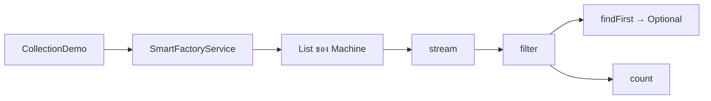

# EP 2.9 — Collection, Optional และ Stream

## เป้าหมาย

- เก็บ Machine หลาย Object ด้วย `List`
- สื่อผลค้นหาที่อาจไม่พบด้วย `Optional`
- กรองและนับข้อมูลด้วย Stream
- แยกโค้ดจัดการรายการออกจากไฟล์ Demo

EP นี้จะสร้างสองไฟล์ใหม่:

1. `SmartFactoryService.java` — เก็บและค้นหา Machine
2. `CollectionDemo.java` — สร้างข้อมูลและทดลองเรียก Service

ทำตามทีละส่วน โดย Compile หลังจบแต่ละหัวข้อได้ ไม่ต้องเขียนทุกอย่างพร้อมกัน

## ภาพรวมการไหลของข้อมูล



Service เก็บรายการ ส่วน Stream อ่านและประมวลผลรายการเดิม

## 1. สร้างไฟล์ SmartFactoryService.java

สร้างไฟล์ใหม่ชื่อ `SmartFactoryService.java` แล้ววาง Import ไว้บนสุดของไฟล์:

```java
import java.util.ArrayList;
import java.util.List;
import java.util.Optional;
```

วาง Class ต่อจาก Import:

```java
public class SmartFactoryService {
    private final List<Machine> machines = new ArrayList<>();
}
```

`List` เพิ่ม Machine ภายหลังได้ ต่างจาก Array ที่มีขนาดคงที่

## 2. เพิ่ม Machine ลงใน List

วาง Method นี้ภายใน `SmartFactoryService`:

```java
public void addMachine(Machine machine) {
    machines.add(machine);
}
```

ตอนนี้ Service มีหน้าที่เก็บ Machine แต่ยังค้นหาไม่ได้

## 3. ค้นหาด้วย Optional

วาง Method ต่อจาก `addMachine(...)`:

```java
public Optional<Machine> findById(String id) {
    return machines.stream()
            .filter(machine -> machine.getId().equalsIgnoreCase(id))
            .findFirst();
}
```

ชี้ส่วนประกอบในโค้ด:

- `machines.stream()` เริ่ม Stream จากข้อมูลใน List โดยไม่ได้คัดลอกหรือแก้ List เดิม
- `.filter(...)` เลือกเฉพาะ Machine ที่ผ่านเงื่อนไข
- `machine -> ...` คือ Lambda ที่รับ Machine หนึ่ง Object แล้วคืน `true` หรือ `false`
- `.findFirst()` จบการประมวลผลและคืน `Optional<Machine>` เพราะอาจพบหรือไม่พบ Object

อ่านลำดับการทำงานจากบนลงล่าง:

1. นำ Machine ทุกตัวจาก `machines`
2. กรองเฉพาะตัวที่รหัสตรงกับ `id`
3. คืน Object ตัวแรกที่พบ
4. ถ้าไม่พบ คืน `Optional.empty()` แทน `null`

## 4. นับ Machine ตามสถานะด้วย Stream

วาง Method นี้ภายใน `SmartFactoryService`:

```java
public long countByStatus(MachineStatus status) {
    return machines.stream()
            .filter(machine -> machine.getStatus() == status)
            .count();
}
```

Method นี้รับสถานะที่ต้องการ แล้วคืนจำนวน Machine ที่ตรงกับสถานะนั้น โดย `filter(...)` ยังเป็นขั้นกรองเหมือนเดิม แต่ครั้งนี้ `count()` เป็นคำสั่งจบ Stream และคืนจำนวนเป็น `long`

## 5. สร้างไฟล์ CollectionDemo.java

สร้างไฟล์ใหม่ชื่อ `CollectionDemo.java`:

```java
public class CollectionDemo {
    public static void main(String[] args) {
        SmartFactoryService service = new SmartFactoryService();
    }
}
```

## 6. สร้างและเพิ่ม Machine

วางภายใน `main` ต่อจากการสร้าง Service:

```java
Machine mixer = new Machine("M-001", "Mixer", "Line A");
mixer.updateReading(new SensorReading(65.5, 3.1));

Machine conveyor = new Machine("M-002", "Conveyor", "Line B");
conveyor.updateReading(new SensorReading(85.0, 4.2));

service.addMachine(mixer);
service.addMachine(conveyor);
```

Mixer มีค่าปลอดภัยจึงเป็น `RUNNING` ส่วน Conveyor มีอุณหภูมิสูงกว่าเกณฑ์จึงเป็น `WARNING`

## 7. ทดลองค้นหา

วางต่อภายใน `main`:

```java
service.findById("M-001")
        .ifPresent(machine -> System.out.println("Found: " + machine.getName()));
```

`ifPresent(...)` จะเรียก Lambda เฉพาะเมื่อ `Optional` มี Machine จึงไม่ต้องเรียก `get()` โดยไม่ตรวจค่า ตัวแปร `machine` ภายใน Lambda คือ Object ที่ค้นพบ ไม่ใช่ Machine ทุกตัวใน List

ทดลองค้นหารหัสที่ไม่มีในระบบ:

```java
String result = service.findById("M-999")
        .map(Machine::getName)
        .orElse("Machine not found");

System.out.println(result);
```

- `map(Machine::getName)` เปลี่ยนค่าภายในจาก `Optional<Machine>` เป็น `Optional<String>` เมื่อค้นพบ
- `Machine::getName` เป็น Method Reference ซึ่งทำหน้าที่เดียวกับ `machine -> machine.getName()`
- `orElse(...)` คืนข้อความสำรองเมื่อ `Optional` ว่าง

Stream ใช้ค้นหาใน Service ส่วน Optional ใช้ส่งผลลัพธ์ที่อาจไม่มีออกจาก Method ทั้งสองแนวคิดทำงานต่อกัน แต่ไม่ใช่สิ่งเดียวกัน

## 8. ทดลองนับด้วย Stream

วางต่อภายใน `main`:

```java
long warningCount = service.countByStatus(MachineStatus.WARNING);
System.out.println("Warning count: " + warningCount);
```

## 9. Compile และ Run

```powershell
javac -encoding UTF-8 MachineStatus.java SensorReading.java FactoryDevice.java Maintainable.java Machine.java SmartFactoryService.java CollectionDemo.java
java "-Dfile.encoding=UTF-8" CollectionDemo
```

ตัวอย่างผลลัพธ์:

```text
Found: Mixer
Machine not found
Warning count: 1
```

## จุดที่มักสับสน

- `machines` อยู่ใน `SmartFactoryService` ดังนั้น Method ที่ใช้ `machines.stream()` ต้องวางภายใน Class นี้
- Import ต้องอยู่บนสุดของไฟล์และอยู่นอก Class
- `Optional<Machine>` ไม่ใช่ Machine โดยตรง ต้องใช้ `ifPresent`, `map`, `orElse` หรือ `orElseThrow`
- `count()` คืนค่าเป็น `long` ไม่ใช่ `int`

## ตรวจความพร้อมก่อนเข้า EP 2.10

- มีไฟล์ `SmartFactoryService.java`
- Service มี Field `List<Machine>`
- มี Method `addMachine(...)`, `findById(...)` และ `countByStatus(...)`
- มีไฟล์ `CollectionDemo.java`
- ค้นหารหัสที่มีและไม่มีในระบบได้
- นับสถานะ `WARNING` ได้หนึ่งเครื่อง
- Compile และ Run ได้โดยไม่มี Error

ซอร์สฉบับเต็ม: [`SmartFactoryService.java`](../../src/main/java/smartfactory/service/SmartFactoryService.java)

## Challenge

เพิ่ม Method นี้ภายใน `SmartFactoryService` เพื่อนับ Machine ที่ควรบำรุงรักษา:

```java
public long countRequiringMaintenance() {
    return machines.stream()
            .filter(machine -> machine.requiresMaintenance())
            .count();
}
```

ค่าที่ได้เป็นยอดรวมของทุก Machine ใน Collection ไม่ใช่ผลของ Machine ตัวล่าสุดหรือ Machine ที่เลือกบนหน้าจอ

จากนั้นเรียกใน `CollectionDemo.java`:

```java
System.out.println(
        "Maintenance count: " + service.countRequiringMaintenance()
);
```

ถัดไป: [EP 2.10 — Service, Exception และ Test](ep10-service-exception-test.md)
