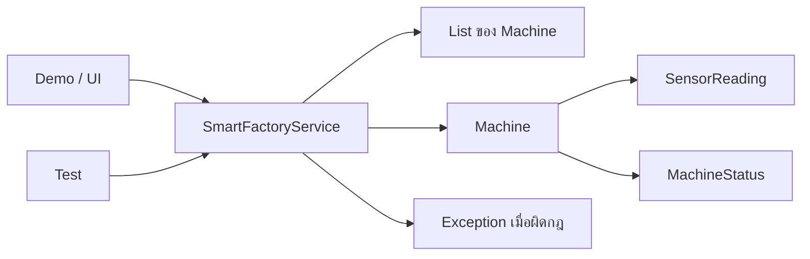

# EP 2.10 — Service Layer, Exception และ Test

## เป้าหมาย

- แยก Use Case ออกจาก Model และไฟล์ Demo
- ปฏิเสธ Machine ที่เป็น `null` หรือมีรหัสซ้ำ
- ค้นหา Machine ที่จำเป็นต้องพบด้วย `orElseThrow`
- เขียน Test ด้วย Java ล้วนโดยไม่ต้องติดตั้ง JUnit

EP นี้ทำต่อจาก `SmartFactoryService.java` ของ EP 2.9 ไม่ต้องสร้าง Service ซ้ำ ให้แก้ Method เดิมและเพิ่มความสามารถทีละส่วน

## ภาพรวมการแบ่งหน้าที่



UI เรียก Use Case ผ่าน Service ส่วน Machine ดูแล State และกฎของตัวเอง

## 1. แบ่งหน้าที่ของ Model และ Service

- `Machine` ดูแลกฎของ Object เช่น ค่า Sensor สถานะ และการบำรุงรักษา
- `SmartFactoryService` ดูแล Use Case ที่เกี่ยวข้องกับหลาย Object เช่น เพิ่ม ค้นหา และตรวจรหัสซ้ำ
- ไฟล์ Demo หรือ UI มีหน้าที่รับข้อมูลและเรียก Service

การแบ่งแบบนี้ทำให้กฎไม่กระจายอยู่ตาม Console หรือหน้าต่าง Desktop

## 2. ป้องกัน null และรหัสซ้ำ

เปิด `SmartFactoryService.java` แล้วแทนที่ Method `addMachine(...)` เดิมทั้ง Method ด้วย:

```java
public void addMachine(Machine machine) {
    if (machine == null) {
        throw new IllegalArgumentException("machine must not be null");
    }

    if (findById(machine.getId()).isPresent()) {
        throw new IllegalArgumentException(
                "รหัสเครื่องจักรซ้ำ: " + machine.getId()
        );
    }

    machines.add(machine);
}
```

ต้องตรวจ `null` ก่อนเรียก `machine.getId()` ไม่เช่นนั้นจะเกิด `NullPointerException` ซึ่งอธิบายปัญหาได้น้อยกว่า Exception ที่กำหนดเอง

การค้นหาใน EP 2.9 ใช้ `equalsIgnoreCase(...)` ดังนั้น `M-001` และ `m-001` จะถือว่าเป็นรหัสเดียวกัน

## 3. เพิ่ม Method สำหรับกรณีที่ต้องค้นพบ

Method `findById(...)` คืน `Optional` เพราะผลค้นหาอาจไม่มี แต่บาง Use Case จำเป็นต้องพบ Machine จึงเพิ่ม Method นี้ภายใน `SmartFactoryService`:

```java
public Machine findRequired(String id) {
    return findById(id)
            .orElseThrow(() -> new IllegalArgumentException(
                    "ไม่พบเครื่องจักร: " + id
            ));
}
```

ใช้ `findById(...)` เมื่อยอมรับกรณีไม่พบ และใช้ `findRequired(...)` เมื่อไม่พบแล้วต้องหยุดการทำงานพร้อมข้อความอธิบาย

## 4. เพิ่ม Use Case อัปเดต Sensor

วาง Method นี้ภายใน `SmartFactoryService`:

```java
public void updateSensor(
        String id,
        double temperature,
        double vibration
) {
    Machine machine = findRequired(id);
    SensorReading reading = new SensorReading(temperature, vibration);
    machine.updateReading(reading);
}
```

Service ทำงานตามลำดับ:

1. ค้นหา Machine จากรหัส
2. สร้าง Value Object `SensorReading`
3. ส่งข้อมูลให้ Machine เป็นผู้เปลี่ยน State ของตัวเอง

## ส่วนไหนคือ Service Layer

| ส่วนของโค้ด | ความรับผิดชอบ |
|---|---|
| `SmartFactoryService` | เป็น Service Layer และรวม Use Case ของระบบ |
| `findById(...)` | ค้นหาแบบยอมรับกรณีไม่พบ จึงคืน Optional |
| `findRequired(...)` | เปลี่ยนกรณีไม่พบให้เป็น Exception สำหรับ Use Case ที่ต้องมีข้อมูล |
| `updateSensor(...)` | ประสานการค้นหา สร้าง SensorReading และสั่ง Machine |
| `Machine.updateReading(...)` | ดูแลกฎและเปลี่ยน State ภายใน Machine |

Service Layer ไม่ได้หมายถึงทุก Method ที่ลงท้ายด้วย `Service` แต่หมายถึงชั้นที่รับ Use Case จาก Demo หรือ UI แล้วประสาน Model หลายส่วน โดยไม่ย้ายกฎภายใน Machine ออกมาไว้ใน UI

## 5. สร้างไฟล์ SmartFactoryCoreTest.java

สร้างไฟล์ใหม่ชื่อ `SmartFactoryCoreTest.java` ในโฟลเดอร์เดียวกับไฟล์ Lab:

```java
public class SmartFactoryCoreTest {
    public static void main(String[] args) {
        testSafeReadingSetsRunning();
        testDuplicateIdIsRejected();

        System.out.println("PASS: 2 tests");
    }
}
```

Test นี้เป็น Java ปกติ ใช้ `main` เป็นจุดเริ่มต้น จึงยังไม่ต้องติดตั้ง JUnit หรือ Maven

## 6. เพิ่ม Test ค่า Sensor ปลอดภัย

วาง Method นี้ภายใน `SmartFactoryCoreTest` แต่ให้อยู่นอก `main`:

```java
private static void testSafeReadingSetsRunning() {
    Machine machine = new Machine("T-001", "Test Machine", "Lab");
    machine.updateReading(new SensorReading(60.0, 2.0));

    if (machine.getStatus() != MachineStatus.RUNNING) {
        throw new AssertionError("Safe reading should set RUNNING");
    }
}
```

ถ้ากฎทำงานถูกต้อง Method จะจบโดยไม่มีข้อความ แต่ถ้าสถานะผิดจะโยน `AssertionError` และโปรแกรมหยุด

โครงสร้าง Test นี้แบ่งได้สามช่วง:

1. Arrange — สร้าง Machine และข้อมูล Sensor
2. Act — เรียก `machine.updateReading(...)`
3. Assert — ตรวจ `machine.getStatus()` และโยน `AssertionError` เมื่อผลไม่ตรง

## 7. เพิ่ม Test รหัสซ้ำ

วาง Method นี้ภายใน `SmartFactoryCoreTest` ต่อจาก Test แรก:

```java
private static void testDuplicateIdIsRejected() {
    SmartFactoryService service = new SmartFactoryService();
    service.addMachine(new Machine("T-002", "First", "Lab"));

    try {
        service.addMachine(new Machine("t-002", "Second", "Lab"));
        throw new AssertionError("Duplicate id should fail");
    } catch (IllegalArgumentException expected) {
        if (!expected.getMessage().contains("ซ้ำ")) {
            throw new AssertionError("Unexpected error message");
        }
    }
}
```

ถ้า Service ไม่ปฏิเสธรหัสซ้ำ บรรทัด `throw new AssertionError(...)` จะทำให้ Test ล้มเหลว

ใน Test นี้ `try` คือการลงมือเพิ่มรหัสซ้ำ ส่วน `catch (IllegalArgumentException expected)` คือการยืนยันว่า Service ปฏิเสธข้อมูลตามที่ออกแบบไว้ หากไม่มี Exception จะไปถึง `AssertionError` และถือว่า Test ไม่ผ่าน

## 8. Compile และ Run Test ของ Lab

เปิด Terminal ในโฟลเดอร์เดียวกับไฟล์ Java แล้วรัน:

```powershell
javac -encoding UTF-8 MachineStatus.java SensorReading.java FactoryDevice.java Maintainable.java Machine.java SmartFactoryService.java SmartFactoryCoreTest.java
java "-Dfile.encoding=UTF-8" SmartFactoryCoreTest
```

ผลลัพธ์ที่ถูกต้อง:

```text
PASS: 2 tests
```

ถ้ามี Test ใดผิด โปรแกรมจะแสดง `AssertionError` แทนข้อความ PASS ให้แก้กฎหรือข้อมูล Test ก่อนทำส่วนถัดไป

## 9. ตรวจโปรเจกต์ฉบับเต็ม

คำสั่งส่วนนี้ใช้กับซอร์สฉบับเต็มใน Repository ไม่ใช่ไฟล์ Lab ที่เพิ่งสร้าง ให้เปิด Terminal ที่โฟลเดอร์หลักของโปรเจกต์แล้วรัน:

```powershell
powershell -ExecutionPolicy Bypass -File .\scripts\test.ps1
```

ผลลัพธ์ของโปรเจกต์ฉบับเต็ม:

```text
Encoding check passed: ... UTF-8 files
Build completed: ...\out
PASS: 5 tests
```

## ตรวจความพร้อมก่อนจบ Playlist 2

- `SmartFactoryService` ปฏิเสธ `null` และรหัสซ้ำ
- มีทั้ง `findById(...)` และ `findRequired(...)`
- การอัปเดต Sensor ทำผ่าน Service และ Machine
- มีไฟล์ `SmartFactoryCoreTest.java`
- Test ของ Lab แสดง `PASS: 2 tests`
- แยก Model, Service และ Demo ออกจากกันชัดเจน

ซอร์สฉบับเต็มสำหรับตรวจคำตอบ:

- [`SmartFactoryService.java`](../../src/main/java/smartfactory/service/SmartFactoryService.java)
- [`SmartFactoryTest.java`](../../src/test/java/smartfactory/SmartFactoryTest.java)

## Final Challenge

เพิ่มกฎ `EMERGENCY_STOP` เมื่ออุณหภูมิตั้งแต่ `100.0` °C:

1. ตรวจว่า `MachineStatus` มี `EMERGENCY_STOP` แล้ว
2. ปรับ `updateReading(...)` ให้ตรวจ `temperature >= 100.0` ก่อนเงื่อนไข WARNING
3. เพิ่ม Test แยกสำหรับ `99.9`, `100.0` และ `100.1`
4. ตรวจว่า `99.9` ยังไม่เป็น EMERGENCY_STOP แต่ `100.0` และ `100.1` ต้องเป็น

ถัดไป: [Playlist 3 — Java Desktop Workshop](../playlist-03-java-desktop/README.md)
