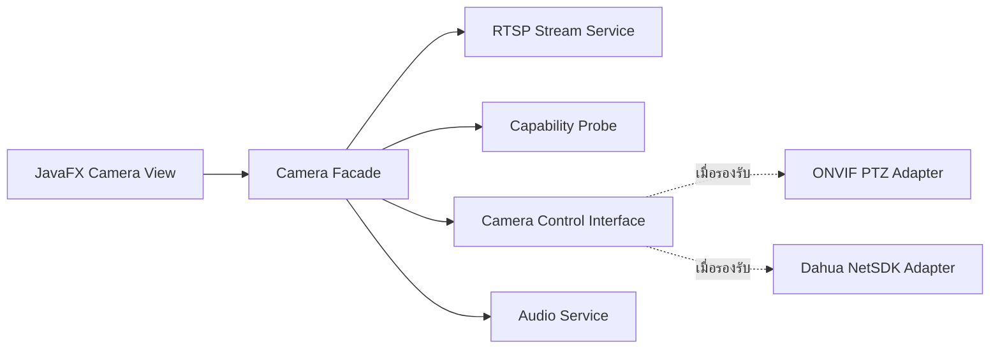

# Optional Camera Integration Roadmap — JavaFX Network Camera

> สถานะ: เอกสารนี้เป็นโครงสร้างสำหรับพัฒนาในอนาคต ยังไม่มีไฟล์บทเรียน Source Code หรือคำสั่งติดตั้งสำหรับ EP 3.17–3.20

Mini Track นี้ต่อยอด Smart Factory Dashboard ให้แสดงกล้องประจำเครื่องจักร โดยแยกหน้าจอ JavaFX ออกจากบริการ RTSP, ONVIF และ Dahua Integration เพื่อให้เปลี่ยนกล้องหรือวิธีเชื่อมต่อได้โดยไม่ย้าย Logic ไปไว้ใน Controller

## ข้อมูลที่ยืนยันแล้วจากอุปกรณ์ตัวอย่าง

อุปกรณ์ตัวอย่างเป็นกล้อง Dahua DH-H3AE ซึ่งการทดสอบ RTSP ยืนยัน Video H.265 ที่ 25 FPS และ Audio PCMA/G.711A ที่ 8 kHz แล้ว ส่วนข้อมูลผลิตภัณฑ์ระบุว่ามี Pan/Tilt, ไมโครโฟน, ลำโพง และ Two-way Talk

ผลดังกล่าวยืนยันความสามารถของ Hardware และ RTSP Stream แต่ยังไม่ยืนยันว่า Firmware เปิด ONVIF PTZ, Audio Backchannel หรือ Dahua NetSDK ให้โปรแกรมภายนอกใช้งาน จึงแยก Capability Probe ออกจากบทควบคุมกล้องโดยตรง

แหล่งอ้างอิง:

- [Dahua DH-H3AE Product Information](https://www.dahuasecurity.com/vi/products/network-products/network-cameras/Wireless-Series/NEW-Channel/Indoor-Camera/Hero-Series/H3AE)
- [Dahua DH-H3AE Datasheet](https://material.dahuasecurity.com/uploads/soft/20240315/DH-H3AE_S0_datasheet_20240123.pdf)
- [ONVIF PTZ Service Specification](https://www.onvif.org/onvif/specs/srv/ptz/ONVIF-PTZ-Service-Spec.pdf)
- [ONVIF Profile T](https://www.onvif.org/profiles/profile-t/)

## Architecture เป้าหมาย



`Camera Facade` เป็นจุดที่ JavaFX Controller เรียกใช้งาน ส่วนรายละเอียด Network, Native Library, Thread และ Resource Lifecycle อยู่ใน Service หรือ Adapter ของแต่ละโปรโตคอล

## EP 3.17 — RTSP Live Camera Monitor

สถานะ: **พร้อมพัฒนาเมื่อเริ่มทำบทเรียน** เพราะ RTSP Video และ Audio Track ผ่านการตรวจสอบแล้ว

ขอบเขตที่วางแผนไว้:

- รู้จัก RTSP, SDP, Video Track และ Audio Track
- สร้าง `CameraConfig` โดยไม่ฝัง IP, Username หรือ Password ใน Source Code
- สร้าง `RtspCameraService` สำหรับ Connect, Disconnect และ Resource Cleanup
- อ่าน Video H.265 ใน Background Thread โดยหน้าต่าง JavaFX ไม่ค้าง
- แปลง Frame และแสดงผลใน `ImageView`
- แสดงสถานะ `CONNECTING`, `LIVE`, `DISCONNECTED` และ `ERROR`
- หยุด Stream เมื่อปิดหน้าต่าง
- ถ่าย Snapshot จาก Frame ปัจจุบัน

ผลลัพธ์ที่คาดหวัง: Camera Monitor ที่แสดงภาพสดบน Smart Factory Dashboard และปิด Connection ได้อย่างถูกต้อง

## EP 3.18 — Camera Capability Probe

สถานะ: **พร้อมพัฒนาเป็นบทตรวจสอบ** โดยยังไม่สรุปว่ากล้องรองรับ ONVIF หรือ NetSDK

ขอบเขตที่วางแผนไว้:

- อ่าน RTSP SDP และสรุป Codec, Frame Rate และทิศทาง Audio
- ตรวจพอร์ต HTTP, HTTPS, RTSP และ Dahua TCP Service โดยไม่ถือว่าพอร์ตเปิดเท่ากับรองรับ API
- ตรวจ ONVIF Device Service, Media Profile และ PTZ Capability
- ตรวจการเชื่อมต่อ Dahua NetSDK แยกจาก ONVIF
- สร้าง `CameraCapabilities` เป็นข้อมูลแบบอ่านอย่างเดียว
- แสดงผล `SUPPORTED`, `NOT_SUPPORTED` และ `NOT_VERIFIED` ให้ต่างกัน
- ไม่แสดง Password, Serial Number, Device ID หรือ Digest Data ใน Log

ผลลัพธ์ที่คาดหวัง: รายงานความสามารถที่ใช้ตัดสินใจเลือก Adapter โดยไม่เดาจากชื่อรุ่นหรือความสามารถในแอป DMSS

## EP 3.19 — PTZ Control

สถานะ: **Conditional Roadmap** เริ่มสร้างเมื่อ EP 3.18 ยืนยัน ONVIF PTZ หรือ Dahua NetSDK อย่างน้อยหนึ่งช่องทาง

ขอบเขตที่วางแผนไว้:

- สร้าง `CameraControl` Interface
- แยก `OnvifPtzAdapter` หรือ `DahuaPtzAdapter` ตามผล Probe
- ใช้ `ContinuousMove` เมื่อกดปุ่มค้างและ `Stop` เมื่อปล่อยปุ่ม
- ควบคุม Pan, Tilt และความเร็วจาก JavaFX
- ส่งคำสั่ง Network ใน Background Executor
- กำหนด Timeout และเรียก Stop เมื่อ Mouse ออกจากปุ่มหรือหน้าต่างปิด
- เพิ่ม Home Position และ Preset เฉพาะความสามารถที่กล้องรายงานว่ารองรับ

ผลลัพธ์ที่คาดหวัง: PTZ Control Panel ที่ไม่ทำให้ JavaFX Application Thread ค้างและหยุดมอเตอร์ได้อย่างปลอดภัย

หากไม่พบ API ที่รองรับ บทนี้จะคงสถานะ Roadmap และไม่ใช้ Private Endpoint ที่ไม่ได้รับการรับรองมาเป็นเนื้อหาสาธารณะ

## EP 3.20 — Push to Talk

สถานะ: **Advanced Conditional Roadmap** เริ่มสร้างเมื่อยืนยัน ONVIF Audio Backchannel หรือ Dahua NetSDK Two-way Talk แล้ว

ขอบเขตที่วางแผนไว้:

- รับเสียงจากไมโครโฟนด้วย Java Sound API
- ตรวจ Codec, Sample Rate และ Channel ที่กล้องยอมรับ
- แปลงเสียงเป็นรูปแบบที่อุปกรณ์รองรับ เช่น PCMA/G.711A 8 kHz
- กดปุ่มค้างเพื่อเริ่มพูดและปล่อยเพื่อหยุดส่ง
- แยก `AudioCaptureService`, Encoder และ Camera Talk Adapter
- จัดการ Native Resource, Callback และ Thread อย่างถูกต้อง
- แสดงสถานะ `READY`, `TALKING`, `MUTED` และ `UNAVAILABLE`

ผลลัพธ์ที่คาดหวัง: Push-to-Talk จาก JavaFX ไปยังลำโพงกล้อง โดยมีเฉพาะ Implementation ที่ผ่านการทดสอบกับอุปกรณ์จริง

## เงื่อนไขก่อนสร้างบทเรียนจริง

| EP | Gate ที่ต้องผ่าน |
|---|---|
| 3.17 | RTSP เชื่อมต่อและถอดรหัส H.265 ได้ต่อเนื่อง |
| 3.18 | Probe ทำงานโดยไม่บันทึกข้อมูลลับลง Log |
| 3.19 | ONVIF PTZ หรือ Dahua NetSDK Login และ Stop Command ผ่านการทดสอบ |
| 3.20 | ยืนยัน Talk Session, Codec และ Audio Transport ที่กล้องยอมรับ |

## ขอบเขตความปลอดภัย

- ตัวอย่างทั้งหมดใช้ Host และ Credential แบบ Placeholder
- Username, Password, Serial Number และ Device ID ไม่เก็บใน Git
- Configuration จริงอ่านจาก Environment Variable หรือไฟล์ Local ที่ถูก Ignore
- Certificate Verification ไม่ถูกปิดใน Production Build
- กล้องไม่เปิด RTSP, HTTP หรือ Dahua Service Port ออกสู่อินเทอร์เน็ตโดยตรง
- การเชื่อมต่อจากภายนอกใช้ VPN หรือเครือข่ายที่ควบคุมสิทธิ์

## โครงสร้างไฟล์ที่สงวนไว้

ยังไม่สร้างไฟล์เหล่านี้จนกว่าจะเริ่มพัฒนาแต่ละ EP:

```text
docs/playlist-03-java-desktop/
├─ ep17-rtsp-camera-monitor.md
├─ ep18-camera-capability-probe.md
├─ ep19-ptz-control.md
└─ ep20-push-to-talk.md
```

Source Code, Dependency Version และ Native Library จะกำหนดในวันที่เริ่มสร้างบทเรียน เพื่อเลือกเครื่องมือที่ยังได้รับการสนับสนุนและผ่านการทดสอบกับอุปกรณ์จริงในขณะนั้น

[กลับไปสารบัญ Playlist 3](README.md) หรือ [กลับไป README หลัก](../../README.md)
