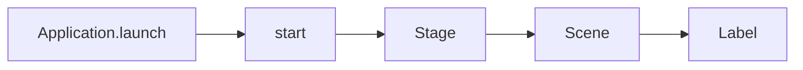

# EP 3.1 — JavaFX, Maven, Stage และ Scene

## Intro — ทำไมเลือก JavaFX

Java มีทางเลือกสำหรับ Desktop UI หลายแบบ โปรเจกต์นี้เลือก JavaFX เพราะมี Component สมัยใหม่ รองรับ CSS, FXML, Property Binding และแยก View ออกจาก Logic ได้ชัด เหมาะกับการต่อยอด OOP Core เดิมเป็น Smart Factory Dashboard

| เทคโนโลยี | ตำแหน่งที่เหมาะสม |
|---|---|
| AWT | API พื้นฐานสำหรับ Window, Graphics และ Native UI ของ Java |
| Swing | Framework ที่ผ่านการใช้งานมายาวนานและยังพบในระบบเดิมหรืองาน Maintenance |
| JavaFX | Desktop Application ที่ต้องการ Theme, Binding, FXML และโครงสร้าง UI ที่ต่อยอดง่าย |

JavaFX เหมาะกับ Dashboard ภายในโรงงาน, โปรแกรม Offline, Machine Configuration, Maintenance และ Monitoring Tool รวมถึงงานที่เชื่อม Serial Port, USB หรืออุปกรณ์ภายใน เพราะใช้ Java Domain และ Service ชุดเดิมได้โดยไม่ต้องเพิ่ม JavaScript

ข้อแลกเปลี่ยนคือ ตลาดงานและ Component Ecosystem เล็กกว่า Web และไม่ยืดหยุ่นเท่า Web Application สำหรับ Public UI หรือการใช้งานจากหลายอุปกรณ์ ดังนั้น Roadmap นี้จึงใช้ JavaFX สำหรับ Desktop แล้วค่อยต่อยอดไป Spring Boot, Vaadin และ Angular

### ทดลอง Dashboard ฉบับสมบูรณ์ก่อนเริ่ม

เปิด PowerShell ที่โฟลเดอร์หลักของ Repository แล้วรัน:

```powershell
powershell -ExecutionPolicy Bypass -File .\scripts\run-desktop.ps1
```

คำสั่งนี้เปิด Source ฉบับสมบูรณ์ใน `src/main/java/smartfactory/ui` เพื่อให้เห็นผลลัพธ์ปลายทาง ส่วนไฟล์ที่สร้างตามคลิปยังคงเก็บแยกไว้ใน `practice/smart-factory-dashboard`

Dashboard ฉบับสมบูรณ์สามารถแสดง Summary และตารางเครื่องจักร เพิ่มหรือลบรายการ อัปเดตค่า Sensor บันทึกการบำรุงรักษา และจำลองข้อมูลอัตโนมัติทุก 2 วินาที โดยใช้ JavaFX, FXML, CSS และ OOP Core ชุดเดียวกัน

## สิ่งที่จะทำ

- สร้างโปรเจกต์ฝึกใน `practice/smart-factory-dashboard`
- ให้ Maven จัดการ JavaFX โดยไม่ต้องหาไฟล์ JAR เอง
- เปิดหน้าต่างแรกด้วย `Application`, `Stage` และ `Scene`



## 1. สร้างโฟลเดอร์

เปิด Terminal ที่โฟลเดอร์หลักของ Repository แล้วรัน:

```powershell
New-Item -ItemType Directory -Force practice/smart-factory-dashboard/src/main/java/smartfactory/desktop
```

โฟลเดอร์ `practice` มีไว้ทำตามคลิปบนเครื่องและถูก `.gitignore` ไว้แล้ว

## 2. สร้าง `pom.xml`

สร้างไฟล์ `practice/smart-factory-dashboard/pom.xml`:

```xml
<?xml version="1.0" encoding="UTF-8"?>
<project xmlns="http://maven.apache.org/POM/4.0.0">
    <modelVersion>4.0.0</modelVersion>
    <groupId>com.kopesolution</groupId>
    <artifactId>smart-factory-dashboard-practice</artifactId>
    <version>1.0-SNAPSHOT</version>

    <properties>
        <maven.compiler.release>21</maven.compiler.release>
        <project.build.sourceEncoding>UTF-8</project.build.sourceEncoding>
        <javafx.version>21.0.10</javafx.version>
    </properties>

    <dependencies>
        <dependency>
            <groupId>org.openjfx</groupId>
            <artifactId>javafx-controls</artifactId>
            <version>${javafx.version}</version>
        </dependency>
    </dependencies>

    <build>
        <plugins>
            <plugin>
                <groupId>org.apache.maven.plugins</groupId>
                <artifactId>maven-compiler-plugin</artifactId>
                <version>3.13.0</version>
                <configuration>
                    <release>${maven.compiler.release}</release>
                    <encoding>${project.build.sourceEncoding}</encoding>
                </configuration>
            </plugin>
            <plugin>
                <groupId>org.openjfx</groupId>
                <artifactId>javafx-maven-plugin</artifactId>
                <version>0.0.8</version>
                <configuration>
                    <mainClass>smartfactory.desktop.DashboardApp</mainClass>
                </configuration>
            </plugin>
        </plugins>
    </build>
</project>
```

### ที่มาของ Dependency และ Plugin

| รายการ | ใช้ทำอะไร | แหล่งอ้างอิง |
|---|---|---|
| `org.openjfx:javafx-controls` | เพิ่ม JavaFX Controls เช่น `Label`, `Button` และ `TableView` พร้อม Dependency พื้นฐานที่ต้องใช้ | [JavaFX Controls — Maven Central](https://central.sonatype.com/artifact/org.openjfx/javafx-controls/21) |
| `maven-compiler-plugin` | Compile Source ด้วย `javac` และกำหนดมาตรฐาน Java ผ่าน `release` | [Apache Maven Compiler Plugin 3.13.0](https://maven.apache.org/plugins-archives/maven-compiler-plugin-3.13.0/examples/set-compiler-release.html) |
| `javafx-maven-plugin` | จัด Classpath หรือ Module Path และเพิ่มคำสั่ง `javafx:run` | [OpenJFX JavaFX Maven Plugin](https://github.com/openjfx/javafx-maven-plugin) |

อ่านภาพรวมการเริ่มต้นและการใช้ Maven ได้ที่ [OpenJFX Getting Started](https://openjfx.io/openjfx-docs/)

`dependency` คือ Library ที่โปรแกรมเรียกใช้ ส่วน `plugin` คือเครื่องมือที่ Maven ใช้ระหว่าง Build หรือ Run ใน EP นี้ยังไม่เพิ่ม `javafx-fxml` เพราะจะเริ่มใช้ FXML ใน EP3.11

## 3. สร้างหน้าต่างแรก

สร้างไฟล์ `practice/smart-factory-dashboard/src/main/java/smartfactory/desktop/DashboardApp.java`:

```java
package smartfactory.desktop;

import javafx.application.Application;
import javafx.scene.Scene;
import javafx.scene.control.Label;
import javafx.scene.layout.StackPane;
import javafx.stage.Stage;

public class DashboardApp extends Application {
    @Override
    public void start(Stage stage) {
        Label title = new Label("Smart Factory Dashboard");
        Scene scene = new Scene(new StackPane(title), 960, 600);

        stage.setTitle("KOPE SOLUTION — Smart Factory");
        stage.setScene(scene);
        stage.show();
    }

    public static void main(String[] args) {
        launch(args);
    }
}
```

`Stage` คือหน้าต่างหลัก ส่วน `Scene` คือพื้นที่ภายในหน้าต่างที่เก็บ UI Component

## 4. รัน

รันจากโฟลเดอร์หลักของ Repository:

```powershell
.\mvnw.cmd -f .\practice\smart-factory-dashboard\pom.xml javafx:run
```

ผลที่ต้องเห็น: หน้าต่างขนาด 960 × 600 และข้อความ `Smart Factory Dashboard` อยู่กลางจอ

## Challenge

เปลี่ยนชื่อหน้าต่างเป็นชื่อโรงงานของคุณ แล้วปรับขนาดเป็น 1100 × 700

ถัดไป: [EP 3.2 — Layout Pane](ep02-layout-pane.md)
