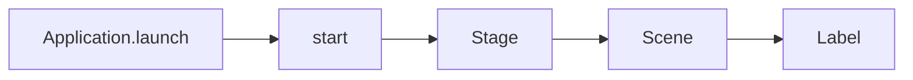

# EP 3.1 — JavaFX, Maven, Stage และ Scene

## สิ่งที่จะทำ

- สร้างโปรเจกต์ฝึกใน `practice/smart-factory-dashboard`
- ให้ Maven จัดการ JavaFX โดยไม่ต้องหาไฟล์ JAR เอง
- เปิดหน้าต่างแรกด้วย `Application`, `Stage` และ `Scene`



## 1. สร้างโฟลเดอร์

เปิด Terminal ที่โฟลเดอร์หลักของ Repository แล้วรัน:

```powershell
New-Item -ItemType Directory -Force practice/smart-factory-dashboard/src/main/java/smartfactory/desktop
```

โฟลเดอร์ `practice` มีไว้ทำตามคลิปบนเครื่องและถูก `.gitignore` ไว้แล้ว

## 2. สร้าง `pom.xml`

สร้างไฟล์ `practice/smart-factory-dashboard/pom.xml`:

```xml
<?xml version="1.0" encoding="UTF-8"?>
<project xmlns="http://maven.apache.org/POM/4.0.0">
    <modelVersion>4.0.0</modelVersion>
    <groupId>com.kopesolution</groupId>
    <artifactId>smart-factory-dashboard-practice</artifactId>
    <version>1.0-SNAPSHOT</version>

    <properties>
        <maven.compiler.release>21</maven.compiler.release>
        <project.build.sourceEncoding>UTF-8</project.build.sourceEncoding>
        <javafx.version>21.0.10</javafx.version>
    </properties>

    <dependencies>
        <dependency>
            <groupId>org.openjfx</groupId>
            <artifactId>javafx-controls</artifactId>
            <version>${javafx.version}</version>
        </dependency>
    </dependencies>

    <build>
        <plugins>
            <plugin>
                <groupId>org.apache.maven.plugins</groupId>
                <artifactId>maven-compiler-plugin</artifactId>
                <version>3.13.0</version>
                <configuration>
                    <release>${maven.compiler.release}</release>
                    <encoding>${project.build.sourceEncoding}</encoding>
                </configuration>
            </plugin>
            <plugin>
                <groupId>org.openjfx</groupId>
                <artifactId>javafx-maven-plugin</artifactId>
                <version>0.0.8</version>
                <configuration>
                    <mainClass>smartfactory.desktop.DashboardApp</mainClass>
                </configuration>
            </plugin>
        </plugins>
    </build>
</project>
```

## 3. สร้างหน้าต่างแรก

สร้างไฟล์ `practice/smart-factory-dashboard/src/main/java/smartfactory/desktop/DashboardApp.java`:

```java
package smartfactory.desktop;

import javafx.application.Application;
import javafx.scene.Scene;
import javafx.scene.control.Label;
import javafx.scene.layout.StackPane;
import javafx.stage.Stage;

public class DashboardApp extends Application {
    @Override
    public void start(Stage stage) {
        Label title = new Label("Smart Factory Dashboard");
        Scene scene = new Scene(new StackPane(title), 960, 600);

        stage.setTitle("KOPE SOLUTION — Smart Factory");
        stage.setScene(scene);
        stage.show();
    }

    public static void main(String[] args) {
        launch(args);
    }
}
```

`Stage` คือหน้าต่างหลัก ส่วน `Scene` คือพื้นที่ภายในหน้าต่างที่เก็บ UI Component

## 4. รัน

รันจากโฟลเดอร์หลักของ Repository:

```powershell
.\mvnw.cmd -f .\practice\smart-factory-dashboard\pom.xml javafx:run
```

ผลที่ต้องเห็น: หน้าต่างขนาด 960 × 600 และข้อความ `Smart Factory Dashboard` อยู่กลางจอ

## Challenge

เปลี่ยนชื่อหน้าต่างเป็นชื่อโรงงานของคุณ แล้วปรับขนาดเป็น 1100 × 700

ถัดไป: [EP 3.2 — Layout Pane](ep02-layout-pane.md)
