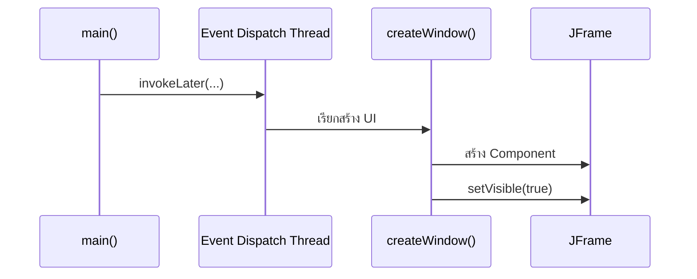

# EP 3.1 — Swing, JFrame และ Event Dispatch Thread

## เป้าหมาย

- สร้างไฟล์เริ่มต้นของ Desktop App
- เปิดและปิดหน้าต่าง `JFrame`
- กำหนดชื่อ ขนาด และตำแหน่งหน้าต่าง
- สร้าง UI บน Event Dispatch Thread

Playlist 3 จะใช้ไฟล์ Java แบบไม่ใส่ `package` เหมือน Playlist ก่อนหน้า ให้เก็บไฟล์ที่ทำตามบทเรียนทั้งหมดไว้ในโฟลเดอร์เดียวกันเพื่อให้ Compile และ Run ด้วยคำสั่งชุดเดียวได้

EP3.1 สร้างเพียงไฟล์เดียวคือ `FirstWindow.java` และไฟล์นี้จะถูกพัฒนาต่อจนถึง EP3.9

## ภาพรวมการเปิดหน้าต่าง



Swing Component ถูกสร้างและแก้ไขบน EDT

## 1. สร้างไฟล์ FirstWindow.java

สร้างไฟล์ใหม่ชื่อ `FirstWindow.java` แล้ววาง Import ไว้บนสุด:

```java
import javax.swing.JFrame;
import javax.swing.JLabel;
import javax.swing.SwingConstants;
import javax.swing.SwingUtilities;
```

Import ต้องอยู่เหนือ `public class FirstWindow`

## 2. สร้าง main()

วาง Class ต่อจาก Import:

```java
public class FirstWindow {
    public static void main(String[] args) {
        SwingUtilities.invokeLater(() -> createWindow());
    }

    // เพิ่ม createWindow() ในส่วนถัดไป
}
```

`SwingUtilities.invokeLater(...)` ส่งงานสร้างหน้าต่างไปยัง Event Dispatch Thread หรือ EDT ซึ่งเป็น Thread หลักสำหรับสร้างและแก้ Swing Component

## 3. เพิ่ม createWindow()

วาง Method นี้ภายใน Class แต่ให้อยู่นอก `main` โดยแทนที่บรรทัด Comment เดิม:

```java
private static void createWindow() {
    JFrame frame = new JFrame("Smart Factory");
    frame.setDefaultCloseOperation(JFrame.EXIT_ON_CLOSE);
    frame.setSize(600, 400);
    frame.setLocationRelativeTo(null);
    frame.setVisible(true);
}
```

- `setDefaultCloseOperation(...)` กำหนดสิ่งที่จะเกิดเมื่อปิดหน้าต่าง
- `setSize(...)` กำหนดความกว้างและความสูง
- `setLocationRelativeTo(null)` จัดหน้าต่างไว้กึ่งกลางหน้าจอ
- `setVisible(true)` ต้องอยู่หลังการเพิ่ม Component

## 4. Compile และเปิดหน้าต่างครั้งแรก

เปิด Terminal ในโฟลเดอร์เดียวกับ `FirstWindow.java`:

```powershell
javac -encoding UTF-8 FirstWindow.java
java "-Dfile.encoding=UTF-8" FirstWindow
```

ผลที่ต้องเห็นคือหน้าต่างว่างชื่อ `Smart Factory` ขนาด 600×400 เมื่อปิดหน้าต่างแล้ว Terminal จึงกลับมารับคำสั่งต่อ

## 5. เพิ่มข้อความตรงกลาง

วางบรรทัดนี้ภายใน `createWindow()` ก่อน `frame.setVisible(true);`:

```java
frame.add(new JLabel("Machine Monitor", SwingConstants.CENTER));
```

Compile และ Run ด้วยคำสั่งเดิม คราวนี้ต้องเห็นข้อความ `Machine Monitor` อยู่ตรงกลางหน้าต่าง

งานที่ใช้เวลานาน เช่น Database, HTTP หรือ MQTT ไม่ควรทำค้างบน EDT เพราะหน้าต่างจะกดไม่ได้และดูเหมือนโปรแกรมค้าง การแยกงานลักษณะนี้จะทำใน EP3.9

## ตรวจความพร้อมก่อนเข้า EP 3.2

- มีไฟล์ `FirstWindow.java`
- `main()` เรียก `SwingUtilities.invokeLater(...)`
- `createWindow()` อยู่ภายใน Class แต่นอก `main`
- เปิดหน้าต่างและปิดโปรแกรมได้
- เห็นข้อความ `Machine Monitor` ตรงกลาง

## Challenge

ทดลองเปลี่ยนทีละค่าแล้ว Run ใหม่:

1. ชื่อหน้าต่าง
2. ขนาดหน้าต่าง
3. ข้อความตรงกลาง
4. เปลี่ยน `EXIT_ON_CLOSE` เป็น `DISPOSE_ON_CLOSE` แล้วสังเกตความแตกต่าง

ถัดไป: [EP 3.2 — JPanel และ Layout Manager](ep02-jpanel-layout.md)
