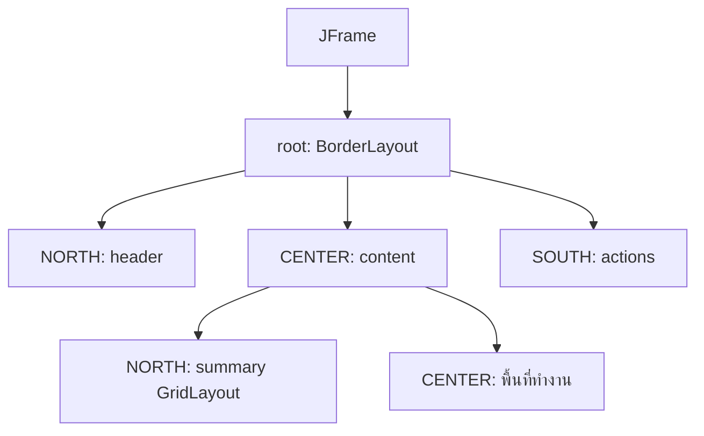

# EP 3.2 — JPanel และ Layout Manager

## เป้าหมาย

- แบ่งหน้าต่างเป็น Panel ย่อย
- ใช้ `BorderLayout`, `GridLayout` และ `FlowLayout`
- เตรียมพื้นที่ Header, Summary, Content และ Action
- หลีกเลี่ยงการกำหนดตำแหน่ง Component ด้วย Pixel

ทำงานต่อใน `FirstWindow.java` จาก EP3.1 โดยยังไม่สร้างไฟล์ใหม่

## ภาพรวม Layout



Panel ใหญ่แบ่งพื้นที่ แล้ว Panel ย่อยจัด Component ภายในอีกชั้น

## 1. เพิ่ม Import

วาง Import ต่อไปนี้รวมกับ Import เดิมเหนือ Class:

```java
import java.awt.BorderLayout;
import java.awt.FlowLayout;
import java.awt.GridLayout;
import javax.swing.JButton;
import javax.swing.JPanel;
```

## 2. ลบข้อความกลางเดิม

ลบบรรทัดนี้ออกจาก `createWindow()`:

```java
frame.add(new JLabel("Machine Monitor", SwingConstants.CENTER));
```

ขั้นตอนนี้เปลี่ยนจากการวาง Component เดียวเป็น Dashboard ที่มีหลาย Panel

## 3. สร้าง Root Panel

วางโค้ดต่อไปนี้หลัง `frame.setLocationRelativeTo(null);` และก่อน `frame.setVisible(true);`:

```java
JPanel root = new JPanel(new BorderLayout(10, 10));
frame.add(root);
```

`BorderLayout` แบ่งพื้นที่เป็น `NORTH`, `SOUTH`, `EAST`, `WEST` และ `CENTER`

## 4. เพิ่ม Header

วางต่อจากการสร้าง `root`:

```java
JPanel header = new JPanel();
header.add(new JLabel("SMART FACTORY MACHINE MONITOR"));
root.add(header, BorderLayout.NORTH);
```

## 5. เตรียมพื้นที่ตรงกลาง

สร้าง `content` เพื่อรองรับ Summary และ Component ที่จะเพิ่มใน EP ถัดไป:

```java
JPanel content = new JPanel(new BorderLayout(10, 10));
root.add(content, BorderLayout.CENTER);
```

## 6. เพิ่ม Summary

วางต่อจาก `content`:

```java
JPanel summary = new JPanel(new GridLayout(1, 3, 10, 0));
summary.add(new JLabel("Total: 0", SwingConstants.CENTER));
summary.add(new JLabel("Running: 0", SwingConstants.CENTER));
summary.add(new JLabel("Warning: 0", SwingConstants.CENTER));
content.add(summary, BorderLayout.NORTH);
```

`GridLayout(1, 3)` หมายถึงหนึ่งแถว สามช่อง และทุกช่องมีขนาดเท่ากัน

## 7. เพิ่มแถวปุ่ม

วางต่อจาก Summary:

```java
JPanel actions = new JPanel(new FlowLayout(FlowLayout.LEFT));

JButton addButton = new JButton("Add");
JButton updateButton = new JButton("Update Sensor");

actions.add(addButton);
actions.add(updateButton);
root.add(actions, BorderLayout.SOUTH);
```

ประกาศปุ่มเป็นตัวแปร เพื่อให้ EP ถัดไปนำตัวแปรเหล่านี้ไปผูก Event

## 8. Compile และ Run

```powershell
javac -encoding UTF-8 FirstWindow.java
java -Dfile.encoding=UTF-8 FirstWindow
```

ผลที่ต้องเห็น:

- Header อยู่ด้านบน
- Summary สามช่องอยู่ถัดลงมา
- ปุ่ม Add และ Update Sensor อยู่ด้านล่าง
- พื้นที่ตรงกลางยังว่างสำหรับ Form และ Table

## จุดที่มักสับสน

- ทุกส่วนใน EP นี้วางภายใน `createWindow()`
- Import วางเหนือ Class ไม่ใช่ภายใน Method
- ต้องมี `frame.add(root);` เพียงครั้งเดียว
- `frame.setVisible(true);` ต้องเป็นบรรทัดท้ายของ `createWindow()`

## Challenge

1. เปลี่ยน Summary เป็นสี่ช่องด้วย `new GridLayout(1, 4, 10, 0)`
2. เพิ่ม `Maintenance: 0`
3. สร้างปุ่ม `Delete` และเพิ่มลงใน `actions`

ถัดไป: [EP 3.3 — Form Components](ep03-form-components.md)
