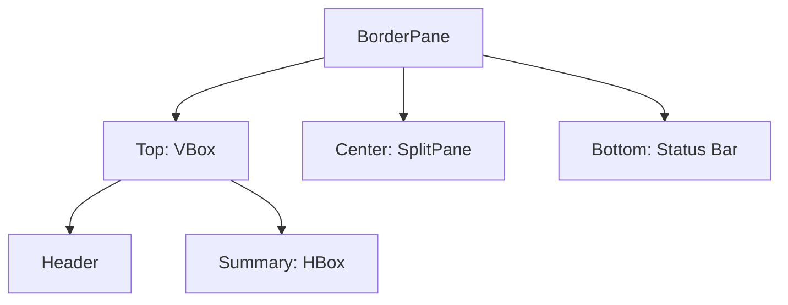

# EP 3.2 — จัดหน้าจอด้วย Layout Pane

## สิ่งที่จะทำ

แบ่ง Dashboard เป็น Header, Summary, Content และ Status Bar โดยยังไม่รีบใส่ข้อมูลจริง



## 1. เปลี่ยน Root Layout

ใน `DashboardApp.java` เพิ่ม Import:

```java
import javafx.geometry.Insets;
import javafx.scene.layout.BorderPane;
import javafx.scene.layout.HBox;
import javafx.scene.layout.VBox;
```

ภายใน `start()` แทนที่การสร้าง `Scene` เดิมด้วย:

```java
BorderPane root = new BorderPane();
root.setPadding(new Insets(20));
root.setTop(buildTopArea());
root.setCenter(new Label("พื้นที่ตารางและแบบฟอร์ม"));
root.setBottom(new Label("พร้อมใช้งาน"));

Scene scene = new Scene(root, 1100, 700);
```

## 2. เพิ่ม Method สร้างส่วนบน

วาง Method นี้ใต้ `start()` แต่ยังอยู่ใน Class:

```java
private VBox buildTopArea() {
    Label title = new Label("SMART FACTORY DASHBOARD");

    HBox summary = new HBox(12);
    summary.getChildren().addAll(
            new Label("ทั้งหมด: 0"),
            new Label("กำลังทำงาน: 0"),
            new Label("Sensor ผิดปกติ: 0")
    );

    return new VBox(12, title, summary);
}
```

`BorderPane` จัดพื้นที่หลัก ส่วน `VBox` วางแนวตั้ง และ `HBox` วางแนวนอน

## 3. รัน

```powershell
.\mvnw.cmd -f .\practice\smart-factory-dashboard\pom.xml javafx:run
```

ผลที่ต้องเห็น: ชื่อและ Summary อยู่ด้านบน ข้อความ Content อยู่กลางจอ และสถานะอยู่ด้านล่าง

## Challenge

เพิ่ม Summary `หยุดฉุกเฉิน: 0` โดยยังไม่ต้องเขียน Logic

ถัดไป: [EP 3.3 — JavaFX CSS](ep03-css-theme.md)
