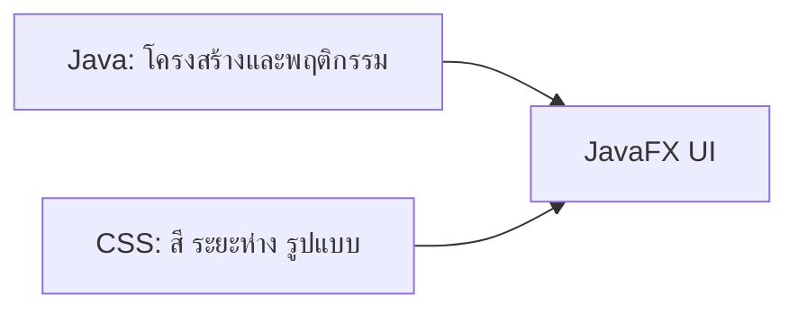

# EP 3.3 — สร้าง Theme ด้วย JavaFX CSS

## สิ่งที่จะทำ

- แยกรูปแบบหน้าจอออกจาก Java
- กำหนดสีและ Class ให้ Header กับ Summary Card



## 1. สร้างไฟล์ CSS

สร้างโฟลเดอร์และไฟล์ `practice/smart-factory-dashboard/src/main/resources/smartfactory/desktop/dashboard.css`:

```css
.root {
    -fx-font-family: "Leelawadee UI", "Tahoma", sans-serif;
    -fx-background-color: #0f172a;
}

.header-title {
    -fx-font-size: 26px;
    -fx-font-weight: bold;
    -fx-text-fill: #f8fafc;
}

.summary-card {
    -fx-padding: 14px 22px;
    -fx-background-color: #1e293b;
    -fx-background-radius: 10px;
    -fx-text-fill: #e2e8f0;
}

.status-bar {
    -fx-padding: 10px 0 0 0;
    -fx-text-fill: #93c5fd;
}
```

## 2. ใส่ Style Class

ใน `buildTopArea()` หลังสร้าง `title`:

```java
title.getStyleClass().add("header-title");
```

เปลี่ยนส่วนสร้าง Summary เป็น:

```java
Label total = new Label("ทั้งหมด: 0");
Label running = new Label("กำลังทำงาน: 0");
Label warning = new Label("แจ้งเตือน: 0");
Label emergency = new Label("หยุดฉุกเฉิน: 0");

total.getStyleClass().add("summary-card");
running.getStyleClass().add("summary-card");
warning.getStyleClass().add("summary-card");
emergency.getStyleClass().add("summary-card");

HBox summary = new HBox(12, total, running, warning, emergency);
```

เก็บ Label ด้านล่างไว้ในตัวแปรและใส่ Class:

```java
Label status = new Label("พร้อมใช้งาน");
status.getStyleClass().add("status-bar");
root.setBottom(status);
```

## 3. โหลด CSS

หลังสร้าง `Scene`:

```java
scene.getStylesheets().add(
        getClass().getResource("dashboard.css").toExternalForm()
);
```

## 4. รัน

```powershell
.\mvnw.cmd -f .\practice\smart-factory-dashboard\pom.xml javafx:run
```

ผลที่ต้องเห็น: พื้นหลังสีน้ำเงินเข้ม ตัวอักษรไทยไม่เพี้ยน และ Summary เป็น Card

## Challenge

สร้าง Class `.summary-warning` ให้ Card แจ้งเตือนใช้สีส้ม แล้วเพิ่ม Class นี้ให้ `warning`

ถัดไป: [EP 3.4 — Controls และ Form](ep04-controls-form.md)
