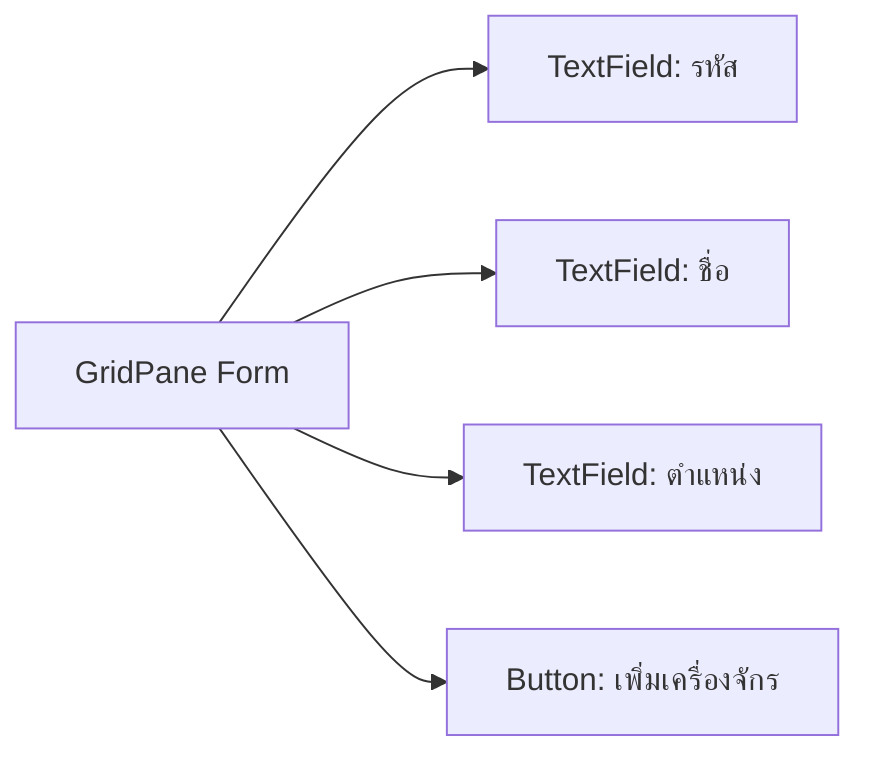

# EP 3.4 — สร้าง Form ด้วย JavaFX Controls

## สิ่งที่จะทำ

เพิ่มช่องรหัส ชื่อ ตำแหน่ง และปุ่มบันทึก โดยแยก Method สร้าง Form ออกจาก `start()`



## 1. เพิ่ม Field ของ Class

วางใต้บรรทัดประกาศ Class:

```java
private final TextField idField = new TextField();
private final TextField nameField = new TextField();
private final TextField locationField = new TextField();
private final Button addButton = new Button("เพิ่มเครื่องจักร");
private final Label statusLabel = new Label("พร้อมใช้งาน");
```

เพิ่ม Import:

```java
import javafx.scene.control.Button;
import javafx.scene.control.TextField;
import javafx.scene.layout.GridPane;
```

## 2. เพิ่ม Method สร้าง Form

```java
private GridPane buildMachineForm() {
    idField.setPromptText("เช่น M-001");
    nameField.setPromptText("เช่น Conveyor Motor");
    locationField.setPromptText("เช่น Production Line A");

    GridPane form = new GridPane();
    form.setHgap(10);
    form.setVgap(10);
    form.setPadding(new Insets(24));
    form.addRow(0, new Label("รหัส"), idField);
    form.addRow(1, new Label("ชื่อเครื่องจักร"), nameField);
    form.addRow(2, new Label("ตำแหน่ง"), locationField);
    form.add(addButton, 1, 3);
    return form;
}
```

## 3. นำ Form ไปวางกลางหน้าจอ

ใน `start()` เปลี่ยน Center และ Bottom เป็น:

```java
root.setCenter(buildMachineForm());
statusLabel.getStyleClass().add("status-bar");
root.setBottom(statusLabel);
```

## 4. รัน

```powershell
.\mvnw.cmd -f .\practice\smart-factory-dashboard\pom.xml javafx:run
```

ผลที่ต้องเห็น: Form สามช่องและปุ่มหนึ่งปุ่ม ปุ่มยังไม่ทำงานเพราะจะผูก Event ใน EP ถัดไป

## Challenge

เพิ่ม `TextField` สำหรับอุณหภูมิ พร้อมข้อความแนะนำ `เช่น 72.5`

ถัดไป: [EP 3.5 — Event, Property และ Binding](ep05-event-binding.md)
