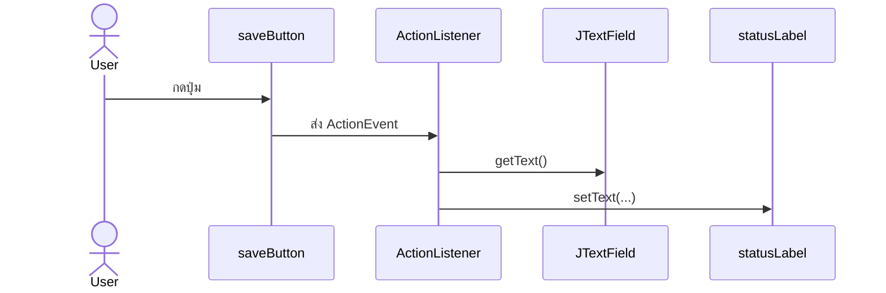

# EP 3.4 — Event-driven Programming และ Listener

## เป้าหมาย

- ให้ปุ่มตอบสนองเมื่อผู้ใช้กด
- อ่านค่าจาก `JTextField`
- เปลี่ยนข้อความบนหน้าจอ
- เข้าใจว่า Lambda ทำงานเมื่อ Event เกิดขึ้น

ทำงานต่อใน `createWindow()` ของ `FirstWindow.java` โดยใช้ `saveButton` และ TextField จาก EP3.3

Desktop App จะเปิดหน้าต่างแล้วรอ Event จากผู้ใช้ ต่างจาก Console App ที่ทำงานจากบนลงล่างแล้วจบ

## ภาพรวม Event



โค้ดใน Listener ทำงานเมื่อ Event เกิด ไม่ได้ทำงานตอนสร้างปุ่ม

## 1. เพิ่ม Label แสดงผล

วางหลังส่วนที่สร้าง `actions` และปุ่มใน EP3.2:

```java
JLabel statusLabel = new JLabel("ยังไม่มีข้อมูล");
actions.add(statusLabel);
```

หากส่วน `actions` อยู่ก่อนส่วน Form โค้ดยังทำงานได้ เพราะตัวแปรทั้งหมดอยู่ภายใน `createWindow()` เดียวกัน

## 2. ผูก Event กับปุ่ม Save

วางโค้ดนี้หลังจากสร้าง `idField`, `nameField`, `locationField`, `saveButton` และ `statusLabel` ครบแล้ว แต่ยังอยู่ก่อน `frame.setVisible(true);`:

```java
saveButton.addActionListener(event -> {
    String id = idField.getText().trim();
    String name = nameField.getText().trim();
    String location = locationField.getText().trim();

    statusLabel.setText(
            "บันทึก " + id + " | " + name + " | " + location
    );
});
```

โค้ดภายใน Lambda ยังไม่ทำงานตอนสร้างปุ่ม แต่จะทำงานเมื่อผู้ใช้กด `saveButton`

## 3. Compile และทดลอง Event

```powershell
javac -encoding UTF-8 FirstWindow.java
java -Dfile.encoding=UTF-8 FirstWindow
```

ทดลองตามลำดับ:

1. กรอกรหัส ชื่อ และตำแหน่ง
2. กดปุ่มบันทึก
3. ตรวจว่า `statusLabel` เปลี่ยนตามข้อมูลที่กรอก
4. แก้ข้อมูลแล้วกดอีกครั้งเพื่อดูผลใหม่

## 4. ผูกปุ่ม Add ให้ Focus ช่องรหัส

ใช้ `addButton` จาก EP3.2 ทดลอง Event อีกแบบ:

```java
addButton.addActionListener(event -> idField.requestFocusInWindow());
```

เมื่อกด Add เคอร์เซอร์จะย้ายไปที่ช่องรหัส ปุ่มนี้จะถูกเปลี่ยนให้เปิด Dialog ใน EP3.5

## จุดที่มักสับสน

- Listener ต้องวางหลังประกาศ Component ที่ Lambda ต้องใช้
- `getText()` อ่านข้อความจาก TextField
- `setText(...)` เปลี่ยนข้อความของ Label หรือ TextField
- Parameter `event` คือข้อมูล Event ที่ Swing ส่งเข้ามา แม้ตัวอย่างนี้ยังไม่ได้อ่านค่าจากมัน

## ตรวจความพร้อมก่อนเข้า EP 3.5

- ปุ่ม Save มี `addActionListener(...)`
- กด Save แล้ว `statusLabel` เปลี่ยน
- ปุ่ม Add ย้าย Focus ไปช่องรหัสได้
- ไม่มี Listener ของปุ่มเดียวกันที่ทำงานซ้ำโดยไม่ตั้งใจ

## Challenge

สร้างปุ่ม Clear และเพิ่มลงใน `actions`:

```java
JButton clearButton = new JButton("Clear");
actions.add(clearButton);
```

จากนั้นผูก Event ให้ล้าง TextField ทีละช่องด้วย `setText("")` และเปลี่ยน `statusLabel` กลับเป็น `ยังไม่มีข้อมูล`

ถัดไป: [EP 3.5 — JOptionPane และ Validation](ep05-dialog-validation.md)
