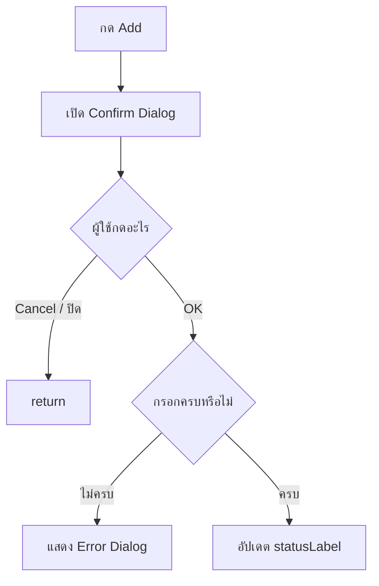

# EP 3.5 — JOptionPane และ Validation

## เป้าหมาย

- เปิด Form ใน Popup ด้วย `JOptionPane`
- แยกการกด OK ออกจาก Cancel
- ตรวจช่องว่างก่อนรับข้อมูล
- แยกโค้ด Dialog ออกจาก `createWindow()`

ทำงานต่อใน `FirstWindow.java` และยังไม่เชื่อม `SmartFactoryService` ใน EP นี้

## ภาพรวม Dialog และ Validation



## 1. เพิ่ม Import

วางรวมกับ Import เดิมเหนือ Class:

```java
import javax.swing.JOptionPane;
```

## 2. เปลี่ยน Event ของปุ่ม Add

ลบ Listener เดิมที่ใช้ `requestFocusInWindow()` จาก EP3.4:

```java
addButton.addActionListener(event -> idField.requestFocusInWindow());
```

แล้ววาง Listener ใหม่แทน:

```java
addButton.addActionListener(event -> showAddDialog(frame, statusLabel));
```

Method `showAddDialog(...)` ยังไม่ถูกสร้าง ให้เพิ่มในส่วนถัดไป

## 3. สร้าง Method showAddDialog()

วาง Method นี้ภายใน `FirstWindow` แต่ให้อยู่นอก `createWindow()`:

```java
private static void showAddDialog(JFrame frame, JLabel statusLabel) {
    JTextField dialogIdField = new JTextField(15);
    JTextField dialogNameField = new JTextField(15);
    JTextField dialogLocationField = new JTextField(15);

    JPanel dialogForm = new JPanel(new GridLayout(3, 2, 10, 10));
    dialogForm.add(new JLabel("รหัส:"));
    dialogForm.add(dialogIdField);
    dialogForm.add(new JLabel("ชื่อเครื่องจักร:"));
    dialogForm.add(dialogNameField);
    dialogForm.add(new JLabel("ตำแหน่ง:"));
    dialogForm.add(dialogLocationField);

    // เปิด Dialog ในส่วนถัดไป
}
```

Dialog ใช้ TextField ชุดใหม่ ไม่ได้นำ `form` ที่แสดงอยู่บนหน้าต่างมาใช้ซ้ำ จึงไม่เกิดปัญหา Component ถูกย้ายออกจากหน้าต่างเดิม

## 4. เปิด Confirm Dialog

แทนที่ Comment `// เปิด Dialog ในส่วนถัดไป` ด้วย:

```java
int answer = JOptionPane.showConfirmDialog(
        frame,
        dialogForm,
        "เพิ่มเครื่องจักร",
        JOptionPane.OK_CANCEL_OPTION,
        JOptionPane.PLAIN_MESSAGE
);

if (answer != JOptionPane.OK_OPTION) {
    return;
}
```

เมื่อผู้ใช้กด Cancel หรือปิด Dialog Method จะ `return` ทันทีและไม่รับข้อมูล

## 5. ตรวจช่องว่าง

วางต่อจาก `if` ที่ตรวจปุ่ม:

```java
String id = dialogIdField.getText().trim();
String name = dialogNameField.getText().trim();
String location = dialogLocationField.getText().trim();

if (id.isBlank() || name.isBlank() || location.isBlank()) {
    JOptionPane.showMessageDialog(
            frame,
            "กรุณากรอกข้อมูลให้ครบ",
            "ข้อมูลไม่ถูกต้อง",
            JOptionPane.ERROR_MESSAGE
    );
    return;
}

statusLabel.setText("พร้อมเพิ่ม " + id + " | " + name + " | " + location);
```

UI Validation ช่วยให้ผู้ใช้แก้ข้อมูลได้ทันที แต่ Model และ Service ยังต้องตรวจ Business Rule ซ้ำ เพราะอาจถูกเรียกจาก Console, Test หรือ API ได้

## 6. Compile และ Run

```powershell
javac -encoding UTF-8 FirstWindow.java
java -Dfile.encoding=UTF-8 FirstWindow
```

ทดลองสามกรณี:

1. กด Cancel — ข้อความเดิมต้องไม่เปลี่ยน
2. กด OK โดยเว้นช่องว่าง — ต้องเห็น Error Dialog
3. กรอกครบแล้วกด OK — `statusLabel` ต้องแสดงข้อมูล

## ตรวจความพร้อมก่อนเข้า EP 3.6

- ปุ่ม Add เรียก `showAddDialog(...)`
- Dialog ใช้ TextField ชุดของตัวเอง
- กด Cancel แล้ว Method หยุดด้วย `return`
- ช่องว่างแสดง Error Dialog
- Compile และ Run ได้โดยไม่มี Error

## Challenge

เพิ่มช่องอุณหภูมิใน Dialog แล้วแปลงข้อความเป็น `double`:

```java
try {
    double temperature = Double.parseDouble(temperatureField.getText().trim());
    statusLabel.setText("Temperature: " + temperature);
} catch (NumberFormatException exception) {
    JOptionPane.showMessageDialog(
            frame,
            "กรุณากรอกอุณหภูมิเป็นตัวเลข",
            "ข้อมูลไม่ถูกต้อง",
            JOptionPane.ERROR_MESSAGE
    );
}
```

อย่าลืมเพิ่มจำนวนแถวของ `GridLayout` ให้ตรงกับช่องกรอกใน Dialog

ถัดไป: [EP 3.6 — JTable และ TableModel](ep06-jtable.md)
