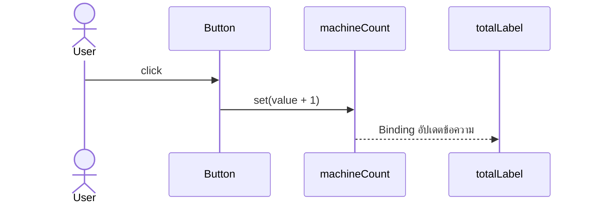

# EP 3.5 — Event, Property และ Binding

## สิ่งที่จะทำ

- ให้ปุ่มตอบสนองด้วย Event Handler
- ใช้ JavaFX Property เก็บจำนวนเครื่องจักร
- Bind ข้อความ Summary ให้เปลี่ยนตาม Property อัตโนมัติ



## 1. เพิ่ม Property

เพิ่ม Import และ Field:

```java
import javafx.beans.property.IntegerProperty;
import javafx.beans.property.SimpleIntegerProperty;

private final IntegerProperty machineCount = new SimpleIntegerProperty(0);
private final Label totalLabel = new Label();
```

ใน `buildTopArea()` ใช้ `totalLabel` แทน Label จำนวนทั้งหมดเดิม แล้ว Bind:

```java
totalLabel.textProperty().bind(machineCount.asString("ทั้งหมด: %d"));
totalLabel.getStyleClass().add("summary-card");
```

## 2. ผูก Event ให้ปุ่ม

ใน `buildMachineForm()` ก่อน `return form;`:

```java
addButton.setOnAction(event -> handleAddMachine());
```

เพิ่ม Method ใหม่:

```java
private void handleAddMachine() {
    machineCount.set(machineCount.get() + 1);
    statusLabel.setText("รับข้อมูลจาก " + nameField.getText());
}
```

`setOnAction(...)` รับ Lambda ที่จะทำงานเมื่อกดปุ่ม ส่วน Label จำนวนทั้งหมดไม่ต้องเรียก `setText()` เพราะ Binding ดูแลให้

## 3. รันและทดลอง

```powershell
.\mvnw.cmd -f .\practice\smart-factory-dashboard\pom.xml javafx:run
```

กรอกชื่อแล้วกดปุ่ม 2 ครั้ง ผลที่ต้องเห็นคือ Summary เปลี่ยนเป็น `ทั้งหมด: 2`

## Challenge

หลังเพิ่มจำนวน ให้ล้าง `idField`, `nameField` และ `locationField` ด้วย `clear()`

ถัดไป: [EP 3.6 — Validation และ Alert](ep06-validation-alert.md)
