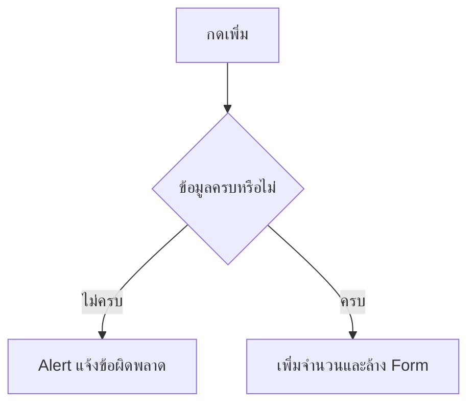

# EP 3.6 — Validation และ Alert

## สิ่งที่จะทำ

ตรวจข้อมูลก่อนเพิ่มเครื่องจักร และแจ้งผู้ใช้ด้วย Popup ภาษาไทยที่อ่านได้ชัดเจน



## 1. เพิ่ม Method ตรวจข้อความ

```java
private String requireText(TextField field, String message) {
    String value = field.getText().trim();
    if (value.isBlank()) {
        throw new IllegalArgumentException(message);
    }
    return value;
}
```

## 2. แก้ Event Handler

แทนที่ `handleAddMachine()` เดิม:

```java
private void handleAddMachine() {
    try {
        String id = requireText(idField, "กรุณากรอกรหัสเครื่องจักร");
        String name = requireText(nameField, "กรุณากรอกชื่อเครื่องจักร");
        requireText(locationField, "กรุณากรอกตำแหน่ง");

        machineCount.set(machineCount.get() + 1);
        statusLabel.setText("เพิ่ม " + id + " — " + name + " แล้ว");
        idField.clear();
        nameField.clear();
        locationField.clear();
    } catch (IllegalArgumentException exception) {
        showError(exception.getMessage());
    }
}
```

## 3. สร้าง Alert

เพิ่ม Import:

```java
import javafx.scene.control.Alert;
import javafx.scene.control.ButtonType;
```

เพิ่ม Method:

```java
private void showError(String message) {
    Alert alert = new Alert(Alert.AlertType.ERROR, message, ButtonType.OK);
    alert.setHeaderText("ข้อมูลไม่ถูกต้อง");
    alert.showAndWait();
}
```

## 4. ทดลองสองกรณี

```powershell
.\mvnw.cmd -f .\practice\smart-factory-dashboard\pom.xml javafx:run
```

- กดปุ่มโดยไม่กรอกข้อมูล ต้องเห็น Alert ภาษาไทย
- กรอกครบแล้วกดปุ่ม จำนวนต้องเพิ่มและ Form ต้องถูกล้าง

หากภาษาไทยใน Source เพี้ยน ให้ตรวจว่า Editor บันทึกไฟล์เป็น UTF-8 ส่วน JavaFX จะเลือก Font ไทยที่ Windows มีให้โดยอัตโนมัติเมื่อ Font หลักไม่มี Glyph

## Challenge

เพิ่มการตรวจว่ารหัสต้องขึ้นต้นด้วย `M-` ถ้าไม่ผ่านให้แสดง Alert

ถัดไป: [EP 3.7 — TableView และ ObservableList](ep07-tableview-observablelist.md)
