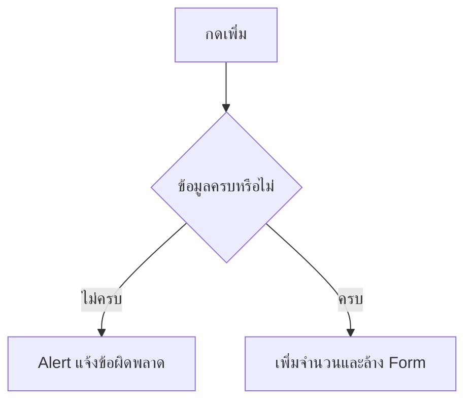

# EP 3.6 — Validation และ Alert

## สิ่งที่จะทำ

ตรวจข้อมูลก่อนเพิ่มเครื่องจักร และแจ้งผู้ใช้ด้วย Popup ภาษาไทยที่อ่านได้ชัดเจน

EP นี้แก้ไฟล์ `practice/smart-factory-dashboard/src/main/java/smartfactory/desktop/DashboardApp.java`

## 1. เตรียมค่า Summary ก่อนเริ่ม

ก่อนเพิ่ม Validation ให้ตรวจค่าบน Summary ก่อน หากยังเห็น `กำลังทำงาน: 5` หรือ `Sensor ผิดปกติ: 1` ให้แก้ค่าตัวอย่างใน `buildTopArea()` เป็น:

```java
Label running = new Label("กำลังทำงาน: 0");
Label warning = new Label("Sensor ผิดปกติ: 0");
Label emergency = new Label("หยุดฉุกเฉิน: 0");
```

เมื่อเปิดโปรแกรมและยังไม่ได้เพิ่มเครื่องจักร Summary ทั้งสี่รายการต้องเริ่มต้นที่ `0`



## 2. เพิ่ม Method ตรวจข้อความ

เปิด `practice/smart-factory-dashboard/src/main/java/smartfactory/desktop/DashboardApp.java` แล้วเพิ่ม Method นี้ภายใน Class โดยวางก่อน `handleAddMachine()`:

```java
private String requireText(TextField field, String message) {
    String value = field.getText().trim();
    if (value.isBlank()) {
        throw new IllegalArgumentException(message);
    }
    return value;
}
```

## 3. แก้ Event Handler

ในไฟล์ `DashboardApp.java` แทนที่ `handleAddMachine()` เดิมทั้ง Method:

```java
private void handleAddMachine() {
    try {
        String id = requireText(idField, "กรุณากรอกรหัสเครื่องจักร");
        String name = requireText(nameField, "กรุณากรอกชื่อเครื่องจักร");
        requireText(locationField, "กรุณากรอกตำแหน่ง");

        machineCount.set(machineCount.get() + 1);
        statusLabel.setText("เพิ่ม " + id + " — " + name + " แล้ว");
        idField.clear();
        nameField.clear();
        locationField.clear();
    } catch (IllegalArgumentException exception) {
        showError(exception.getMessage());
    }
}
```

Method ใหม่นี้ยังคงการเพิ่ม `machineCount`, อัปเดต `statusLabel` และล้าง Form จาก EP 3.5 ไว้ แต่ครอบด้วย Validation เพื่อไม่ให้จำนวนเพิ่มเมื่อข้อมูลไม่ครบ

หากทำ Challenge เพิ่ม `temperatureField` จาก EP 3.4 ให้เพิ่มการตรวจและล้างช่องนั้นด้วย:

```java
requireText(temperatureField, "กรุณากรอกอุณหภูมิ");
// หลังเพิ่มข้อมูลสำเร็จ
temperatureField.clear();
```

## 4. สร้าง Alert

เพิ่ม Import ด้านบนของ `DashboardApp.java` ต่อจาก Import เดิม:

```java
import javafx.scene.control.Alert;
import javafx.scene.control.ButtonType;
```

เพิ่ม Method นี้ภายใน Class โดยวางต่อจาก `handleAddMachine()`:

```java
private void showError(String message) {
    Alert alert = new Alert(Alert.AlertType.ERROR, message, ButtonType.OK);
    alert.setHeaderText("ข้อมูลไม่ถูกต้อง");
    alert.showAndWait();
}
```

## 5. ทดลองสองกรณี

```powershell
.\mvnw.cmd -f .\practice\smart-factory-dashboard\pom.xml javafx:run
```

- กดปุ่มโดยไม่กรอกข้อมูล ต้องเห็น Alert ภาษาไทย
- กรอกครบแล้วกดปุ่ม จำนวนต้องเพิ่มและ Form ต้องถูกล้าง

หากภาษาไทยใน Source เพี้ยน ให้ตรวจว่า Editor บันทึกไฟล์เป็น UTF-8 ส่วน JavaFX จะเลือก Font ไทยที่ Windows มีให้โดยอัตโนมัติเมื่อ Font หลักไม่มี Glyph

## Challenge

เพิ่มการตรวจว่ารหัสต้องขึ้นต้นด้วย `M-` ถ้าไม่ผ่านให้แสดง Alert

ถัดไป: [EP 3.7 — TableView และ ObservableList](ep07-tableview-observablelist.md)
