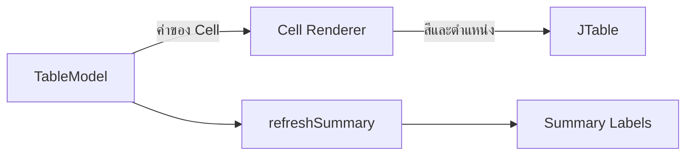

# EP 3.7 — Cell Renderer และ Summary Card

## เป้าหมาย

- จัดข้อความสถานะให้อยู่กึ่งกลาง
- เปลี่ยนสีตามสถานะโดยไม่แก้ข้อมูลใน TableModel
- เปลี่ยน Summary จากข้อความคงที่เป็น Label ที่อัปเดตได้
- แยกการคำนวณ Summary ไว้ใน Method

ทำงานต่อใน `FirstWindow.java` และใช้ `table`, `tableModel` กับ `summary` จาก EP ก่อนหน้า

## ภาพรวมการแสดงผล



Renderer เปลี่ยนหน้าตา Cell แต่ไม่เปลี่ยนข้อมูลใน TableModel

## 1. เพิ่ม Import

วางรวมกับ Import เดิมเหนือ Class:

```java
import java.awt.Color;
import java.awt.Component;
import javax.swing.table.DefaultTableCellRenderer;
```

## 2. เปลี่ยน Summary Label ให้เป็นตัวแปร

หาโค้ด Summary จาก EP3.2 แล้วแทนที่สามบรรทัดที่สร้าง Label โดยตรงด้วย:

```java
JLabel totalLabel = new JLabel("Total: 0", SwingConstants.CENTER);
JLabel runningLabel = new JLabel("Running: 0", SwingConstants.CENTER);
JLabel warningLabel = new JLabel("Warning: 0", SwingConstants.CENTER);

summary.add(totalLabel);
summary.add(runningLabel);
summary.add(warningLabel);
```

อย่าเหลือ `summary.add(new JLabel(...))` ชุดเดิมไว้ ไม่เช่นนั้นจำนวน Component จะเกินจำนวนช่องที่ตั้งใจ

## 3. สร้าง Renderer แบบกึ่งกลาง

วางหลังสร้าง `table` ใน `createWindow()`:

```java
DefaultTableCellRenderer statusRenderer = new DefaultTableCellRenderer();
statusRenderer.setHorizontalAlignment(SwingConstants.CENTER);
table.getColumnModel().getColumn(3).setCellRenderer(statusRenderer);
```

Run ดูผลก่อนเพิ่มสี ข้อความในคอลัมน์สถานะต้องอยู่กึ่งกลาง

## 4. เปลี่ยน Renderer ให้กำหนดสี

แทนที่โค้ด Renderer ในส่วนก่อนหน้าทั้งชุดด้วย:

```java
DefaultTableCellRenderer statusRenderer = new DefaultTableCellRenderer() {
    @Override
    public Component getTableCellRendererComponent(
            JTable table,
            Object value,
            boolean selected,
            boolean focus,
            int row,
            int column
    ) {
        Component component = super.getTableCellRendererComponent(
                table, value, selected, focus, row, column
        );

        if (!selected) {
            boolean warning = "WARNING".equals(value);
            component.setForeground(
                    warning ? Color.RED : new Color(31, 122, 75)
            );
        }

        return component;
    }
};

statusRenderer.setHorizontalAlignment(SwingConstants.CENTER);
table.getColumnModel().getColumn(3).setCellRenderer(statusRenderer);
```

Renderer เปลี่ยนเฉพาะการแสดงผล ไม่ได้เปลี่ยนค่า `RUNNING` หรือ `WARNING` ที่เก็บใน TableModel

## 5. สร้าง Method refreshSummary()

วาง Method นี้ภายใน `FirstWindow` แต่ให้อยู่นอก `createWindow()`:

```java
private static void refreshSummary(
        DefaultTableModel tableModel,
        JLabel totalLabel,
        JLabel runningLabel,
        JLabel warningLabel
) {
    int running = 0;
    int warning = 0;

    for (int row = 0; row < tableModel.getRowCount(); row++) {
        String status = tableModel.getValueAt(row, 3).toString();
        if ("RUNNING".equals(status)) {
            running++;
        } else if ("WARNING".equals(status)) {
            warning++;
        }
    }

    totalLabel.setText("Total: " + tableModel.getRowCount());
    runningLabel.setText("Running: " + running);
    warningLabel.setText("Warning: " + warning);
}
```

## 6. เรียก refreshSummary()

วางหลัง `tableModel.addRow(...)` ของข้อมูลทดลอง:

```java
refreshSummary(tableModel, totalLabel, runningLabel, warningLabel);
```

ทุกครั้งที่เพิ่ม ลบ หรือ Refresh ตาราง ต้องเรียก Method นี้อีกครั้งเพื่อให้ Summary ตรงกับข้อมูล

## 7. Compile และ Run

```powershell
javac -encoding UTF-8 FirstWindow.java
java "-Dfile.encoding=UTF-8" FirstWindow
```

ผลที่ต้องเห็น:

- สถานะ RUNNING เป็นสีเขียว
- สถานะ WARNING เป็นสีแดงเมื่อเพิ่มแถวทดลองสถานะ WARNING
- ข้อความสถานะอยู่กึ่งกลาง
- Summary แสดงจำนวนตรงกับแถวใน Table

## ตรวจความพร้อมก่อนเข้า EP 3.8

- Summary Label ถูกเก็บในตัวแปร
- Table ใช้ Renderer ที่คอลัมน์ Index 3
- มี Method `refreshSummary(...)` อยู่นอก `createWindow()`
- เรียก Refresh หลังเพิ่มข้อมูล
- Compile และ Run ได้โดยไม่มี Error

ซอร์สฉบับเต็ม: ดู `StatusCellRenderer` และ `buildSummaryPanel` ใน [`SmartFactoryFrame.java`](../../src/main/java/smartfactory/ui/SmartFactoryFrame.java)

## Challenge

เพิ่มสีส้มสำหรับ `MAINTENANCE` โดยเปลี่ยนจากเงื่อนไขสองทางเป็น `if / else if / else` ภายใน Renderer แล้วเพิ่มแถวทดลองหนึ่งแถวเพื่อตรวจสี

ถัดไป: [EP 3.8 — เชื่อม Service และ CRUD](ep08-service-crud.md)
