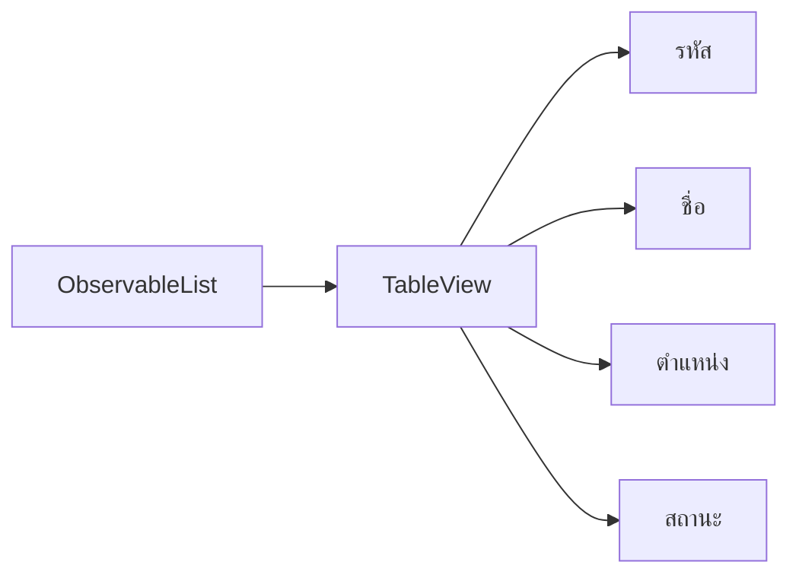

# EP 3.7 — TableView และ ObservableList

## สิ่งที่จะทำ

แสดงข้อมูลเครื่องจักรใน `TableView` และให้ตารางติดตามรายการจาก `ObservableList`



## 1. สร้างข้อมูลสำหรับตาราง

เพิ่มไว้ท้าย Class ก่อนปีกกาปิด:

```java
private record MachineRow(String id, String name, String location, String status) {}
```

เพิ่ม Import และ Field:

```java
import javafx.beans.property.ReadOnlyStringWrapper;
import javafx.collections.FXCollections;
import javafx.collections.ObservableList;
import javafx.scene.control.TableColumn;
import javafx.scene.control.TableView;

private final ObservableList<MachineRow> machines = FXCollections.observableArrayList();
private final TableView<MachineRow> machineTable = new TableView<>();
```

## 2. สร้างตาราง

```java
private TableView<MachineRow> buildMachineTable() {
    TableColumn<MachineRow, String> idColumn = new TableColumn<>("รหัส");
    idColumn.setCellValueFactory(data -> new ReadOnlyStringWrapper(data.getValue().id()));

    TableColumn<MachineRow, String> nameColumn = new TableColumn<>("ชื่อเครื่องจักร");
    nameColumn.setCellValueFactory(data -> new ReadOnlyStringWrapper(data.getValue().name()));

    TableColumn<MachineRow, String> locationColumn = new TableColumn<>("ตำแหน่ง");
    locationColumn.setCellValueFactory(data -> new ReadOnlyStringWrapper(data.getValue().location()));

    TableColumn<MachineRow, String> statusColumn = new TableColumn<>("สถานะ");
    statusColumn.setCellValueFactory(data -> new ReadOnlyStringWrapper(data.getValue().status()));

    machineTable.getColumns().addAll(idColumn, nameColumn, locationColumn, statusColumn);
    machineTable.setItems(machines);
    return machineTable;
}
```

## 3. วางตารางกับ Form คนละฝั่ง

เพิ่ม Import:

```java
import javafx.scene.control.SplitPane;
```

ใน `start()` แทนที่ `root.setCenter(...)` เดิม:

```java
SplitPane content = new SplitPane(buildMachineTable(), buildMachineForm());
content.setDividerPositions(0.68);
root.setCenter(content);
```

## 4. เพิ่มข้อมูลจริงเมื่อกดปุ่ม

ใน `handleAddMachine()` หลังตรวจข้อมูลครบ:

```java
String location = requireText(locationField, "กรุณากรอกตำแหน่ง");
machines.add(new MachineRow(id, name, location, "กำลังทำงาน"));
machineCount.set(machines.size());
```

`กำลังทำงาน` ในบรรทัดนี้เป็นสถานะของเครื่องจักรแต่ละแถว ส่วน Card ด้านบนใช้ชื่อ `สถานะปกติ` เพื่อสรุปจำนวนแถวที่อยู่ในสถานะนี้

ลบบรรทัดเดิมที่เพิ่ม `machineCount` ทีละหนึ่ง เพื่อไม่ให้นับซ้ำ

## 5. รัน

```powershell
.\mvnw.cmd -f .\practice\smart-factory-dashboard\pom.xml javafx:run
```

ผลที่ต้องเห็น: เมื่อกรอกข้อมูลครบแล้วกดเพิ่ม แถวใหม่จะปรากฏทันทีโดยไม่ต้องสร้าง Table ใหม่

## Challenge

เพิ่มเครื่องจักรสามรายการ แล้วทดลองเลือกแต่ละแถวด้วยเมาส์

ถัดไป: [EP 3.8 — CellFactory และ Summary Card](ep08-cellfactory-summary.md)
