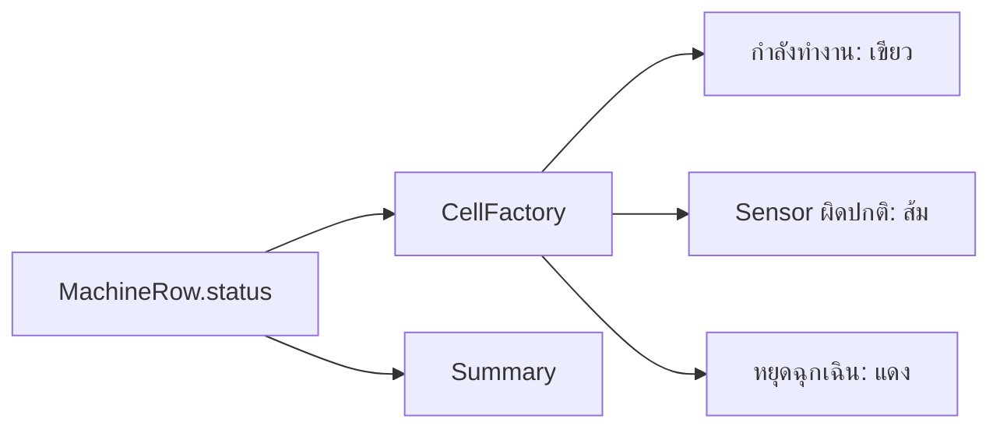

# EP 3.8 — CellFactory และ Summary Card

## สิ่งที่จะทำ

- เปลี่ยนสีสถานะเฉพาะ Cell
- สรุปจำนวนแต่ละสถานะจากข้อมูลในรายการ



## 1. เก็บ Label สรุปเป็น Field

เพิ่ม Field:

```java
private final Label normalLabel = new Label();
private final Label warningLabel = new Label();
private final Label emergencyLabel = new Label();
```

ใน `buildTopArea()` ใช้ Field ทั้งสามแทน Label เดิม และใส่ `summary-card` ให้แต่ละตัว

## 2. สร้าง Cell ตามสถานะ

เพิ่ม Import:

```java
import javafx.scene.control.TableCell;
```

ใน `buildMachineTable()` หลังตั้งค่า `statusColumn`:

```java
statusColumn.setCellFactory(column -> new TableCell<>() {
    @Override
    protected void updateItem(String status, boolean empty) {
        super.updateItem(status, empty);
        getStyleClass().removeAll("status-running", "status-warning", "status-emergency");

        if (empty || status == null) {
            setText(null);
            return;
        }

        setText(status);
        String style = switch (status) {
            case "Sensor ผิดปกติ" -> "status-warning";
            case "หยุดฉุกเฉิน" -> "status-emergency";
            default -> "status-running";
        };
        getStyleClass().add(style);
    }
});
```

เพิ่ม CSS:

```css
.status-running { -fx-text-fill: #22c55e; -fx-font-weight: bold; }
.status-warning { -fx-text-fill: #f59e0b; -fx-font-weight: bold; }
.status-emergency { -fx-text-fill: #ef4444; -fx-font-weight: bold; }
```

## 3. Refresh Summary

Summary เป็นยอดรวมของเครื่องจักรทุกแถว ไม่ใช่ข้อมูลของแถวที่กำลังเลือก

```java
private void refreshSummary() {
    machineCount.set(machines.size());
    normalLabel.setText("สถานะปกติ: " + countStatus("กำลังทำงาน"));
    warningLabel.setText("Sensor ผิดปกติ: " + countStatus("Sensor ผิดปกติ"));
    emergencyLabel.setText("หยุดฉุกเฉิน: " + countStatus("หยุดฉุกเฉิน"));
}

private long countStatus(String status) {
    return machines.stream().filter(machine -> machine.status().equals(status)).count();
}
```

หลัง `machines.add(...)` เรียก:

```java
refreshSummary();
```

เมื่อข้อมูลของแถวเปลี่ยน ต้องเรียก `refreshSummary()` อีกครั้งด้วย หลักเดียวกันนี้จะถูกย้ายไปอยู่ใน `refreshDashboard()` เมื่อเชื่อม Service ใน EP ถัดไป

## 4. ทดลองสถานะอื่นชั่วคราว

เปลี่ยนสถานะที่สร้างจาก `กำลังทำงาน` เป็น `Sensor ผิดปกติ` แล้วรันใหม่เพื่อดูสีและตัวเลข จากนั้นเปลี่ยนกลับ

## Challenge

เพิ่มสถานะ `หยุดซ่อมบำรุง` และกำหนดสีฟ้าให้ Cell

ถัดไป: [EP 3.9 — เชื่อม Service และ CRUD เบื้องต้น](ep09-service-crud.md)
