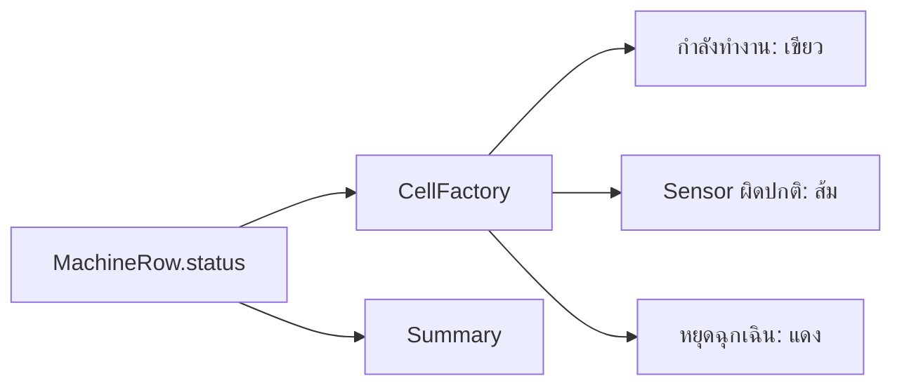

# EP 3.8 — CellFactory และ Summary Card

## สิ่งที่จะทำ

- เปลี่ยนสีสถานะเฉพาะ Cell
- สรุปจำนวนแต่ละสถานะจากข้อมูลในรายการ

โค้ด Java ใน EP นี้แก้ที่ `practice/smart-factory-dashboard/src/main/java/smartfactory/desktop/DashboardApp.java` ส่วน CSS แก้ที่ `practice/smart-factory-dashboard/src/main/resources/smartfactory/desktop/dashboard.css`



## 1. เก็บ Label สรุปเป็น Field

เพิ่ม Field ภายใน Class ต่อจาก `totalLabel`:

```java
private final Label normalLabel = new Label("สถานะปกติ: 0");
private final Label warningLabel = new Label("Sensor ผิดปกติ: 0");
private final Label emergencyLabel = new Label("หยุดฉุกเฉิน: 0");
```

ใน `buildTopArea()` ลบเฉพาะ Local Variable `running`, `warning` และ `emergency` เดิม แล้วใช้ Field ชุดนี้แทน:

```java
normalLabel.getStyleClass().add("summary-card");
warningLabel.getStyleClass().add("summary-card");
emergencyLabel.getStyleClass().add("summary-card");

HBox summary = new HBox(
        12,
        totalLabel,
        normalLabel,
        warningLabel,
        emergencyLabel
);
```

ห้ามสร้าง Label `ทั้งหมด` ตัวใหม่ ให้ใช้ `totalLabel` และ Binding ที่สร้างมาตั้งแต่ EP 3.5 ต่อไป

EP นี้เป็นจุดที่เริ่มใช้ชื่อ Card `สถานะปกติ` เพราะเรากำลังจะนับข้อมูลจริงจากสถานะของแต่ละแถว

## 2. สร้าง Cell ตามสถานะ

เพิ่ม Import ด้านบนของ `DashboardApp.java`:

```java
import javafx.scene.control.TableCell;
```

ใน `buildMachineTable()` หลังตั้งค่า `statusColumn`:

```java
statusColumn.setCellFactory(column -> new TableCell<>() {
    @Override
    protected void updateItem(String status, boolean empty) {
        super.updateItem(status, empty);
        getStyleClass().removeAll("status-running", "status-warning", "status-emergency");

        if (empty || status == null) {
            setText(null);
            return;
        }

        setText(status);
        String style = switch (status) {
            case "Sensor ผิดปกติ" -> "status-warning";
            case "หยุดฉุกเฉิน" -> "status-emergency";
            default -> "status-running";
        };
        getStyleClass().add(style);
    }
});
```

เพิ่ม CSS ต่อท้ายไฟล์ `dashboard.css`:

```css
.status-running { -fx-text-fill: #22c55e; -fx-font-weight: bold; }
.status-warning { -fx-text-fill: #f59e0b; -fx-font-weight: bold; }
.status-emergency { -fx-text-fill: #ef4444; -fx-font-weight: bold; }
```

## 3. Refresh Summary

Summary เป็นยอดรวมของเครื่องจักรทุกแถว ไม่ใช่ข้อมูลของแถวที่กำลังเลือก

เพิ่ม Method ทั้งสองภายใน Class โดยวางต่อจาก `buildMachineTable()`:

```java
private void refreshSummary() {
    machineCount.set(machines.size());
    normalLabel.setText("สถานะปกติ: " + countStatus("กำลังทำงาน"));
    warningLabel.setText("Sensor ผิดปกติ: " + countStatus("Sensor ผิดปกติ"));
    emergencyLabel.setText("หยุดฉุกเฉิน: " + countStatus("หยุดฉุกเฉิน"));
}

private long countStatus(String status) {
    return machines.stream().filter(machine -> machine.status().equals(status)).count();
}
```

`normalLabel` แสดงคำว่า `สถานะปกติ` แต่ยังนับแถวที่มีข้อความสถานะ `กำลังทำงาน` จึงไม่ได้เปลี่ยนข้อมูลเดิม เพียงปรับถ้อยคำบน Summary ให้ชัดขึ้น

ใน `handleAddMachine()` หลัง `machines.add(...)` ให้แทนที่ `machineCount.set(machines.size());` ด้วย:

```java
refreshSummary();
```

เมื่อข้อมูลของแถวเปลี่ยน ต้องเรียก `refreshSummary()` อีกครั้งด้วย หลักเดียวกันนี้จะถูกย้ายไปอยู่ใน `refreshDashboard()` เมื่อเชื่อม Service ใน EP ถัดไป

## 4. ทดลองสถานะอื่นชั่วคราว

ใน `handleAddMachine()` เปลี่ยนข้อความสถานะของ `new MachineRow(...)` จาก `กำลังทำงาน` เป็น `Sensor ผิดปกติ` แล้วรันเพื่อดูสีและตัวเลข จากนั้นเปลี่ยนกลับเป็น `กำลังทำงาน`

## Challenge

เพิ่มสถานะ `หยุดซ่อมบำรุง` และกำหนดสีฟ้าให้ Cell

ถัดไป: [EP 3.9 — เชื่อม Service และ CRUD เบื้องต้น](ep09-service-crud.md)
