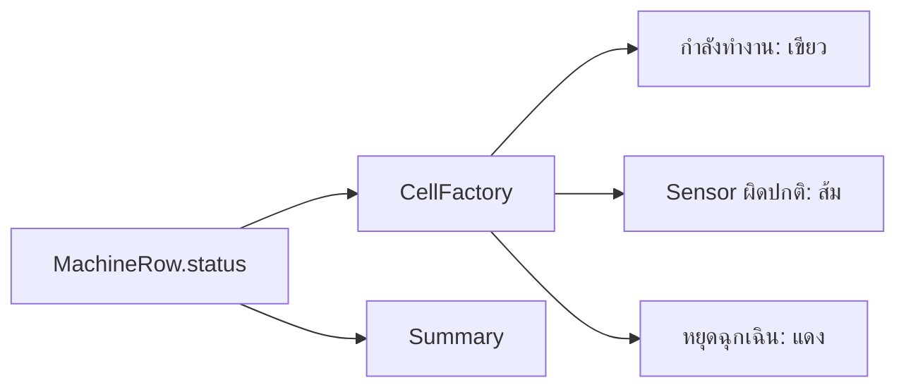

# EP 3.8 — CellFactory และ Summary Card

## สิ่งที่จะทำ

- เปลี่ยนสีสถานะเฉพาะ Cell
- สรุปจำนวนแต่ละสถานะจากข้อมูลในรายการ

โค้ด Java ใน EP นี้แก้ที่ `practice/smart-factory-dashboard/src/main/java/smartfactory/desktop/DashboardApp.java` ส่วน CSS แก้ที่ `practice/smart-factory-dashboard/src/main/resources/smartfactory/desktop/dashboard.css`



## 1. เก็บ Label สรุปเป็น Field

เพิ่ม Field ภายใน Class ต่อจาก `totalLabel`:

```java
private final Label normalLabel = new Label("สถานะปกติ: 0");
private final Label warningLabel = new Label("Sensor ผิดปกติ: 0");
private final Label emergencyLabel = new Label("หยุดฉุกเฉิน: 0");
```

ใน `buildTopArea()` ลบเฉพาะ Local Variable `running`, `warning` และ `emergency` เดิม แล้วใช้ Field ชุดนี้แทน:

```java
normalLabel.getStyleClass().add("summary-card");
warningLabel.getStyleClass().add("summary-card");
emergencyLabel.getStyleClass().add("summary-card");

HBox summary = new HBox(
        12,
        totalLabel,
        normalLabel,
        warningLabel,
        emergencyLabel
);
```

ห้ามสร้าง Label `ทั้งหมด` ตัวใหม่ ให้ใช้ `totalLabel` และ Binding ที่สร้างมาตั้งแต่ EP 3.5 ต่อไป

EP นี้เป็นจุดที่เริ่มใช้ชื่อ Card `สถานะปกติ` เพราะเรากำลังจะนับข้อมูลจริงจากสถานะของแต่ละแถว

## 2. สร้าง Cell ตามสถานะ

เพิ่ม Import ด้านบนของ `DashboardApp.java`:

```java
import javafx.scene.control.TableCell;
```

ใน `buildMachineTable()` หลังตั้งค่า `statusColumn`:

```java
statusColumn.setCellFactory(column -> new TableCell<>() {
    @Override
    protected void updateItem(String status, boolean empty) {
        super.updateItem(status, empty);
        getStyleClass().removeAll("status-running", "status-warning", "status-emergency");

        if (empty || status == null) {
            setText(null);
            return;
        }

        setText(status);
        String style = switch (status) {
            case "Sensor ผิดปกติ" -> "status-warning";
            case "หยุดฉุกเฉิน" -> "status-emergency";
            default -> "status-running";
        };
        getStyleClass().add(style);
    }
});
```

เพิ่ม CSS ต่อท้ายไฟล์ `dashboard.css`:

```css
.status-running { -fx-text-fill: #22c55e; -fx-font-weight: bold; }
.status-warning { -fx-text-fill: #f59e0b; -fx-font-weight: bold; }
.status-emergency { -fx-text-fill: #ef4444; -fx-font-weight: bold; }
```

## 3. Refresh Summary

Summary เป็นยอดรวมของเครื่องจักรทุกแถว ไม่ใช่ข้อมูลของแถวที่กำลังเลือก

เพิ่ม Method ทั้งสองภายใน Class โดยวางต่อจาก `buildMachineTable()`:

```java
private void refreshSummary() {
    machineCount.set(machines.size());
    normalLabel.setText("สถานะปกติ: " + countStatus("กำลังทำงาน"));
    warningLabel.setText("Sensor ผิดปกติ: " + countStatus("Sensor ผิดปกติ"));
    emergencyLabel.setText("หยุดฉุกเฉิน: " + countStatus("หยุดฉุกเฉิน"));
}

private long countStatus(String status) {
    return machines.stream().filter(machine -> machine.status().equals(status)).count();
}
```

`normalLabel` แสดงคำว่า `สถานะปกติ` แต่ยังนับแถวที่มีข้อความสถานะ `กำลังทำงาน` จึงไม่ได้เปลี่ยนข้อมูลเดิม เพียงปรับถ้อยคำบน Summary ให้ชัดขึ้น

ใน `handleAddMachine()` หลัง `machines.add(...)` ให้แทนที่ `machineCount.set(machines.size());` ด้วย:

```java
refreshSummary();
```

เมื่อข้อมูลของแถวเปลี่ยน ต้องเรียก `refreshSummary()` อีกครั้งด้วย หลักเดียวกันนี้จะถูกย้ายไปอยู่ใน `refreshDashboard()` เมื่อเชื่อม Service ใน EP ถัดไป

## 4. รันและตรวจผล

บันทึก `DashboardApp.java` และ `dashboard.css` แล้วเปิด Terminal ที่โฟลเดอร์หลักของ Repository ซึ่งมีไฟล์ `mvnw.cmd` จากนั้นรัน:

```powershell
.\mvnw.cmd -f .\practice\smart-factory-dashboard\pom.xml javafx:run
```

ทดลองตามลำดับ:

1. เมื่อเปิดโปรแกรม ตารางยังไม่มีเครื่องจักร และ Summary ทั้งสี่รายการต้องเป็น `0`
2. กรอกรหัส `M-001`, ชื่อ `เครื่องผสม`, ตำแหน่ง `Line A` แล้วกดเพิ่มเครื่องจักร
3. ต้องเห็นแถวใหม่ โดยข้อความ `กำลังทำงาน` ในคอลัมน์สถานะเป็นสีเขียว ส่วน Summary แสดง `ทั้งหมด: 1`, `สถานะปกติ: 1`, `Sensor ผิดปกติ: 0` และ `หยุดฉุกเฉิน: 0`
4. เพิ่ม `M-002`, ชื่อ `สายพานลำเลียง`, ตำแหน่ง `Line B` ต้องมีสองแถว และทั้ง `ทั้งหมด` กับ `สถานะปกติ` เพิ่มเป็น `2` ทันที
5. ลองกดเพิ่มขณะที่ช่องกรอกว่าง ต้องเห็น Alert จาก EP 3.6 โดยจำนวนแถวและ Summary ไม่เพิ่ม

หากทำ Challenge เพิ่มช่องอุณหภูมิไว้ ให้กรอกช่องนั้นให้ครบด้วย เช่น `65.5`

หากแถวเพิ่มแต่ Summary ไม่เปลี่ยน ให้ตรวจว่า `refreshSummary();` อยู่หลัง `machines.add(...)` ใน `handleAddMachine()` หากสีไม่เปลี่ยน ให้ตรวจว่าโหลด `dashboard.css` ใน `start()` แล้ว และชื่อ CSS Class ตรงกับขั้นที่ 2

## 5. ทดลองสีและ Summary ของสถานะอื่น

ปิดหน้าต่างโปรแกรมก่อนแก้โค้ด ใน `DashboardApp.java` ภายใน `handleAddMachine()` แทนที่เฉพาะบรรทัด `machines.add(...)` ด้วย:

```java
machines.add(new MachineRow(id, name, location, "Sensor ผิดปกติ"));
```

บรรทัดถัดไปยังเป็น `refreshSummary();` บันทึกไฟล์แล้วรันด้วยคำสั่งเดิม จากนั้นเพิ่มเครื่องจักรหนึ่งรายการ เช่น `M-001`, `เครื่องผสม`, `Line A`

ใน EP นี้ข้อมูลอยู่ในหน่วยความจำ เมื่อปิดแล้วเปิดโปรแกรมใหม่ ตารางและ Summary จะเริ่มจากศูนย์ทุกครั้ง

ตรวจผลหลังเพิ่มหนึ่งรายการ แล้วลองเปลี่ยนข้อความสถานะเป็น `หยุดฉุกเฉิน` ปิดและรันใหม่เพื่อทดสอบอีกครั้ง:

| สถานะที่กำหนดในโค้ด | สีข้อความใน Cell | ทั้งหมด | สถานะปกติ | Sensor ผิดปกติ | หยุดฉุกเฉิน |
| --- | --- | --- | --- | --- | --- |
| `Sensor ผิดปกติ` | ส้ม | 1 | 0 | 1 | 0 |
| `หยุดฉุกเฉิน` | แดง | 1 | 0 | 0 | 1 |

สถานะในการทดลองนี้มาจากข้อความที่กำหนดในโค้ด ส่วนการคำนวณสถานะจากค่า Sensor จะทำใน EP 3.10

เมื่อทดสอบเสร็จ ให้เปลี่ยนบรรทัดเพิ่มข้อมูลกลับเป็น:

```java
machines.add(new MachineRow(id, name, location, "กำลังทำงาน"));
```

บันทึกไฟล์ ปิดและรันใหม่ แล้วเพิ่มหนึ่งรายการอีกครั้ง ต้องเห็นสถานะสีเขียว พร้อม `ทั้งหมด: 1` และ `สถานะปกติ: 1` โดยอีกสองรายการเป็น `0` ก่อนเริ่ม EP ถัดไป

## Challenge

เพิ่มสถานะ `หยุดซ่อมบำรุง` และกำหนดสีฟ้าให้ Cell

ถัดไป: [EP 3.9 — เชื่อม Service และ CRUD เบื้องต้น](ep09-service-crud.md)
