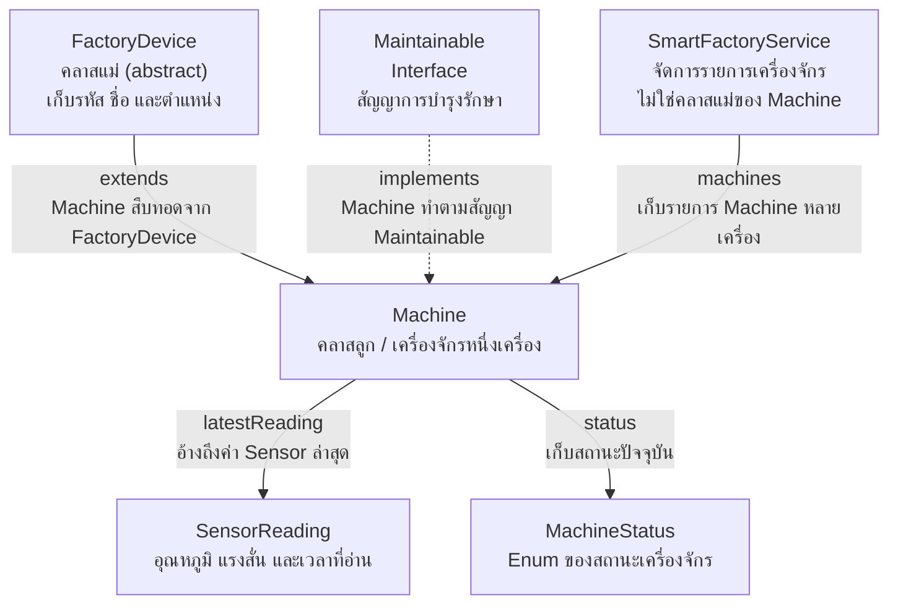

# EP 3.9 ตอนที่ 1 — ทบทวนและเตรียม OOP Core

เป้าหมาย: ใช้หน้าจอจาก EP3.8 ต่อ แล้วสร้าง Model และ Service ทีละไฟล์ ก่อนนำมาเชื่อมกันในตอนที่ 2

## 1. ทบทวนหน้าจอเดิม

เปิด `practice/smart-factory-dashboard` ใช้ `pom.xml`, `DashboardApp.java` และ `dashboard.css` ที่ทำไว้จาก EP3.8

ใน `src/main/java/smartfactory/desktop/DashboardApp.java` ภายใน `handleAddMachine()` ให้สองบรรทัดเพิ่มข้อมูลเป็น:

```java
machines.add(new MachineRow(id, name, location, "กำลังทำงาน"));
refreshSummary();
```

ตอนนี้ตารางยังใช้ `MachineRow` และ Form มีรหัส ชื่อ และตำแหน่ง ส่วนการแสดงค่า Sensor จะเพิ่มใน EP3.10

<details>
<summary>เตรียมงานที่มี Challenge เพิ่มเติมให้ใช้ฟอร์มสามช่อง</summary>

แก้เฉพาะส่วนทดลองใน `DashboardApp.java` ก่อนทำต่อ:

- ลบ Field และทุกบรรทัดที่ใช้ `temperatureField` ทั้ง Prompt, แถวใน Form, การตรวจค่า และการล้างค่า
- ใน `buildMachineForm()` เปลี่ยนบรรทัดวางปุ่มเป็น `form.add(addButton, 1, 3);`
- ใน `buildMachineTable()` ลบ Event ทดลอง `machineTable.setOnMouseClicked(...);` ทั้งชุด
- ลบ Case ทดลอง `"หยุดซ่อมบำรุง"` ใน `switch (status)` และนำ `"status-maintenance"` ออกจาก `removeAll(...)`

Validation รหัสขึ้นต้นด้วย `M-` ใช้ต่อได้

</details>

## 2. สร้างโฟลเดอร์และไฟล์

สร้าง `model` และ `service` ข้างโฟลเดอร์ `desktop`:

```text
src/main/java/smartfactory/
├── desktop/
│   └── DashboardApp.java
├── model/
│   ├── MachineStatus.java
│   ├── SensorReading.java
│   ├── FactoryDevice.java
│   ├── Maintainable.java
│   └── Machine.java
└── service/
    └── SmartFactoryService.java
```

นำแนวคิดจาก [Playlist Java OOP](../playlist-02-java-oop/README.md) มาประกอบเป็นหกไฟล์นี้ สร้างตามลำดับแล้วใส่โค้ดของแต่ละไฟล์ รวมบรรทัด `package`

<details>
<summary>1. MachineStatus — กำหนดสถานะที่ใช้ได้</summary>

Enum จับคู่สถานะกับข้อความภาษาไทย เช่น RUNNING แสดงว่า กำลังทำงาน

สร้าง `practice/smart-factory-dashboard/src/main/java/smartfactory/model/MachineStatus.java`:

```java
package smartfactory.model;

public enum MachineStatus {
    OFFLINE("ปิดเครื่อง"),
    RUNNING("กำลังทำงาน"),
    WARNING("Sensor ผิดปกติ"),
    EMERGENCY_STOP("หยุดฉุกเฉิน"),
    MAINTENANCE("กำลังบำรุงรักษา");

    private final String displayName;

    MachineStatus(String displayName) {
        this.displayName = displayName;
    }

    public String getDisplayName() {
        return displayName;
    }
}
```

</details>

<details>
<summary>2. SensorReading — เก็บค่าจาก Sensor</summary>

เก็บอุณหภูมิ แรงสั่น และเวลาที่อ่านค่า โดยตรวจข้อมูลใน Constructor

สร้าง `practice/smart-factory-dashboard/src/main/java/smartfactory/model/SensorReading.java`:

```java
package smartfactory.model;

import java.time.LocalDateTime;

/** Value Object แทนค่าที่อ่านได้จากเซนเซอร์หนึ่งครั้ง */
public class SensorReading {
    private final double temperature;
    private final double vibration;
    private final LocalDateTime recordedAt;

    public SensorReading(double temperature, double vibration) {
        this(temperature, vibration, LocalDateTime.now());
    }

    public SensorReading(double temperature, double vibration, LocalDateTime recordedAt) {
        if (!Double.isFinite(temperature) || !Double.isFinite(vibration)) {
            throw new IllegalArgumentException("Sensor values must be finite numbers");
        }
        if (vibration < 0) {
            throw new IllegalArgumentException("Vibration must not be negative");
        }
        if (recordedAt == null) {
            throw new IllegalArgumentException("recordedAt must not be null");
        }
        this.temperature = temperature;
        this.vibration = vibration;
        this.recordedAt = recordedAt;
    }

    public double getTemperature() {
        return temperature;
    }

    public double getVibration() {
        return vibration;
    }

    public LocalDateTime getRecordedAt() {
        return recordedAt;
    }
}
```

</details>

<details>
<summary>3. FactoryDevice — ข้อมูลร่วมของอุปกรณ์</summary>

Abstract Class เก็บรหัส ชื่อ และตำแหน่ง เป็นคลาสแม่ของ Machine

สร้าง `practice/smart-factory-dashboard/src/main/java/smartfactory/model/FactoryDevice.java`:

```java
package smartfactory.model;

/**
 * Abstract class เก็บข้อมูลร่วมของอุปกรณ์ทุกชนิดในโรงงาน
 */
public abstract class FactoryDevice {
    private final String id;
    private String name;
    private String location;

    protected FactoryDevice(String id, String name, String location) {
        this.id = requireText(id, "id");
        this.name = requireText(name, "name");
        this.location = requireText(location, "location");
    }

    public abstract String getDeviceType();

    public String getId() {
        return id;
    }

    public String getName() {
        return name;
    }

    public void setName(String name) {
        this.name = requireText(name, "name");
    }

    public String getLocation() {
        return location;
    }

    public void setLocation(String location) {
        this.location = requireText(location, "location");
    }

    protected static String requireText(String value, String fieldName) {
        if (value == null || value.isBlank()) {
            throw new IllegalArgumentException(fieldName + " must not be blank");
        }
        return value.trim();
    }
}
```

</details>

<details>
<summary>4. Maintainable — สัญญาการบำรุงรักษา</summary>

Interface กำหนดว่าต้องตรวจการบำรุงรักษาและบันทึกว่าบำรุงเสร็จได้

สร้าง `practice/smart-factory-dashboard/src/main/java/smartfactory/model/Maintainable.java`:

```java
package smartfactory.model;

/**
 * Interface บอกความสามารถของอุปกรณ์ที่บำรุงรักษาได้
 */
public interface Maintainable {
    boolean requiresMaintenance();

    void performMaintenance();
}
```

</details>

<details>
<summary>5. Machine — เครื่องจักรหนึ่งเครื่อง</summary>

สืบทอด FactoryDevice, ทำตาม Maintainable และเก็บ SensorReading เพื่อคำนวณสถานะกับกำหนดบำรุง

สร้าง `practice/smart-factory-dashboard/src/main/java/smartfactory/model/Machine.java`:

```java
package smartfactory.model;

/**
 * Encapsulation: สถานะภายในเปลี่ยนผ่าน method เท่านั้น
 * Inheritance: Machine สืบทอด FactoryDevice
 * Interface: Machine ทำตามสัญญา Maintainable
 */
public class Machine extends FactoryDevice implements Maintainable {
    public static final double MAX_TEMPERATURE = 80.0;
    public static final double EMERGENCY_TEMPERATURE = 100.0;
    public static final double MAX_VIBRATION = 7.0;
    public static final int MAINTENANCE_HOURS = 500;

    private MachineStatus status;
    private SensorReading latestReading;
    private int operatingHours;

    public Machine(String id, String name, String location) {
        this(id, name, location, MachineStatus.OFFLINE, 0);
    }

    public Machine(
            String id,
            String name,
            String location,
            MachineStatus status,
            int operatingHours
    ) {
        super(id, name, location);
        if (status == null) {
            throw new IllegalArgumentException("status must not be null");
        }
        if (operatingHours < 0) {
            throw new IllegalArgumentException("operatingHours must not be negative");
        }
        this.status = status;
        this.operatingHours = operatingHours;
        this.latestReading = new SensorReading(0, 0);
    }

    @Override
    public String getDeviceType() {
        return "Machine";
    }

    public void updateReading(SensorReading reading) {
        if (reading == null) {
            throw new IllegalArgumentException("reading must not be null");
        }

        this.latestReading = reading;
        this.operatingHours++;

        if (reading.getTemperature() >= EMERGENCY_TEMPERATURE) {
            this.status = MachineStatus.EMERGENCY_STOP;
        } else if (reading.getTemperature() >= MAX_TEMPERATURE
                || reading.getVibration() >= MAX_VIBRATION) {
            this.status = MachineStatus.WARNING;
        } else {
            this.status = MachineStatus.RUNNING;
        }
    }

    @Override
    public boolean requiresMaintenance() {
        return operatingHours >= MAINTENANCE_HOURS
                || status == MachineStatus.WARNING
                || status == MachineStatus.EMERGENCY_STOP;
    }

    @Override
    public void performMaintenance() {
        this.operatingHours = 0;
        this.status = MachineStatus.OFFLINE;
    }

    public MachineStatus getStatus() {
        return status;
    }

    public SensorReading getLatestReading() {
        return latestReading;
    }

    public int getOperatingHours() {
        return operatingHours;
    }
}
```

</details>

<details>
<summary>6. SmartFactoryService — จัดการหลายเครื่อง</summary>

เก็บรายการ Machine และให้ Method สำหรับเพิ่ม ลบ สรุปจำนวน และบำรุงรักษา ส่วน createWithSampleData() เตรียมตัวอย่างสามเครื่อง

สร้าง `practice/smart-factory-dashboard/src/main/java/smartfactory/service/SmartFactoryService.java`:

```java
package smartfactory.service;

import smartfactory.model.Machine;
import smartfactory.model.MachineStatus;
import smartfactory.model.SensorReading;

import java.util.ArrayList;
import java.util.Collections;
import java.util.List;
import java.util.Optional;
import java.util.Random;

/** Service แยก business logic ออกจาก Console และ JavaFX UI */
public class SmartFactoryService {
    private final List<Machine> machines = new ArrayList<>();

    public void addMachine(Machine machine) {
        if (machine == null) {
            throw new IllegalArgumentException("machine must not be null");
        }
        if (findById(machine.getId()).isPresent()) {
            throw new IllegalArgumentException("รหัสเครื่องจักรซ้ำ: " + machine.getId());
        }
        machines.add(machine);
    }

    public void removeMachine(String id) {
        Machine machine = findRequired(id);
        machines.remove(machine);
    }

    public Optional<Machine> findById(String id) {
        if (id == null) {
            return Optional.empty();
        }
        return machines.stream()
                .filter(machine -> machine.getId().equalsIgnoreCase(id.trim()))
                .findFirst();
    }

    public Machine findRequired(String id) {
        return findById(id)
                .orElseThrow(() -> new IllegalArgumentException("ไม่พบเครื่องจักร: " + id));
    }

    public void updateSensor(String id, double temperature, double vibration) {
        findRequired(id).updateReading(new SensorReading(temperature, vibration));
    }

    public void performMaintenance(String id) {
        findRequired(id).performMaintenance();
    }

    public List<Machine> getMachines() {
        return Collections.unmodifiableList(machines);
    }

    public long countByStatus(MachineStatus status) {
        return machines.stream()
                .filter(machine -> machine.getStatus() == status)
                .count();
    }

    public long countRequiringMaintenance() {
        return machines.stream()
                .filter(Machine::requiresMaintenance)
                .count();
    }

    public void simulateSensorReadings(Random random) {
        for (Machine machine : machines) {
            double temperature = 50.0 + random.nextDouble() * 40.0;
            double vibration = 1.0 + random.nextDouble() * 8.0;
            machine.updateReading(new SensorReading(temperature, vibration));
        }
    }

    public static SmartFactoryService createWithSampleData() {
        SmartFactoryService service = new SmartFactoryService();

        Machine mixer = new Machine("M-001", "เครื่องผสม", "Line A", MachineStatus.RUNNING, 120);
        mixer.updateReading(new SensorReading(65.5, 3.1));

        Machine conveyor = new Machine("M-002", "สายพาน", "Line A", MachineStatus.RUNNING, 480);
        conveyor.updateReading(new SensorReading(82.3, 6.2));

        Machine pump = new Machine("M-003", "ปั๊มน้ำ", "Utility Room", MachineStatus.RUNNING, 520);
        pump.updateReading(new SensorReading(58.0, 2.4));

        service.addMachine(mixer);
        service.addMachine(conveyor);
        service.addMachine(pump);
        return service;
    }
}
```

</details>

## 3. ความสัมพันธ์ของแต่ละคลาส

อ่านจาก `Machine` ตรงกลางภาพ แล้วแยกการสืบทอดออกจากการเก็บข้อมูล:



- `extends` คือสืบทอดจากคลาสแม่ ส่วน `implements` คือทำตามข้อกำหนดของ Interface
- `machines`, `latestReading` และ `status` คือชื่อ Field ที่เก็บหรืออ้างถึงข้อมูล ไม่ใช่ความเป็นแม่–ลูก

## 4. รันและตรวจผล

บันทึกทุกไฟล์ แล้วเปิด Terminal ที่โฟลเดอร์หลักของ Repository:

```powershell
.\mvnw.cmd -f .\practice\smart-factory-dashboard\pom.xml javafx:run
```

- คอมไพล์ครบทั้งหกไฟล์และเปิดหน้าจอได้ ตารางกับ Summary เริ่มที่ 0
- เพิ่ม M-001 / เครื่องผสม / Line A: เห็นหนึ่งแถวสีเขียว ทั้งหมด 1 และสถานะปกติ 1
- กดเพิ่มโดยไม่กรอกข้อมูล: เห็น Alert และจำนวนไม่เพิ่ม

ยังไม่เห็นสามเครื่องตัวอย่าง เพราะหน้าจอยังไม่ได้เรียก Service เราจะเชื่อมในตอนที่ 2

[ซอร์สหลังจบตอนนี้](../../lesson-resources/ep3-9-steps/00-start/) ใช้เทียบผล ไม่ต้องคัดลอกมาแทนงานที่ทำ

[ต่อ ตอนที่ 2 — อ่านข้อมูลจาก Service](ep09a-service-table.md)
