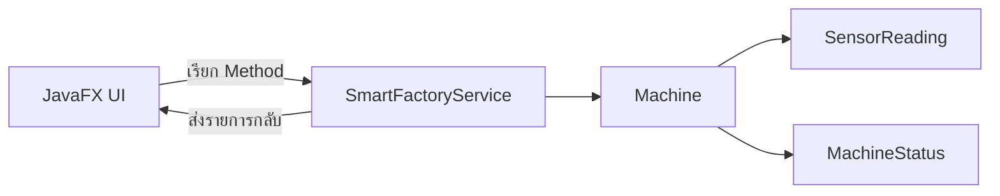

# EP 3.9 — เชื่อม OOP Core ผ่าน Service และทำ CRUD

## สิ่งที่จะทำ

เลิกเก็บข้อมูลจำลองไว้ใน UI แล้วให้ `SmartFactoryService` เป็นผู้จัดการ `Machine`



## 1. นำ OOP Core จาก Playlist 2 มาใช้

รันจากโฟลเดอร์หลักของ Repository:

```powershell
$destination = ".\practice\smart-factory-dashboard\src\main\java\smartfactory"
Copy-Item .\src\main\java\smartfactory\model $destination -Recurse -Force
Copy-Item .\src\main\java\smartfactory\oop $destination -Recurse -Force
Copy-Item .\src\main\java\smartfactory\service $destination -Recurse -Force
```

คำสั่งนี้คัดลอก Source ที่ทำเสร็จจาก Playlist 2 เข้าโปรเจกต์ฝึกบนเครื่อง ไม่ได้เพิ่มไฟล์ใน Repository

## 2. เปลี่ยนข้อมูลของตารางเป็น `Machine`

ลบ `MachineRow` แล้วเพิ่ม Import:

```java
import smartfactory.model.Machine;
import smartfactory.model.MachineStatus;
import smartfactory.service.SmartFactoryService;
```

เปลี่ยน Field:

```java
private final SmartFactoryService service = new SmartFactoryService();
private final ObservableList<Machine> machines = FXCollections.observableArrayList();
private final TableView<Machine> machineTable = new TableView<>();
```

เปลี่ยน Generic ของทุก `TableColumn` จาก `MachineRow` เป็น `Machine` และอ่านค่าผ่าน Getter เช่น:

```java
idColumn.setCellValueFactory(data -> new ReadOnlyStringWrapper(data.getValue().getId()));
nameColumn.setCellValueFactory(data -> new ReadOnlyStringWrapper(data.getValue().getName()));
locationColumn.setCellValueFactory(data -> new ReadOnlyStringWrapper(data.getValue().getLocation()));
```

สำหรับสถานะใช้:

```java
TableColumn<Machine, MachineStatus> statusColumn = new TableColumn<>("สถานะ");
statusColumn.setCellValueFactory(data -> new ReadOnlyObjectWrapper<>(data.getValue().getStatus()));
```

เพิ่ม Import `ReadOnlyObjectWrapper` และเปลี่ยน `TableCell` ให้รับ `MachineStatus` แล้วแสดง `status.getDisplayName()`

## 3. เพิ่มผ่าน Service

แทนที่ `machines.add(...)` ใน `handleAddMachine()`:

```java
service.addMachine(new Machine(id, name, location));
refreshDashboard();
```

เพิ่ม Method กลางสำหรับ Refresh:

```java
private void refreshDashboard() {
    machines.setAll(service.getMachines());
    machineCount.set(machines.size());
    runningLabel.setText("กำลังทำงาน: " + service.countByStatus(MachineStatus.RUNNING));
    warningLabel.setText("แจ้งเตือน: " + service.countByStatus(MachineStatus.WARNING));
    emergencyLabel.setText("หยุดฉุกเฉิน: " + service.countByStatus(MachineStatus.EMERGENCY_STOP));
    maintenanceLabel.setText("ต้องบำรุงทั้งหมด: " + service.countRequiringMaintenance());
}
```

เพิ่ม Field `maintenanceLabel` แบบเดียวกับ Summary Label อื่น แล้วนำไปวางในส่วนบนของหน้าจอ ตัวเลขนี้นับทุกเครื่องที่ `requiresMaintenance()` คืนค่า `true` ไม่ใช่เฉพาะแถวที่เลือก

## 4. เพิ่มปุ่มลบ

สร้างปุ่มและวางข้างปุ่มเพิ่ม:

```java
Button deleteButton = new Button("ลบรายการที่เลือก");
deleteButton.setOnAction(event -> {
    Machine selected = machineTable.getSelectionModel().getSelectedItem();
    if (selected == null) {
        showError("กรุณาเลือกเครื่องจักรในตารางก่อน");
        return;
    }
    service.removeMachine(selected.getId());
    refreshDashboard();
});
```

ตอนนี้ UI รู้เพียงว่าเรียก Service อะไร แต่กฎเพิ่ม ลบ ค้นหา และตรวจสถานะยังอยู่ใน OOP Core

## 5. เพิ่มปุ่มบำรุงรักษา

หลังเรียก Service ต้อง Refresh ทั้งตารางและ Summary:

```java
Button maintenanceButton = new Button("บำรุงเสร็จแล้ว");
maintenanceButton.setOnAction(event -> {
    Machine selected = machineTable.getSelectionModel().getSelectedItem();
    if (selected == null) {
        showError("กรุณาเลือกเครื่องจักรในตารางก่อน");
        return;
    }
    service.performMaintenance(selected.getId());
    refreshDashboard();
});
```

ลำดับสำคัญคือ `Service เปลี่ยนข้อมูล -> refreshDashboard() อ่านค่าล่าสุด -> UI แสดงผล` หากขาดบรรทัด Refresh ตัวเลขด้านบนจะยังเป็นค่าเดิม

## Challenge

แสดงข้อความหลังบำรุงรักษาว่าเหลือเครื่องที่ต้องบำรุงทั้งหมดกี่เครื่อง

ซอร์สฉบับเต็ม: [`DashboardController.java`](../../src/main/java/smartfactory/ui/DashboardController.java)

ถัดไป: [EP 3.10 — Task, Thread และ Timeline](ep10-task-timeline.md)
