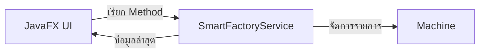

# EP 3.9 — เชื่อม OOP Core ผ่าน Service

จากตารางที่เก็บ `MachineRow` ในหน้าจอ เปลี่ยนมาใช้ `Machine` และ `SmartFactoryService` จาก Java OOP โดยแบ่งเป็นสามตอน ทำทีละส่วนแล้วรันตรวจผล

| ตอน | เนื้อหา | ผลเมื่อทำจบ |
| --- | --- | --- |
| [ตอนที่ 1 — อ่านข้อมูลจาก Service](ep09a-service-table.md) | เชื่อม Machine กับ TableView และ Summary | เปิดแล้วเห็นเครื่องจักรตัวอย่าง 3 เครื่อง |
| [ตอนที่ 2 — เพิ่มและลบเครื่องจักร](ep09b-service-add-delete.md) | ใช้ Service เพิ่มข้อมูล ตรวจรหัสซ้ำ และลบแถวที่เลือก | ตารางและจำนวนอัปเดตหลังเพิ่มหรือลบ |
| [ตอนที่ 3 — ชั่วโมงและการบำรุงรักษา](ep09c-service-maintenance.md) | แสดงชั่วโมง ตรวจรายการที่ต้องบำรุง และบันทึกว่าบำรุงเสร็จ | ชั่วโมง สถานะ และจำนวนที่ต้องบำรุงเปลี่ยนพร้อมกัน |

`Machine` คือเครื่องจักรหนึ่งเครื่อง ส่วน `SmartFactoryService` จัดการรายการและเป็นจุดที่หน้าจอเรียกใช้งาน

## เลือกจุดเริ่มต้น

- เรียนต่อจาก EP3.8: เริ่มที่ [ตอนที่ 1](ep09a-service-table.md)
- เริ่มเฉพาะตอน: ใช้ชุดก่อนเริ่มที่ลิงก์ไว้ในตอนนั้น ทุกชุดมี Maven, Model, Service และ CSS ครบ
- ดูผลลัพธ์ก่อน: เปิด [ชุดซอร์สพร้อมรัน](../../lesson-resources/ep3-9-steps/) แล้วเลือกคำสั่งของตอนที่ต้องการ

ตัวอย่างใช้ Java 21 และ JavaFX 21.0.10 เช่นเดียวกับ EP ก่อนหน้า การรัน Maven ครั้งแรกต้องใช้อินเทอร์เน็ตเพื่อดาวน์โหลด Dependency ข้อมูลยังอยู่ในหน่วยความจำ ปิดและเปิดใหม่จะกลับเป็นข้อมูลเริ่มต้นของชุดนั้น

EP3.9 ครอบคลุมการอ่าน เพิ่ม ลบ และบำรุงรักษา ส่วนการแก้ชื่อและตำแหน่งอยู่ใน [EP3.15](ep15-edit-machine-crud.md)

เมื่อจบตอนที่ 3 ไปต่อ [EP3.10 — Task, Thread และ Timeline](ep10-task-timeline.md) โดยใช้ `DashboardApp.java` ชุดที่เพิ่งทำเสร็จ

[กลับสารบัญ Playlist](README.md)
