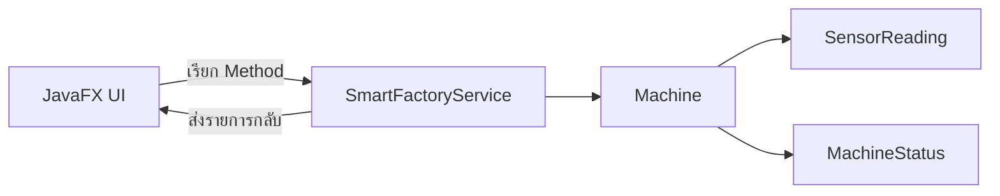
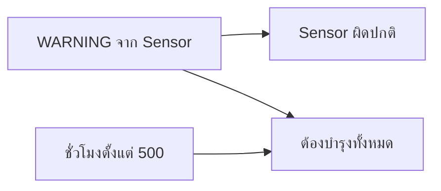

# EP 3.9 — เชื่อม OOP Core ผ่าน Service และ CRUD เบื้องต้น

## สิ่งที่จะทำ

เลิกเก็บข้อมูลจำลองไว้ใน UI แล้วให้ `SmartFactoryService` เป็นผู้จัดการ `Machine`

EP นี้เริ่มจาก Create, Read และ Delete ก่อน ส่วน Update สำหรับแก้ชื่อกับตำแหน่งจะเติมให้ CRUD ครบใน [EP 3.15](ep15-edit-machine-crud.md)



## 1. นำ OOP Core จาก Playlist 2 มาใช้

รันจากโฟลเดอร์หลักของ Repository โดยใช้ Checkpoint ก่อนเพิ่ม Search และ Edit เพื่อไม่ให้ความสามารถจาก EP หลัง ๆ ติดเข้ามาก่อนเวลา:

```powershell
$checkpointArchive = Join-Path $env:TEMP "javafx-ep39-checkpoint.tar"
git archive --format=tar --output=$checkpointArchive 3da3c5d `
    src/main/java/smartfactory/model `
    src/main/java/smartfactory/oop `
    src/main/java/smartfactory/service `
    src/test/java/smartfactory/SmartFactoryTest.java
tar -xf $checkpointArchive -C .\practice\smart-factory-dashboard
Remove-Item -LiteralPath $checkpointArchive
```

Checkpoint `3da3c5d` เป็น Git Commit ที่ระบุเวอร์ชันแน่นอน จึงได้ OOP Core ที่ตรงกับลำดับบทเรียนนี้ แม้ Source ฉบับสมบูรณ์บน Branch หลักจะพัฒนาต่อไปแล้ว คำสั่งนี้เขียนเฉพาะใน `practice` ซึ่ง Git ไม่นำขึ้น Repository

## 2. เปลี่ยนข้อมูลของตารางเป็น `Machine`

ลบ `MachineRow` แล้วเพิ่ม Import:

```java
import smartfactory.model.Machine;
import smartfactory.model.MachineStatus;
import smartfactory.service.SmartFactoryService;
```

เปลี่ยน Field:

```java
private final SmartFactoryService service = new SmartFactoryService();
private final ObservableList<Machine> machines = FXCollections.observableArrayList();
private final TableView<Machine> machineTable = new TableView<>();
```

เปลี่ยน Generic ของทุก `TableColumn` จาก `MachineRow` เป็น `Machine` และอ่านค่าผ่าน Getter เช่น:

```java
idColumn.setCellValueFactory(data -> new ReadOnlyStringWrapper(data.getValue().getId()));
nameColumn.setCellValueFactory(data -> new ReadOnlyStringWrapper(data.getValue().getName()));
locationColumn.setCellValueFactory(data -> new ReadOnlyStringWrapper(data.getValue().getLocation()));
```

สำหรับสถานะใช้:

```java
TableColumn<Machine, MachineStatus> statusColumn = new TableColumn<>("สถานะ");
statusColumn.setCellValueFactory(data -> new ReadOnlyObjectWrapper<>(data.getValue().getStatus()));
```

เพิ่ม Import `ReadOnlyObjectWrapper` และเปลี่ยน `TableCell` ให้รับ `MachineStatus`:

```java
statusColumn.setCellFactory(column -> new TableCell<>() {
    @Override
    protected void updateItem(MachineStatus status, boolean empty) {
        super.updateItem(status, empty);
        getStyleClass().removeAll(
                "status-running",
                "status-warning",
                "status-emergency",
                "status-offline",
                "status-maintenance"
        );

        if (empty || status == null) {
            setText(null);
            return;
        }

        setText(status.getDisplayName());
        String style = switch (status) {
            case RUNNING -> "status-running";
            case WARNING -> "status-warning";
            case EMERGENCY_STOP -> "status-emergency";
            case OFFLINE -> "status-offline";
            case MAINTENANCE -> "status-maintenance";
        };
        getStyleClass().add(style);
    }
});
```

เพิ่ม CSS สำหรับสถานะที่เพิ่งนำมาจาก OOP Core:

```css
.status-offline { -fx-text-fill: #94a3b8; -fx-font-weight: bold; }
.status-maintenance { -fx-text-fill: #3b82f6; -fx-font-weight: bold; }
```

## 3. เพิ่มคอลัมน์ชั่วโมงและการบำรุงรักษา

เพิ่มใน `buildMachineTable()`:

```java
TableColumn<Machine, Integer> hoursColumn = new TableColumn<>("ชั่วโมง");
hoursColumn.setCellValueFactory(data -> new ReadOnlyObjectWrapper<>(
        data.getValue().getOperatingHours()
));

TableColumn<Machine, String> maintenanceColumn = new TableColumn<>("บำรุงรักษา");
maintenanceColumn.setCellValueFactory(data -> new ReadOnlyStringWrapper(
        data.getValue().requiresMaintenance() ? "ต้องบำรุง" : "ปกติ"
));
```

แทนที่บรรทัด `machineTable.getColumns().addAll(...)` เดิม เพื่อกำหนดรายการคอลัมน์เพียงครั้งเดียว:

```java
machineTable.getColumns().setAll(
        idColumn,
        nameColumn,
        locationColumn,
        statusColumn,
        hoursColumn,
        maintenanceColumn
);
```

## 4. เพิ่มผ่าน Service

แทนที่ `machines.add(...)` ใน `handleAddMachine()`:

```java
service.addMachine(new Machine(id, name, location));
refreshDashboard();
```

Constructor แบบสามค่าเริ่มเครื่องใหม่ด้วยสถานะ `OFFLINE` ตามกฎของ Model เครื่องจะเปลี่ยนเป็น `RUNNING`, `WARNING` หรือ `EMERGENCY_STOP` เมื่อได้รับค่าจาก Sensor ใน EP 3.10

เพิ่ม Method กลางสำหรับ Refresh:

```java
private void refreshDashboard() {
    machines.setAll(service.getMachines());
    machineCount.set(machines.size());
    normalLabel.setText("สถานะปกติ: " + service.countByStatus(MachineStatus.RUNNING));
    warningLabel.setText("Sensor ผิดปกติ: " + service.countByStatus(MachineStatus.WARNING));
    emergencyLabel.setText("หยุดฉุกเฉิน: " + service.countByStatus(MachineStatus.EMERGENCY_STOP));
    maintenanceLabel.setText("ต้องบำรุงทั้งหมด: " + service.countRequiringMaintenance());
}
```

`normalLabel` นับเฉพาะ `MachineStatus.RUNNING` ส่วนสถานะรายเครื่องยังแสดง `กำลังทำงาน` ผ่าน `getDisplayName()` ตามเดิม

เพิ่ม Field แล้วนำไปวางเป็น Card สุดท้ายใน `HBox summary`:

```java
private final Label maintenanceLabel = new Label("ต้องบำรุงทั้งหมด: 0");
```

ใน `buildTopArea()` ใส่ `summary-card` และเพิ่มต่อจาก `emergencyLabel` โดยยังคงใช้ `totalLabel` ตัวเดิม:

```java
maintenanceLabel.getStyleClass().add("summary-card");
HBox summary = new HBox(
        12,
        totalLabel,
        normalLabel,
        warningLabel,
        emergencyLabel,
        maintenanceLabel
);
```

ตัวเลขนี้นับทุกเครื่องที่ `requiresMaintenance()` คืนค่า `true` ไม่ใช่เฉพาะแถวที่เลือก



สองการ์ดนี้จึงอาจมีตัวเลขต่างกัน เช่น `M-003` มี Sensor ปกติจึงยังเป็น `RUNNING` แต่ถูกนับใน `ต้องบำรุงทั้งหมด` เพราะทำงานเกิน 500 ชั่วโมง

## 5. เพิ่มปุ่มลบ

สร้างปุ่มและวางข้างปุ่มเพิ่ม:

```java
Button deleteButton = new Button("ลบรายการที่เลือก");
deleteButton.setOnAction(event -> {
    Machine selected = machineTable.getSelectionModel().getSelectedItem();
    if (selected == null) {
        showError("กรุณาเลือกเครื่องจักรในตารางก่อน");
        return;
    }
    service.removeMachine(selected.getId());
    refreshDashboard();
});
```

ตอนนี้ UI รู้เพียงว่าเรียก Service อะไร แต่กฎเพิ่ม ลบ ค้นหา และตรวจสถานะยังอยู่ใน OOP Core

## 6. เพิ่มปุ่มบำรุงรักษา

หลังเรียก Service ต้อง Refresh ทั้งตารางและ Summary:

```java
Button maintenanceButton = new Button("บำรุงเสร็จแล้ว");
maintenanceButton.setOnAction(event -> {
    Machine selected = machineTable.getSelectionModel().getSelectedItem();
    if (selected == null) {
        showError("กรุณาเลือกเครื่องจักรในตารางก่อน");
        return;
    }
    service.performMaintenance(selected.getId());
    refreshDashboard();
});
```

ลำดับสำคัญคือ `Service เปลี่ยนข้อมูล -> refreshDashboard() อ่านค่าล่าสุด -> UI แสดงผล` หากขาดบรรทัด Refresh ตัวเลขด้านบนจะยังเป็นค่าเดิม

## Challenge

แสดงข้อความหลังบำรุงรักษาว่าเหลือเครื่องที่ต้องบำรุงทั้งหมดกี่เครื่อง

ซอร์สฉบับเต็ม: [`DashboardController.java`](../../src/main/java/smartfactory/ui/DashboardController.java)

ถัดไป: [EP 3.10 — Task, Thread และ Timeline](ep10-task-timeline.md)
