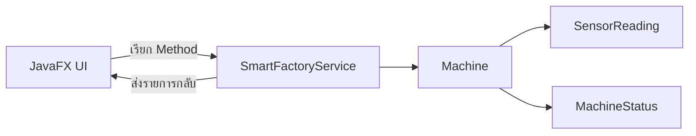
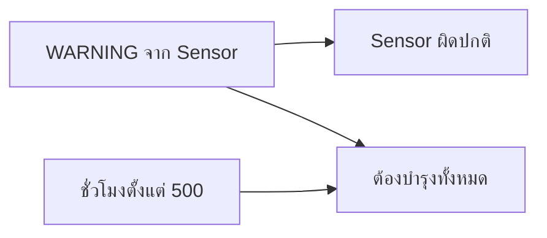

# EP 3.9 — เชื่อม OOP Core ผ่าน Service และ CRUD เบื้องต้น

## สิ่งที่จะทำ

เลิกเก็บข้อมูลจำลองไว้ใน UI แล้วให้ `SmartFactoryService` เป็นผู้จัดการ `Machine`

EP นี้เริ่มจาก Create, Read และ Delete ก่อน ส่วน Update สำหรับแก้ชื่อกับตำแหน่งจะเติมให้ CRUD ครบใน [EP 3.15](ep15-edit-machine-crud.md)

โค้ดหน้าจอใน EP นี้แก้ที่ `practice/smart-factory-dashboard/src/main/java/smartfactory/desktop/DashboardApp.java` และเพิ่มสีสถานะใน `practice/smart-factory-dashboard/src/main/resources/smartfactory/desktop/dashboard.css`



## 1. เตรียม OOP Core

ใช้ [ชุดไฟล์ OOP Core สำหรับ EP3.9](../../lesson-resources/ep3-9-oop-core/) ซึ่งเตรียม Model และ Service ที่ต่อยอดจาก Playlist 2 ไว้ให้แล้ว

1. [ดาวน์โหลด ZIP](../../lesson-resources/ep3-9-oop-core/ep3-9-oop-core.zip?raw=true) แล้วแตกไฟล์ หรือเปิดโฟลเดอร์ `lesson-resources/ep3-9-oop-core` ใน Repository ที่ดาวน์โหลดไว้
2. คัดลอกทั้งโฟลเดอร์ `model` และ `service` ไปวางใน `practice/smart-factory-dashboard/src/main/java/smartfactory/` ข้างโฟลเดอร์ `desktop`
3. ตรวจโครงสร้างให้ตรงตามนี้:

```text
practice/smart-factory-dashboard/src/main/java/smartfactory/
├── desktop/
│   └── DashboardApp.java
├── model/
│   ├── FactoryDevice.java
│   ├── Machine.java
│   ├── MachineStatus.java
│   ├── Maintainable.java
│   └── SensorReading.java
└── service/
    └── SmartFactoryService.java
```

หากมี `model` หรือ `service` อยู่แล้ว ให้สำรองสองโฟลเดอร์นั้นก่อนใช้ชุดนี้ เก็บ `DashboardApp.java` และ `dashboard.css` ที่ทำไว้ต่อได้เลย

`Machine` แทนเครื่องจักรแต่ละเครื่อง ส่วน `SmartFactoryService` จัดการรายการเครื่องจักรและเป็นจุดที่หน้าจอเรียกใช้งาน

## 2. เปลี่ยนข้อมูลของตารางเป็น `Machine`

ใน `DashboardApp.java` ลบ `MachineRow` ที่ท้าย Class แล้วเพิ่ม Import ด้านบนไฟล์:

```java
import smartfactory.model.Machine;
import smartfactory.model.MachineStatus;
import smartfactory.service.SmartFactoryService;
```

แทนที่ Field `machines` และ `machineTable` เดิมภายใน Class พร้อมเพิ่ม `service`:

```java
private final SmartFactoryService service = SmartFactoryService.createWithSampleData();
private final ObservableList<Machine> machines = FXCollections.observableArrayList();
private final TableView<Machine> machineTable = new TableView<>();
```

เปลี่ยนบรรทัดประกาศ Method `buildMachineTable()` ให้คืนตารางชนิด `Machine` ด้วย:

```java
private TableView<Machine> buildMachineTable() {
```

ใน `buildMachineTable()` เปลี่ยน Generic ของทุก `TableColumn` จาก `MachineRow` เป็น `Machine` และเปลี่ยน Cell Value Factory ของสามคอลัมน์แรกเป็น:

```java
idColumn.setCellValueFactory(data -> new ReadOnlyStringWrapper(data.getValue().getId()));
nameColumn.setCellValueFactory(data -> new ReadOnlyStringWrapper(data.getValue().getName()));
locationColumn.setCellValueFactory(data -> new ReadOnlyStringWrapper(data.getValue().getLocation()));
```

หากเพิ่ม Event เลือกแถวไว้ใน EP3.7 ให้เปลี่ยน `MachineRow selected` เป็น `Machine selected` และใช้ `selected.getId()` กับ `selected.getName()` แทน `selected.id()` กับ `selected.name()`

ใน `buildMachineTable()` แทนที่การประกาศ `statusColumn` และ Cell Value Factory เดิมด้วย:

```java
TableColumn<Machine, MachineStatus> statusColumn = new TableColumn<>("สถานะ");
statusColumn.setCellValueFactory(data -> new ReadOnlyObjectWrapper<>(data.getValue().getStatus()));
```

เพิ่ม Import ด้านบนไฟล์:

```java
import javafx.beans.property.ReadOnlyObjectWrapper;
```

จากนั้นใน `buildMachineTable()` เก็บการสร้าง `statusColumn` กับ `setCellValueFactory(...)` ด้านบนไว้ และแทนที่เฉพาะ `statusColumn.setCellFactory(...)` เดิมด้วยชุดนี้:

```java
statusColumn.setCellFactory(column -> new TableCell<>() {
    @Override
    protected void updateItem(MachineStatus status, boolean empty) {
        super.updateItem(status, empty);
        getStyleClass().removeAll(
                "status-running",
                "status-warning",
                "status-emergency",
                "status-offline",
                "status-maintenance"
        );

        if (empty || status == null) {
            setText(null);
            return;
        }

        setText(status.getDisplayName());
        String style = switch (status) {
            case RUNNING -> "status-running";
            case WARNING -> "status-warning";
            case EMERGENCY_STOP -> "status-emergency";
            case OFFLINE -> "status-offline";
            case MAINTENANCE -> "status-maintenance";
        };
        getStyleClass().add(style);
    }
});
```

เพิ่ม CSS สำหรับสถานะที่เพิ่งนำมาจาก OOP Core ต่อท้ายไฟล์ `dashboard.css`:

```css
.status-offline { -fx-text-fill: #94a3b8; -fx-font-weight: bold; }
.status-maintenance { -fx-text-fill: #3b82f6; -fx-font-weight: bold; }
```

## 3. เพิ่มคอลัมน์ชั่วโมงและการบำรุงรักษา

เพิ่มใน `buildMachineTable()` ต่อจาก `statusColumn.setCellFactory(...)` และก่อนกำหนดรายการคอลัมน์:

```java
TableColumn<Machine, Integer> hoursColumn = new TableColumn<>("ชั่วโมง");
hoursColumn.setCellValueFactory(data -> new ReadOnlyObjectWrapper<>(
        data.getValue().getOperatingHours()
));

TableColumn<Machine, String> maintenanceColumn = new TableColumn<>("บำรุงรักษา");
maintenanceColumn.setCellValueFactory(data -> new ReadOnlyStringWrapper(
        data.getValue().requiresMaintenance() ? "ต้องบำรุง" : "ปกติ"
));
```

แทนที่บรรทัด `machineTable.getColumns().addAll(...)` เดิม เพื่อกำหนดรายการคอลัมน์เพียงครั้งเดียว:

```java
machineTable.getColumns().setAll(
        idColumn,
        nameColumn,
        locationColumn,
        statusColumn,
        hoursColumn,
        maintenanceColumn
);
```

## 4. เพิ่มผ่าน Service

ใน `DashboardApp.java` แทนที่บรรทัด `machines.add(...)` และ `refreshSummary()` ภายใน `handleAddMachine()` ด้วย:

```java
service.addMachine(new Machine(id, name, location));
refreshDashboard();
```

Constructor แบบสามค่าเริ่มเครื่องใหม่ด้วยสถานะ `OFFLINE` ตามกฎของ Model เครื่องจะเปลี่ยนเป็น `RUNNING`, `WARNING` หรือ `EMERGENCY_STOP` เมื่อได้รับค่าจาก Sensor ใน EP 3.10

ลบ Method `refreshSummary()` และ `countStatus(String status)` เดิมจาก EP3.8 ทั้งสอง Method แล้วใช้ `refreshDashboard()` ด้านล่างเพื่ออ่านรายการและจำนวนจาก Service

เพิ่ม Method กลางภายใน Class โดยวางต่อจาก `handleAddMachine()`:

```java
private void refreshDashboard() {
    machines.setAll(service.getMachines());
    machineCount.set(machines.size());
    normalLabel.setText("สถานะปกติ: " + service.countByStatus(MachineStatus.RUNNING));
    warningLabel.setText("Sensor ผิดปกติ: " + service.countByStatus(MachineStatus.WARNING));
    emergencyLabel.setText("หยุดฉุกเฉิน: " + service.countByStatus(MachineStatus.EMERGENCY_STOP));
    maintenanceLabel.setText("ต้องบำรุงทั้งหมด: " + service.countRequiringMaintenance());
}
```

`normalLabel` นับเฉพาะ `MachineStatus.RUNNING` ส่วนสถานะรายเครื่องยังแสดง `กำลังทำงาน` ผ่าน `getDisplayName()` ตามเดิม

เพิ่ม Field ภายใน Class ต่อจาก `emergencyLabel`:

```java
private final Label maintenanceLabel = new Label("ต้องบำรุงทั้งหมด: 0");
```

ใน `buildTopArea()` ใส่ `summary-card` และเพิ่มต่อจาก `emergencyLabel` โดยยังคงใช้ `totalLabel` ตัวเดิม:

```java
maintenanceLabel.getStyleClass().add("summary-card");
HBox summary = new HBox(
        12,
        totalLabel,
        normalLabel,
        warningLabel,
        emergencyLabel,
        maintenanceLabel
);
```

ตัวเลขนี้นับทุกเครื่องที่ `requiresMaintenance()` คืนค่า `true` ไม่ใช่เฉพาะแถวที่เลือก

ใน `start()` เพิ่มบรรทัดนี้หลัง `root.setCenter(content);` และก่อน `stage.show();` เพื่อโหลดข้อมูลตัวอย่างเข้าสู่ตารางเมื่อเปิดโปรแกรม:

```java
refreshDashboard();
```



สองการ์ดนี้จึงอาจมีตัวเลขต่างกัน เช่น `M-003` มี Sensor ปกติจึงยังเป็น `RUNNING` แต่ถูกนับใน `ต้องบำรุงทั้งหมด` เพราะทำงานเกิน 500 ชั่วโมง

## 5. เพิ่มปุ่มลบ

ใน `buildMachineForm()` แทนที่บรรทัด `form.add(addButton, 1, 3);` ด้วยชุดนี้ เพื่อสร้างปุ่ม ผูก Event และนำปุ่มไปวางใน Form:

```java
Button deleteButton = new Button("ลบรายการที่เลือก");
deleteButton.setOnAction(event -> {
    Machine selected = machineTable.getSelectionModel().getSelectedItem();
    if (selected == null) {
        showError("กรุณาเลือกเครื่องจักรในตารางก่อน");
        return;
    }
    service.removeMachine(selected.getId());
    refreshDashboard();
});

HBox actionButtons = new HBox(8, addButton, deleteButton);
form.add(actionButtons, 1, 3);
```

หากเพิ่มช่องอุณหภูมิจาก Challenge จนปุ่มเดิมอยู่ที่ `form.add(addButton, 1, 4);` ให้แทนที่บรรทัดนั้นและวางชุดปุ่มที่ `form.add(actionButtons, 1, 4);` เพื่อให้อยู่ใต้ช่องกรอกสุดท้าย

ตอนนี้ UI รู้เพียงว่าเรียก Service อะไร แต่กฎเพิ่ม ลบ ค้นหา และตรวจสถานะยังอยู่ใน OOP Core

## 6. เพิ่มปุ่มบำรุงรักษา

ใน `buildMachineForm()` เพิ่มชุดนี้ต่อจากบรรทัด `form.add(actionButtons, ...);` และก่อน `return form;` ปุ่มใหม่จะถูกเพิ่มเข้า `actionButtons` ที่สร้างในขั้นก่อนหน้า:

```java
Button maintenanceButton = new Button("บำรุงเสร็จแล้ว");
maintenanceButton.setOnAction(event -> {
    Machine selected = machineTable.getSelectionModel().getSelectedItem();
    if (selected == null) {
        showError("กรุณาเลือกเครื่องจักรในตารางก่อน");
        return;
    }
    service.performMaintenance(selected.getId());
    refreshDashboard();
});

actionButtons.getChildren().add(maintenanceButton);
```

ลำดับสำคัญคือ `Service เปลี่ยนข้อมูล -> refreshDashboard() อ่านค่าล่าสุด -> UI แสดงผล` หากขาดบรรทัด Refresh ตัวเลขด้านบนจะยังเป็นค่าเดิม

## 7. รันและตรวจผล

```powershell
.\mvnw.cmd -f .\practice\smart-factory-dashboard\pom.xml javafx:run
```

เมื่อเปิดโปรแกรมต้องเห็นข้อมูลตัวอย่าง 3 เครื่อง จากนั้นทดลองเพิ่ม `M-004`, เลือกแถวเพื่อลบ และเลือก `M-002` เพื่อบันทึกการบำรุงรักษา ตารางกับ Summary ต้องเปลี่ยนทันทีหลังแต่ละคำสั่ง

## Challenge

แสดงข้อความหลังบำรุงรักษาว่าเหลือเครื่องที่ต้องบำรุงทั้งหมดกี่เครื่อง

ซอร์สฉบับเต็ม: [`DashboardController.java`](../../src/main/java/smartfactory/ui/DashboardController.java)

ถัดไป: [EP 3.10 — Task, Thread และ Timeline](ep10-task-timeline.md)
