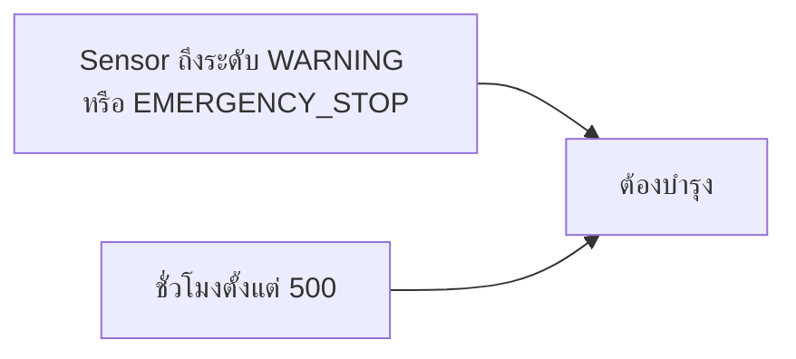

# EP 3.9 ตอนที่ 3 — ชั่วโมงและการบำรุงรักษา

## สิ่งที่จะทำ

เพิ่มคอลัมน์ชั่วโมงและการบำรุงรักษา พร้อมปุ่มบันทึกว่าบำรุงเสร็จ เพื่อให้ตารางและ Summary แสดงข้อมูลล่าสุดตรงกัน

## ก่อนเริ่ม

ใช้ผลจากตอนที่ 2 หรือ [ชุดก่อนเริ่มตอนนี้](../../lesson-resources/ep3-9-steps/02-add-delete/) ซึ่งมี `pom.xml`, Java และ CSS ครบแล้ว

หากใช้ชุดไฟล์ ให้คัดลอก **เนื้อหาภายใน** `02-add-delete` ไปไว้ใน `practice/smart-factory-dashboard` ให้ `pom.xml` อยู่ใต้โฟลเดอร์นี้ทันที หากมีงานเดิมให้เปลี่ยนชื่อโฟลเดอร์เดิมเก็บไว้ก่อน ไม่วางทับหรือรวมสองเวอร์ชันเข้าด้วยกัน

รันจากโฟลเดอร์หลักของ Repository ที่มี `mvnw.cmd`:

```powershell
.\mvnw.cmd -f .\practice\smart-factory-dashboard\pom.xml javafx:run
```

ต้องเห็น 3 เครื่องและมีปุ่มเพิ่มกับปุ่มลบ ปิดหน้าต่างก่อนแก้โค้ด

แก้ Java ที่ `practice/smart-factory-dashboard/src/main/java/smartfactory/desktop/DashboardApp.java` ทุก Method ที่เพิ่มให้อยู่ภายใน `DashboardApp` ก่อนปีกกาปิด Class ไม่วางซ้อนใน `start()` หรือ Method อื่น

## 1. เพิ่มคอลัมน์ชั่วโมง

เพิ่ม Import ด้านบน `DashboardApp.java`:

```java
import javafx.beans.property.ReadOnlyObjectWrapper;
```

ใน `buildMachineTable()` หลังจบ `statusColumn.setCellFactory(...);` และก่อน `machineTable.getColumns()...` เพิ่ม:

```java
TableColumn<Machine, Integer> hoursColumn = new TableColumn<>("ชั่วโมง");
hoursColumn.setCellValueFactory(data -> new ReadOnlyObjectWrapper<>(data.getValue().getOperatingHours()));
```

## 2. เพิ่มคอลัมน์บำรุงรักษา

เพิ่มต่อจากคอลัมน์ชั่วโมง ภายใน `buildMachineTable()`:

```java
TableColumn<Machine, String> maintenanceColumn = new TableColumn<>("บำรุงรักษา");
maintenanceColumn.setCellValueFactory(data -> new ReadOnlyStringWrapper(data.getValue().requiresMaintenance() ? "ต้องบำรุง" : "ปกติ"));
```

แทนที่บรรทัด `machineTable.getColumns().addAll(...);` เดิมด้วยบรรทัดนี้ หากใช้ `setAll(...)` อยู่แล้ว ให้แทนที่บรรทัดนั้น:

```java
machineTable.getColumns().setAll(idColumn, nameColumn, locationColumn, statusColumn, hoursColumn, maintenanceColumn);
```

`requiresMaintenance()` อยู่ใน Model หน้าจอเพียงนำคำตอบมาแสดง โดยไม่เขียนเงื่อนไข 500 ชั่วโมงซ้ำใน UI

## 3. เพิ่ม Summary การบำรุงรักษา

เพิ่ม Field ต่อจาก `emergencyLabel`:

```java
private final Label maintenanceLabel = new Label("ต้องบำรุงทั้งหมด: 0");
```

ใน `buildTopArea()` เพิ่มบรรทัดแรกต่อจากการกำหนด Style ของ `emergencyLabel` แล้วแทนที่บรรทัดประกาศ `HBox summary` เดิมด้วยบรรทัดที่สอง:

```java
maintenanceLabel.getStyleClass().add("summary-card");
HBox summary = new HBox(12, totalLabel, normalLabel, warningLabel, emergencyLabel, maintenanceLabel);
```

ใน `refreshDashboard()` เพิ่มหลัง `machines.setAll(service.getMachines());`:

```java
machineTable.refresh();
```

เมื่อบำรุงรักษา เราเปลี่ยนค่าภายใน `Machine` ตัวเดิม ซึ่งยังไม่ได้ใช้ JavaFX Property จึงสั่งให้ตารางอ่านค่า Cell ใหม่ด้วย

จากนั้นเพิ่มบรรทัดนี้ท้าย `refreshDashboard()` ก่อนปีกกาปิด Method:

```java
maintenanceLabel.setText("ต้องบำรุงทั้งหมด: " + service.countRequiringMaintenance());
```

### รันตรวจตารางก่อนเพิ่มปุ่ม

```powershell
.\mvnw.cmd -f .\practice\smart-factory-dashboard\pom.xml javafx:run
```

| รหัส | ชั่วโมง | สถานะ | บำรุงรักษา |
| --- | --- | --- | --- |
| M-001 | 121 | กำลังทำงาน | ปกติ |
| M-002 | 481 | Sensor ผิดปกติ | ต้องบำรุง |
| M-003 | 521 | กำลังทำงาน | ต้องบำรุง |

Summary ต้องเป็น **ทั้งหมด 3 · สถานะปกติ 2 · Sensor ผิดปกติ 1 · หยุดฉุกเฉิน 0 · ต้องบำรุงทั้งหมด 2** แล้วปิดหน้าต่างเพื่อแก้ขั้นถัดไป



M-003 ยังเป็น `RUNNING` แต่ต้องบำรุงเพราะชั่วโมงถึงกำหนด สอง Summary จึงนับคนละเงื่อนไข และเครื่องหนึ่งเครื่องจะถูกนับในยอดต้องบำรุงเพียงครั้งเดียวแม้เข้าเงื่อนไขทั้งสองข้อ

## 4. เพิ่ม Method บำรุงรักษา

เพิ่ม Method นี้หลังปีกกาปิดของ `handleDeleteMachine()` และก่อน `showError(...)`:

```java
private void handleMaintenance() {
        Machine selected = machineTable.getSelectionModel().getSelectedItem();
        if (selected == null) {
            showError("กรุณาเลือกเครื่องจักรในตารางก่อน");
            return;
        }
        service.performMaintenance(selected.getId());
        refreshDashboard();
        statusLabel.setText("บำรุงรักษา " + selected.getId() + " แล้ว");
    }
```

ใน `buildMachineForm()` เพิ่มหลัง `form.add(actionButtons, 1, 3);` และก่อน `return form;` หากใช้แถว 4 ให้เพิ่มหลังบรรทัดแถว 4 ที่มีอยู่:

```java
Button maintenanceButton = new Button("บำรุงเสร็จแล้ว");
maintenanceButton.setOnAction(event -> handleMaintenance());
actionButtons.getChildren().add(maintenanceButton);
```

`performMaintenance(...)` ในตัวอย่างนี้ตั้งชั่วโมงเป็น 0 และสถานะเป็น `OFFLINE` เป็นการบันทึกข้อมูลในโปรแกรม ไม่ใช่คำสั่งซ่อมหรือหยุดเครื่องจักรจริง

## 5. รันและตรวจผล

```powershell
.\mvnw.cmd -f .\practice\smart-factory-dashboard\pom.xml javafx:run
```

ทดลองโดยไม่เพิ่มหรือลบข้อมูลก่อน:

| สิ่งที่ทดลอง | ผลที่ต้องเห็น |
| --- | --- |
| กดบำรุงเสร็จโดยไม่เลือกแถว | Alert ให้เลือกเครื่องจักร ข้อมูลไม่เปลี่ยน |
| เลือก M-002 แล้วกดบำรุงเสร็จ | ชั่วโมง 0, สถานะปิดเครื่อง, บำรุงรักษาปกติ, Sensor ผิดปกติ 0, ต้องบำรุงทั้งหมด 1 |
| เลือก M-003 แล้วกดบำรุงเสร็จ | ชั่วโมง 0, สถานะปิดเครื่อง, บำรุงรักษาปกติ, ต้องบำรุงทั้งหมด 0 |

หลังทำครบ ทั้งหมดจะยังเป็น 3 แต่สถานะปกติเหลือ 1 เพราะอีกสองเครื่องอยู่ในสถานะปิดเครื่อง ไม่ใช่ `RUNNING` เมื่อปิดและเปิดโปรแกรมใหม่ ข้อมูลจะกลับเป็นชุดตัวอย่างเดิม

## Challenge

หลังบำรุงรักษา ให้แถบล่างบอกว่าเหลือเครื่องที่ต้องบำรุงทั้งหมดกี่เครื่อง

<details>
<summary>เฉลย Challenge</summary>

ใน `handleMaintenance()` แทนที่เฉพาะบรรทัด `statusLabel.setText(...);` หลัง `refreshDashboard();` ด้วย:

```java
long remaining = service.countRequiringMaintenance();
statusLabel.setText("บำรุงรักษา " + selected.getId() + " แล้ว — เหลือเครื่องที่ต้องบำรุงทั้งหมด " + remaining + " เครื่อง");
```

เริ่มโปรแกรมใหม่แล้วบำรุง M-002 ต้องเห็นเหลือ 1 เครื่อง จากนั้นบำรุง M-003 ต้องเหลือ 0 เครื่อง

</details>

## เปิดผลลัพธ์ของตอนนี้ได้ทันที

[ซอร์สหลังจบตอนที่ 3](../../lesson-resources/ep3-9-steps/03-maintenance/) เป็นโปรเจกต์ครบชุด รันจากโฟลเดอร์หลักของ Repository:

```powershell
.\mvnw.cmd -f .\lesson-resources\ep3-9-steps\03-maintenance\pom.xml javafx:run
```

ชุดสำเร็จเป็นเนื้อหาหลักก่อนทำ Challenge เมื่อจบตอนนี้ใช้ `DashboardApp.java` ต่อได้เลย ไม่ต้องคัดลอก Controller ฉบับเต็มที่มีความสามารถจาก EP หลัง ๆ

ถัดไป: [EP3.10 — Task, Thread และ Timeline](ep10-task-timeline.md) · [สารบัญ EP3.9](ep09-service-crud.md)
