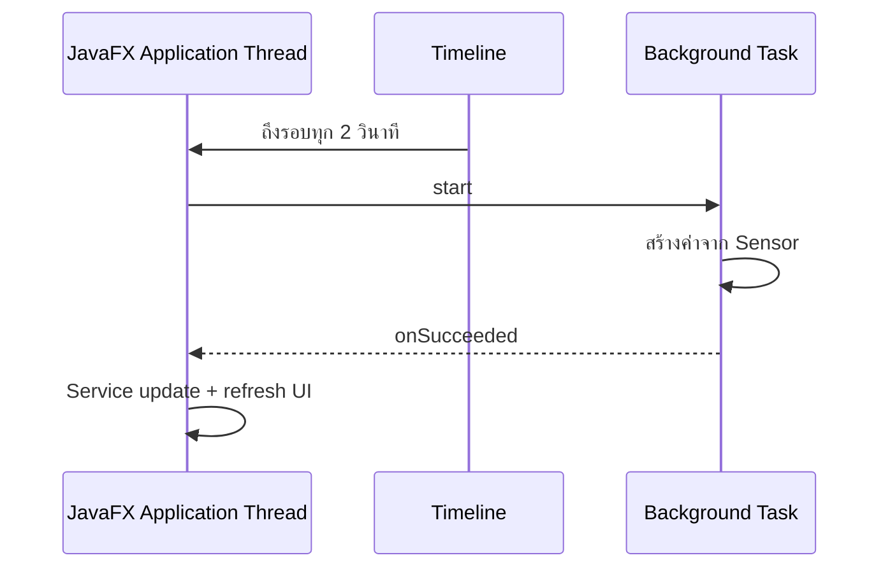

# EP 3.10 — จำลอง Sensor ด้วย Task, Thread และ Timeline

## สิ่งที่จะทำ

- ใช้ `Task` ทำงานเบื้องหลัง
- ใช้ `Timeline` เรียกงานเป็นช่วงเวลา
- อัปเดต UI เมื่อ Task สำเร็จโดยไม่ทำให้หน้าต่างค้าง



## 1. สร้างข้อมูลผลลัพธ์

สร้าง `practice/smart-factory-dashboard/src/main/java/smartfactory/desktop/SensorUpdate.java`:

```java
package smartfactory.desktop;

public record SensorUpdate(String machineId, double temperature, double vibration) {}
```

## 2. สร้าง Background Task

สร้าง `SensorSimulationTask.java` ใน Package เดียวกัน:

```java
package smartfactory.desktop;

import javafx.concurrent.Task;
import java.util.List;
import java.util.concurrent.ThreadLocalRandom;

public class SensorSimulationTask extends Task<List<SensorUpdate>> {
    private final List<String> machineIds;

    public SensorSimulationTask(List<String> machineIds) {
        this.machineIds = List.copyOf(machineIds);
    }

    @Override
    protected List<SensorUpdate> call() {
        return machineIds.stream()
                .map(id -> new SensorUpdate(
                        id,
                        ThreadLocalRandom.current().nextDouble(50, 110),
                        ThreadLocalRandom.current().nextDouble(1, 9)
                ))
                .toList();
    }
}
```

`call()` ทำงานบน Background Thread และไม่แก้ JavaFX Component โดยตรง

## 3. รัน Task และกลับมาอัปเดต UI

เพิ่ม Method ใน `DashboardApp`:

```java
private void simulateInBackground() {
    List<String> ids = service.getMachines().stream().map(Machine::getId).toList();
    if (ids.isEmpty()) {
        return;
    }

    SensorSimulationTask task = new SensorSimulationTask(ids);
    task.setOnSucceeded(event -> {
        for (SensorUpdate update : task.getValue()) {
            service.updateSensor(update.machineId(), update.temperature(), update.vibration());
        }
        refreshDashboard();
        statusLabel.setText("อัปเดต Sensor ล่าสุดแล้ว");
    });

    Thread worker = new Thread(task, "sensor-simulation");
    worker.setDaemon(true);
    worker.start();
}
```

เพิ่ม Import `java.util.List` และ `smartfactory.model.Machine`

## 4. เรียกอัตโนมัติทุก 2 วินาที

เพิ่ม Import และ Field:

```java
import javafx.animation.KeyFrame;
import javafx.animation.Timeline;
import javafx.util.Duration;

private Timeline sensorTimeline;
```

ใน `start()` หลังสร้างหน้าจอ:

```java
sensorTimeline = new Timeline(
        new KeyFrame(Duration.seconds(2), event -> simulateInBackground())
);
sensorTimeline.setCycleCount(Timeline.INDEFINITE);
sensorTimeline.play();
stage.setOnHidden(event -> sensorTimeline.stop());
```

ผลที่ต้องเห็น: อุณหภูมิ สถานะ และ Summary เปลี่ยนทุก 2 วินาที แต่หน้าต่างยังลากและกดได้ตามปกติ

`refreshDashboard()` ต้องอยู่หลัง Loop เพราะ Summary ต้องคำนวณใหม่หลังอัปเดต Sensor ครบทุกเครื่อง หากเรียกก่อนอัปเดต ตัวเลขที่เห็นจะช้ากว่าข้อมูลจริงหนึ่งรอบ

## Challenge

เพิ่มปุ่มเริ่ม/หยุด Auto Sensor โดยตรวจ `sensorTimeline.getStatus()`

ถัดไป: [EP 3.11 — FXML และ Controller](ep11-fxml-controller.md)
