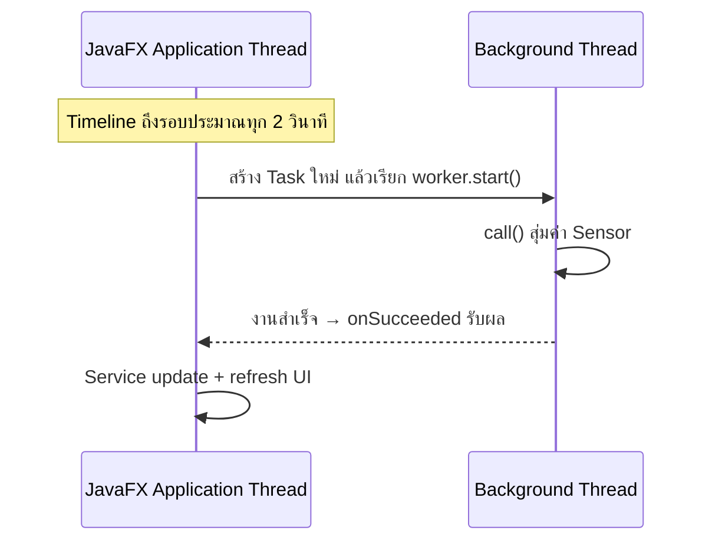

# EP 3.10 — จำลอง Sensor ด้วย Task, Thread และ Timeline

## สิ่งที่จะทำ

- ใช้ `Task` ทำงานเบื้องหลัง
- ใช้ `Timeline` เรียกงานเป็นช่วงเวลา
- อัปเดต UI เมื่อ Task สำเร็จโดยไม่ทำให้หน้าต่างค้าง

## ก่อนเริ่ม

เปิดโปรเจกต์ `practice/smart-factory-dashboard` ที่ทำต่อจาก [EP3.9 ตอนที่ 4](ep09c-service-maintenance.md) ใช้ตาราง Summary และปุ่มเดิมต่อได้เลย

ปิดหน้าต่างโปรแกรมก่อนแก้โค้ด ตอนนี้จะแก้ `DashboardApp.java` และสร้าง `SensorUpdate.java` กับ `SensorSimulationTask.java` เพิ่มใน `src/main/java/smartfactory/desktop` ของโปรเจกต์นี้

`Task` กำหนดงาน, `Thread` รันงานเบื้องหลัง ส่วน `Timeline` เรียกงานตามเวลา ในตอนนี้ใช้ค่าสุ่มแทน Sensor จริง



## 1. เพิ่มคอลัมน์สำหรับดูผลจาก Sensor

ใน `DashboardApp.java` ภายใน `buildMachineTable()` เพิ่มคอลัมน์อุณหภูมิและแรงสั่นสะเทือน หลังตั้งค่า `maintenanceColumn` และก่อน `machineTable.getColumns().setAll(...)`:

```java
TableColumn<Machine, String> temperatureColumn = new TableColumn<>("อุณหภูมิ °C");
temperatureColumn.setCellValueFactory(data -> new ReadOnlyStringWrapper(
        format(data.getValue().getLatestReading().getTemperature())
));

TableColumn<Machine, String> vibrationColumn = new TableColumn<>("แรงสั่น mm/s");
vibrationColumn.setCellValueFactory(data -> new ReadOnlyStringWrapper(
        format(data.getValue().getLatestReading().getVibration())
));
```

แก้ `setAll(...)` ให้เรียงคอลัมน์ดังนี้:

```java
machineTable.getColumns().setAll(
        idColumn,
        nameColumn,
        locationColumn,
        statusColumn,
        temperatureColumn,
        vibrationColumn,
        hoursColumn,
        maintenanceColumn
);
```

เพิ่ม Import `Locale` ด้านบนของ `DashboardApp.java`:

```java
import java.util.Locale;
```

เพิ่ม Method จัดรูปแบบทศนิยมภายใน Class โดยวางต่อจาก `buildMachineTable()`:

```java
private static String format(double value) {
    return String.format(Locale.ROOT, "%.1f", value);
}
```

## 2. สร้างข้อมูลผลลัพธ์

สร้าง `practice/smart-factory-dashboard/src/main/java/smartfactory/desktop/SensorUpdate.java`:

```java
package smartfactory.desktop;

public record SensorUpdate(String machineId, double temperature, double vibration) {}
```

`SensorUpdate` เก็บผลหนึ่งเครื่อง: รหัส อุณหภูมิ และแรงสั่น เพื่อส่งจากงานเบื้องหลังกลับมาอัปเดตข้อมูล

## 3. สร้าง Background Task

สร้าง `practice/smart-factory-dashboard/src/main/java/smartfactory/desktop/SensorSimulationTask.java`:

```java
package smartfactory.desktop;

import javafx.concurrent.Task;
import java.util.List;
import java.util.concurrent.ThreadLocalRandom;

public class SensorSimulationTask extends Task<List<SensorUpdate>> {
    private final List<String> machineIds;

    public SensorSimulationTask(List<String> machineIds) {
        this.machineIds = List.copyOf(machineIds);
    }

    @Override
    protected List<SensorUpdate> call() {
        return machineIds.stream()
                .map(id -> new SensorUpdate(
                        id,
                        ThreadLocalRandom.current().nextDouble(50, 110),
                        ThreadLocalRandom.current().nextDouble(1, 9)
                ))
                .toList();
    }
}
```

เมื่อรันผ่าน Thread ในขั้นถัดไป `call()` จะทำงานเบื้องหลังและคืน `List<SensorUpdate>` โดยไม่แก้หน้าจอหรือ `Machine` โดยตรง

## 4. รัน Task และกลับมาอัปเดต UI

เพิ่ม Method นี้ภายใน `DashboardApp` โดยวางต่อจาก `refreshDashboard()`:

```java
private void simulateInBackground() {
    List<String> ids = service.getMachines().stream().map(Machine::getId).toList();
    if (ids.isEmpty()) {
        return;
    }

    SensorSimulationTask task = new SensorSimulationTask(ids);
    task.setOnSucceeded(event -> {
        for (SensorUpdate update : task.getValue()) {
            service.updateSensor(update.machineId(), update.temperature(), update.vibration());
        }
        refreshDashboard();
        statusLabel.setText("อัปเดต Sensor ล่าสุดแล้ว");
    });

    Thread worker = new Thread(task, "sensor-simulation");
    worker.setDaemon(true);
    worker.start();
}
```

เพิ่ม `import java.util.List;` ต่อจาก Import เดิมใน `DashboardApp.java` ส่วน `Machine` มี Import จาก EP ก่อนแล้ว

`worker.start()` เริ่มงานเบื้องหลัง ส่วน `setOnSucceeded` รับผลบน JavaFX Application Thread จึงอัปเดต Service และหน้าจอในส่วนนี้ได้ สร้าง Task ใหม่ทุกรอบเพราะ Task หนึ่งตัวรันได้ครั้งเดียว

## 5. เรียกอัตโนมัติทุก 2 วินาที

เพิ่ม Import ด้านบนของ `DashboardApp.java`:

```java
import javafx.animation.KeyFrame;
import javafx.animation.Timeline;
import javafx.util.Duration;
```

เพิ่ม Field ภายใน Class ต่อจาก Field เดิม:

```java
private Timeline sensorTimeline;
```

ใน `start()` วางชุดนี้หลัง `stage.show();` และก่อนปีกกาปิดของ Method:

```java
sensorTimeline = new Timeline(
        new KeyFrame(Duration.seconds(2), event -> simulateInBackground())
);
sensorTimeline.setCycleCount(Timeline.INDEFINITE);
sensorTimeline.play();
stage.setOnHidden(event -> sensorTimeline.stop());
```

`Timeline` เรียกงานประมาณทุก 2 วินาที ไม่ได้ทำให้งานเป็น Background เอง ส่วน `stop()` หยุดเรียกรอบใหม่ ไม่ได้ยกเลิก Task ที่เริ่มไปแล้ว

## 6. รันและตรวจผล

บันทึกทั้งสามไฟล์ แล้วรันจากโฟลเดอร์หลักของ Repository:

```powershell
.\mvnw.cmd -f .\practice\smart-factory-dashboard\pom.xml javafx:run
```

- ก่อนรอบแรก ตารางมีข้อมูลตัวอย่าง 3 เครื่อง: สถานะปกติ 2, Sensor ผิดปกติ 1, หยุดฉุกเฉิน 0 และต้องบำรุงทั้งหมด 2
- หลังประมาณ 2 วินาที ค่าอุณหภูมิและแรงสั่นเริ่มอัปเดต จากนั้นอัปเดตต่อเป็นรอบ สถานะและ Summary ต้องตรงกับค่าล่าสุด แต่ไม่จำเป็นต้องเปลี่ยนทุกครั้ง
- ลองเลือกแถวและเลื่อนหน้าต่าง โปรแกรมยังตอบสนองตามปกติ

คง `refreshDashboard()` ไว้หลัง Loop เพื่ออัปเดตตารางและ Summary เมื่อรับค่าครบทุกเครื่องแล้ว

ชั่วโมงใน Model เดิมเพิ่ม 1 ทุกครั้งที่รับค่า Sensor จึงเป็นชั่วโมงจำลอง ไม่ใช่เวลาทำงานจริง และรอบ Sensor ถัดไปสามารถเปลี่ยนสถานะ OFFLINE หลังบำรุงเสร็จได้

## Challenge

เพิ่มปุ่มเริ่ม/หยุด Auto Sensor โดยตรวจ `sensorTimeline.getStatus()`

ถัดไป: [EP 3.11 — FXML และ Controller](ep11-fxml-controller.md)
