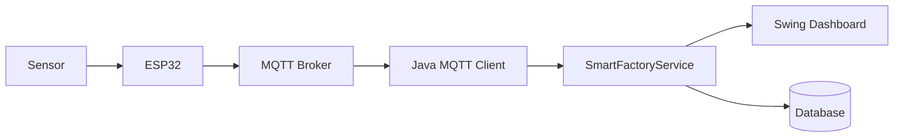

# EP 3.10 — ภาษาไทย, Packaging และ IoT Roadmap

## เป้าหมาย

- ป้องกันภาษาไทยกลายเป็นสี่เหลี่ยมหรืออักขระเพี้ยนใน Swing
- เปลี่ยนข้อความปุ่มมาตรฐานของ `JOptionPane` เป็นภาษาไทย
- ตรวจ Build และ Test ก่อน Packaging
- สร้าง App Image ด้วย `jpackage`
- วางเส้นทางต่อยอดจากข้อมูลจำลองไปสู่ IoT

ทำตามลำดับ: ภาษาไทย → Test → App Image → IoT Roadmap อย่าเริ่ม Packaging ก่อนโปรแกรมและ Test ทำงานครบ

## 1. สร้างไฟล์ ThaiUiSupport.java

สร้างไฟล์ใหม่ชื่อ `ThaiUiSupport.java` ในโฟลเดอร์เดียวกับ `FirstWindow.java` แล้วเพิ่ม Import:

```java
import java.awt.Font;
import java.util.Enumeration;
import java.util.Locale;
import javax.swing.JComponent;
import javax.swing.UIManager;
import javax.swing.plaf.FontUIResource;
```

วาง Class ต่อจาก Import:

```java
public final class ThaiUiSupport {
    private ThaiUiSupport() {
    }

    public static void configure() {
        Locale thaiLocale = Locale.forLanguageTag("th-TH");
        Locale.setDefault(thaiLocale);
        JComponent.setDefaultLocale(thaiLocale);

        Font thaiFont = new Font("Leelawadee UI", Font.PLAIN, 14);
        Enumeration<Object> keys = UIManager.getDefaults().keys();

        while (keys.hasMoreElements()) {
            Object key = keys.nextElement();
            Object value = UIManager.get(key);

            if (value instanceof Font currentFont) {
                UIManager.put(
                        key,
                        new FontUIResource(
                                thaiFont.getFamily(),
                                currentFont.getStyle(),
                                Math.max(currentFont.getSize(), 14)
                        )
                );
            }
        }

        UIManager.put("OptionPane.okButtonText", "ตกลง");
        UIManager.put("OptionPane.cancelButtonText", "ยกเลิก");
        UIManager.put("OptionPane.yesButtonText", "ใช่");
        UIManager.put("OptionPane.noButtonText", "ไม่");
    }
}
```

บน Windows ใช้ `Leelawadee UI` เป็นตัวเลือกแรก หากเครื่องอื่นไม่มีฟอนต์นี้ให้ดูซอร์สตัวอย่างใน Repository ซึ่งตรวจฟอนต์สำรองหลายตัว:

[`ThaiUiSupport.java`](../../src/main/java/smartfactory/ui/ThaiUiSupport.java)

## 2. เรียก ThaiUiSupport ก่อนสร้าง Component

เปิด `FirstWindow.java` แล้วแทนที่ `main()` เดิมด้วย:

```java
public static void main(String[] args) {
    SwingUtilities.invokeLater(() -> {
        ThaiUiSupport.configure();
        createWindow();
    });
}
```

ต้องเรียก `configure()` ก่อน `createWindow()` เพราะ Component ที่สร้างไปแล้วอาจเก็บ Font และข้อความเดิมจาก `UIManager`

## 3. Compile และตรวจภาษาไทย

เปิด Terminal ในโฟลเดอร์เดียวกับไฟล์ Java:

```powershell
javac -encoding UTF-8 MachineStatus.java SensorReading.java FactoryDevice.java Maintainable.java Machine.java SmartFactoryService.java ThaiUiSupport.java FirstWindow.java
java "-Dfile.encoding=UTF-8" FirstWindow
```

ตรวจอย่างน้อยห้าจุด:

1. Label ภาษาไทยใน Form
2. หัวตารางภาษาไทย
3. Error Dialog ภาษาไทย
4. ปุ่ม `ตกลง` และ `ยกเลิก`
5. Console ไม่มีเครื่องหมาย `????`

ถ้า Source แสดงถูกแต่ Popup เพี้ยน ปัญหามักอยู่ที่ Font หรือเรียก `configure()` หลังสร้าง Component หาก Console เพี้ยนให้ตรวจทั้ง `javac -encoding UTF-8` และ `java "-Dfile.encoding=UTF-8"`

## 4. ตรวจโปรเจกต์ใน Repository

เปิด Terminal ที่โฟลเดอร์หลักของ Repository แล้วรันคำสั่งสำหรับซอร์สใน `src/main/java` และ `src/test/java`:

```powershell
powershell -ExecutionPolicy Bypass -File .\scripts\check-encoding.ps1
powershell -ExecutionPolicy Bypass -File .\scripts\test.ps1
powershell -ExecutionPolicy Bypass -File .\scripts\run-desktop.ps1
```

ผล Test ที่ถูกต้อง:

```text
Encoding check passed: ... UTF-8 files
Build completed: ...\out
PASS: 5 tests
```

ปิด Desktop App หลังตรวจหน้าต่าง เพื่อให้คำสั่ง Run จบและกลับมาที่ Terminal

## 5. ตรวจ jpackage

JDK 21 มี `jpackage` มาให้ ตรวจสอบก่อน:

```powershell
jpackage --version
```

ถ้าระบบหาไม่พบ ให้ตรวจว่าโฟลเดอร์ `bin` ของ JDK อยู่ใน `PATH` เช่นเดียวกับ `java` และ `javac`

## 6. สร้าง App Image ของโปรเจกต์ใน Repository

รันจากโฟลเดอร์หลักของ Repository หลัง `test.ps1` ผ่านแล้ว

สร้างโฟลเดอร์สำหรับ JAR:

```powershell
New-Item -ItemType Directory -Force .\package-input
```

รวม Class ที่ Build แล้วเป็น JAR:

```powershell
jar --create --file .\package-input\smart-factory.jar -C .\out .
```

สร้าง App Image:

```powershell
jpackage --type app-image --name SmartFactory --input .\package-input --main-jar smart-factory.jar --main-class smartfactory.ui.DesktopApp --dest .\release
```

ผลลัพธ์จะอยู่ใน `release\SmartFactory` ถ้าจะ Run `jpackage` ซ้ำและปลายทางเดิมมีอยู่แล้ว ให้เปลี่ยนชื่อโฟลเดอร์ `--dest` เป็นชื่อใหม่ก่อน เพื่อไม่เขียนทับไฟล์เดิมโดยไม่ตั้งใจ

`app-image` ใช้ทดสอบการ Packaging ได้ก่อน ส่วน Installer แบบ `.exe` อาจต้องติดตั้ง WiX Toolset เพิ่ม

## 7. เส้นทางต่อยอด IoT



เมื่อเชื่อมอุปกรณ์จริง ให้เปลี่ยนเฉพาะแหล่งข้อมูลจาก `simulateSensorReadings(...)` เป็น MQTT Client แล้วส่งค่าที่ได้รับเข้า `service.updateSensor(...)`

Model, Validation, Service, JTable และ Summary ยังนำกลับมาใช้ต่อได้ ไม่ต้องเขียน Desktop App ใหม่ทั้งหมด

## ตรวจความพร้อมก่อนจบ Playlist 3

- ภาษาไทยแสดงครบทั้ง Component และ Popup
- ปุ่มมาตรฐานของ JOptionPane เป็นภาษาไทย
- Encoding Check และ Test ผ่าน
- Desktop App ฉบับเต็มเปิดได้
- `jpackage --version` ทำงาน
- สร้าง App Image ได้หรือทราบ Dependency ที่ยังขาด
- เข้าใจจุดที่ MQTT จะเชื่อมเข้ากับ Service

## Final Challenge

เลือกทำครั้งละหนึ่งหัวข้อและเพิ่ม Test ก่อนต่อยอดหัวข้อถัดไป:

1. Export CSV
2. บันทึก SQLite
3. รับ JSON Sensor จำลอง
4. เพิ่ม MQTT Client
5. สร้าง Installer ด้วย `jpackage`

รัน Desktop App ฉบับสมบูรณ์:

```powershell
powershell -ExecutionPolicy Bypass -File .\scripts\run-desktop.ps1
```

กลับไป [README หลัก](../../README.md)
