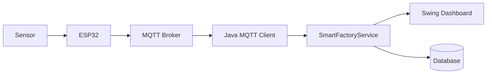

# EP 3.10 — ภาษาไทย, Packaging และ IoT Roadmap

## เป้าหมาย

- ตรวจภาษาไทยใน Source, Console และ Swing
- รันชุดตรวจสอบก่อนส่งมอบ
- เห็นเส้นทางต่อยอดจากข้อมูลจำลองไป IoT

ทำตามแต่ละส่วนแยกกัน โดยตรวจภาษาไทยและ Test ให้ผ่านก่อนเริ่ม Packaging

## 1. ตรวจภาษาไทย

โปรเจกต์ดูแลภาษาไทยสามชั้น:

1. บันทึก Source เป็น UTF-8 ผ่าน `.editorconfig`
2. Compile ด้วย `javac -encoding UTF-8`
3. ตั้ง Locale และเลือกฟอนต์ที่รองรับภาษาไทยใน Swing

[`ThaiUiSupport.java`](../../src/main/java/smartfactory/ui/ThaiUiSupport.java) ตรวจฟอนต์ตามลำดับ `Leelawadee UI`, `Tahoma`, `Noto Sans Thai` และ Logical Font ของ Java

รันชุดตรวจสอบ:

```powershell
powershell -ExecutionPolicy Bypass -File .\scripts\check-encoding.ps1
powershell -ExecutionPolicy Bypass -File .\scripts\test.ps1
powershell -ExecutionPolicy Bypass -File .\scripts\run-desktop.ps1
```

## 2. เตรียม Packaging

เมื่อโปรแกรมทำงานครบแล้ว สามารถใช้ `jpackage` สร้าง App Image หรือ Installer ขั้นต่อไปควรเพิ่ม Maven หรือ Gradle และกำหนด Main Class เป็น:

```text
smartfactory.ui.DesktopApp
```

Packaging เป็นงานหลังจาก Build, Test และภาษาไทยผ่านแล้ว

## 3. เส้นทางต่อยอด IoT



เปลี่ยนแหล่งข้อมูลจาก `simulateSensorReadings` เป็น MQTT Client โดยยังใช้ Model, Service และ UI ส่วนใหญ่ต่อได้

## Final Challenge

เลือกทำทีละหนึ่งหัวข้อ:

1. Export CSV
2. บันทึก SQLite
3. รับ JSON Sensor จำลอง
4. เพิ่ม MQTT Client
5. สร้าง Installer ด้วย `jpackage`

รัน Desktop App ฉบับสมบูรณ์:

```powershell
powershell -ExecutionPolicy Bypass -File .\scripts\run-desktop.ps1
```

กลับไป [README หลัก](../../README.md)
