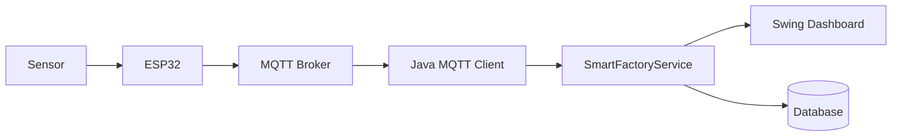

# EP 3.10 — ภาษาไทย, Packaging และ IoT Roadmap

## เป้าหมาย

- ทำให้ Source, Console และ Swing แสดงภาษาไทยสม่ำเสมอ
- ตรวจโปรเจกต์ก่อนส่งมอบ
- เห็นเส้นทางจากข้อมูลจำลองไป MQTT และ Database

## ภาษาไทยสามชั้น

1. Source บันทึกเป็น UTF-8 ผ่าน `.editorconfig`
2. Compile ด้วย `javac -encoding UTF-8`
3. Swing ตั้ง Locale และเลือกฟอนต์ที่แสดงอักษรไทยได้

[`ThaiUiSupport.java`](../../src/main/java/smartfactory/ui/ThaiUiSupport.java) ตรวจฟอนต์ตามลำดับ `Leelawadee UI`, `Tahoma`, `Noto Sans Thai` และ logical font ของ Java พร้อมกำหนดข้อความ Popup เป็น `ตกลง`, `ยกเลิก`, `ใช่`, `ไม่`

```powershell
powershell -ExecutionPolicy Bypass -File .\scripts\check-encoding.ps1
powershell -ExecutionPolicy Bypass -File .\scripts\test.ps1
powershell -ExecutionPolicy Bypass -File .\scripts\run-desktop.ps1
```

## Packaging

เมื่อพร้อมแจกจ่าย สามารถใช้ `jpackage` สร้าง App Image หรือ Installer โดยควรเพิ่ม Maven/Gradle และกำหนด Main Class เป็น:

```text
smartfactory.ui.DesktopApp
```

## จาก Random ไป IoT



เปลี่ยนเฉพาะแหล่งข้อมูลจาก `simulateSensorReadings` เป็น MQTT Client โดยเก็บ Model, Service และ UI ส่วนใหญ่ไว้ได้

## Final Challenge

เลือกหนึ่งงานต่อยอด:

1. Export CSV
2. บันทึก SQLite
3. รับ JSON Sensor จำลอง
4. เพิ่ม MQTT Client
5. สร้าง Installer ด้วย `jpackage`

รัน Desktop App ฉบับสมบูรณ์:

```powershell
powershell -ExecutionPolicy Bypass -File .\scripts\run-desktop.ps1
```

กลับไป [README หลัก](../../README.md)

