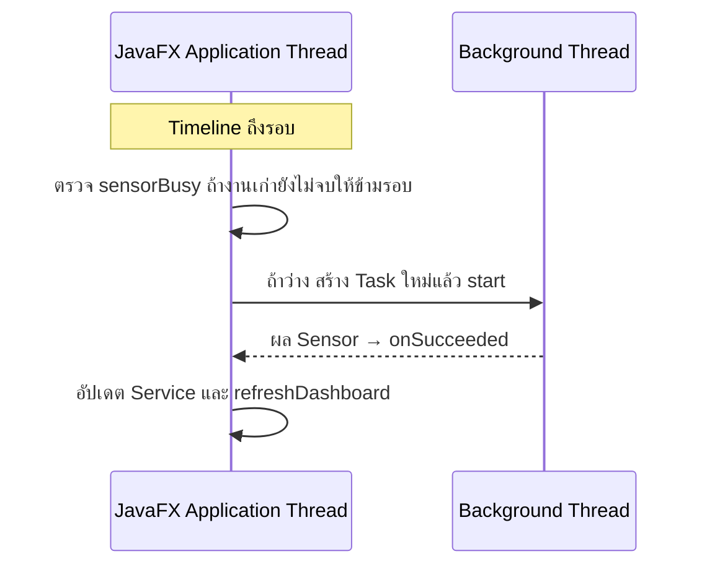

# EP 3.10 ตอนที่ 4 — เริ่มและหยุด Auto Sensor ด้วย Timeline

เป้าหมาย: กดเริ่ม–หยุดการอัปเดต Sensor ทุกประมาณ 2 วินาที และปิดโปรแกรมได้เรียบร้อย

ใช้โปรเจกต์จาก [ตอนที่ 3B](ep10c2-sensor-task-safety.md) ต่อ ปิดโปรแกรมก่อนแก้ ไฟล์อยู่ใน `practice/smart-factory-dashboard/src/main/java/smartfactory/desktop/`

<details>
<summary>ก่อนเริ่ม: ตรวจโค้ดทดลองจาก 3B และดูภาพรวม</summary>

ใน `SensorSimulationTask.call()` ต้องคืน `return results;` แทน `throw` ที่ทดลอง แล้วลบ `Thread.sleep(3000);` และ `throws Exception` หากคืนแล้วให้ข้าม



</details>

## 1. เปิด DashboardApp.java

### 1.1 เตรียมตัวตั้งเวลา

ตรวจ Import ให้มีครบชุดนี้ โดยเก็บ Import เดิมไว้ ไม่เพิ่มซ้ำ:

```java
import javafx.animation.Animation;
import javafx.animation.KeyFrame;
import javafx.animation.Timeline;
import javafx.concurrent.Task;
import javafx.util.Duration;
```

เพิ่ม Field หลัง `private boolean sensorBusy;` ระดับเดียวกัน:

```java
private Timeline sensorTimeline;
private final Button autoSensorButton = new Button("เริ่ม Auto Sensor");
```

ใน `start()` เพิ่มหลัง `stage.show();`:

```java
sensorTimeline = new Timeline(
        new KeyFrame(Duration.seconds(2), event -> simulateInBackground())
);
sensorTimeline.setCycleCount(Timeline.INDEFINITE);
```

`Timeline` ตั้งรอบเรียกงาน, `KeyFrame` กำหนดเวลา, `INDEFINITE` ให้ทำซ้ำจนสั่งหยุด เริ่มเมื่อเรียก `play()`

### 1.2 เพิ่มปุ่มเริ่ม–หยุด

เพิ่ม Method ระหว่าง `simulateInBackground()` กับ `finishSensorTask()` ระดับเดียวกัน ไม่ซ้อนใน Method เดิม:

```java
private void toggleAutoSensor() {
    if (sensorTimeline.getStatus() == Animation.Status.RUNNING) {
        sensorTimeline.stop();
        autoSensorButton.setText("เริ่ม Auto Sensor");
        statusLabel.setText("หยุด Auto Sensor แล้ว");
    } else {
        sensorTimeline.play();
        autoSensorButton.setText("หยุด Auto Sensor");
        statusLabel.setText("เริ่ม Auto Sensor แล้ว");
    }
}
```

ใน `buildMachineForm()` เพิ่มหลัง `actionButtons.getChildren().add(sensorButton);`:

```java
autoSensorButton.setOnAction(event -> toggleAutoSensor());
actionButtons.getChildren().add(autoSensorButton);
```

ปุ่มบอก **สิ่งที่จะทำเมื่อกด** ส่วน Label บอก **สิ่งที่เกิดขึ้นแล้ว**

### 1.3 จัดการงานเมื่อปิดหน้าต่าง

เพิ่ม Field ถัดจาก `autoSensorButton` ระดับเดียวกัน:

```java
private Task<?> activeSensorTask;
```

เก็บ Task ปัจจุบันไว้ขอยกเลิก โดย `<?>` ไม่เจาะจงชนิดผลลัพธ์ ใช้ Import `Task` ด้านบน ไม่ใส่ `<?>` ใน Import

ใน `simulateInBackground()` เพิ่มหลัง `});` ที่ปิด `setOnFailed` ก่อน `Thread worker = ...`:

```java
task.setOnCancelled(event -> finishSensorTask());
activeSensorTask = task;
```

`setOnCancelled` คืนสถานะปุ่มเมื่อยกเลิกสำเร็จ

ใน `finishSensorTask()` เพิ่มหลัง `sensorButton.setDisable(false);`:

```java
activeSensorTask = null; // ล้างการอ้างถึงงานที่จบแล้ว
```

ใน `start()` เพิ่มหลัง `sensorTimeline.setCycleCount(Timeline.INDEFINITE);`:

```java
stage.setOnHidden(event -> {
    sensorTimeline.stop();
    if (activeSensorTask != null) {
        activeSensorTask.cancel();
    }
});
```

`setOnHidden` ทำงานเมื่อหน้าต่างปิดหรือซ่อน: หยุดรอบใหม่ แล้ว `cancel()` เพื่อขอยกเลิกงานที่ค้าง

### 1.4 ตั้ง Worker เป็น Daemon

ใน `simulateInBackground()` เพิ่มหลัง `Thread worker = new Thread(task, "sensor-worker");` ก่อน `worker.start();`:

```java
worker.setDaemon(true);
```

Daemon ไม่รั้งโปรแกรมไว้เมื่อ Thread ที่ไม่ใช่ daemon จบหมดแล้ว ไม่ใช่คำสั่งยกเลิก Task

## 2. เปลี่ยนไป SensorSimulationTask.java

ใน `call()` เพิ่มหลัง `for (String id : machineIds) {` ก่อน `double temperature = ...`:

```java
if (isCancelled()) {
    break;
}
```

`isCancelled()` ตรวจการยกเลิก ถ้าใช่ `break` ออกจาก Loop

<details>
<summary>ทบทวนเพิ่มเติม: Thread และการยกเลิก</summary>

- Timeline เรียก Method บน JavaFX Thread ส่วน Task ทำงานบน Background Thread
- `sensorBusy` จาก 3B ข้ามรอบที่งานเก่ายังไม่จบ
- `cancel()` ขอให้ Task ยกเลิก ไม่ได้บังคับฆ่า Thread จึงเพิ่มการตรวจ `isCancelled()` ใน Loop
- Task ที่ยกเลิกสำเร็จไม่ส่งผลผ่าน `setOnSucceeded` ส่วน `activeSensorTask = null` แค่ล้างการอ้างถึง ไม่ใช่การยกเลิก
- `setOnHidden` ไม่ใช่เหตุการณ์ย่อหน้าต่าง งานจำลองอาจจบก่อนปิด จึงไม่จำเป็นต้องเห็นเหตุการณ์ยกเลิกทุกรอบ

</details>

## 3. รันและตรวจผล

บันทึกทั้งสองไฟล์ รันจากโฟลเดอร์หลักของ Repository:

```powershell
.\mvnw.cmd -f .\practice\smart-factory-dashboard\pom.xml javafx:run
```

1. เปิดโปรแกรม ค่า Sensor ยังไม่เปลี่ยนเอง
2. กด **เริ่ม Auto Sensor** ค่าต้องอัปเดตทุกประมาณ 2 วินาที หน้าจอไม่ค้าง
3. กด **หยุด Auto Sensor** รอรอบที่ค้างจบ ค่าและชั่วโมงต้องหยุดเปลี่ยน
4. กด **จำลอง Sensor 1 ครั้ง** ต้องอัปเดตหนึ่งรอบ แล้วเริ่ม Auto ใหม่ได้
5. ปิดหน้าต่าง โปรแกรมต้องจบและ Terminal กลับมารับคำสั่ง

**หยุด Auto** หยุดเฉพาะรอบใหม่ งานที่เริ่มแล้วอาจอัปเดตได้อีกหนึ่งรอบ

<details>
<summary>ถ้าจะทดสอบบำรุงรักษาด้วย</summary>

หยุด Auto และรอรอบที่ค้างจบก่อนกดบำรุงรักษา ไม่เช่นนั้นผล Sensor อาจเปลี่ยน OFFLINE อีกครั้ง ชั่วโมงเพิ่มต่อรอบจำลอง ไม่ใช่เวลาจริง

</details>

ถัดไป: [EP 3.11 — FXML และ Controller](ep11-fxml-controller.md)
