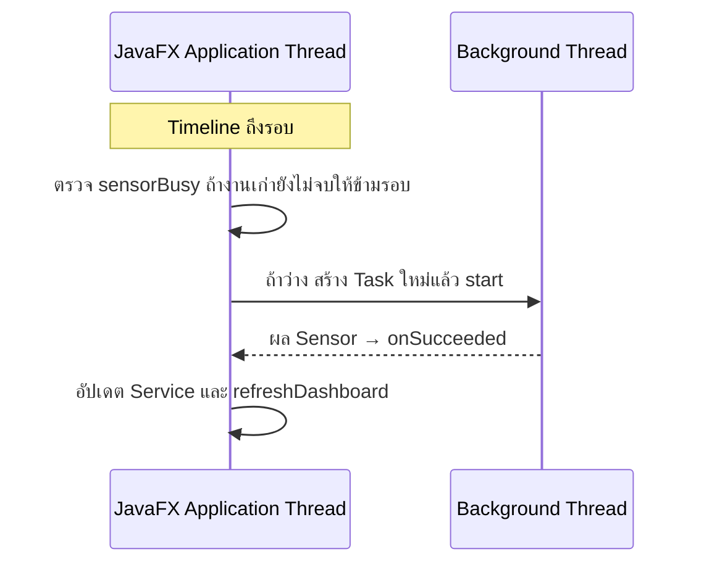

# EP 3.10 ตอนที่ 4 — เริ่มและหยุด Auto Sensor ด้วย Timeline

เป้าหมาย: เรียกงาน Sensor ประมาณทุก 2 วินาที กดเริ่ม–หยุดได้ และจัดการงานเมื่อปิดหน้าต่าง

ใช้โปรเจกต์จาก [ตอนที่ 3B](ep10c2-sensor-task-safety.md) ต่อ ปิดโปรแกรมก่อนแก้ ไฟล์อยู่ใน `practice/smart-factory-dashboard/src/main/java/smartfactory/desktop/`

ก่อนเริ่ม ใน `SensorSimulationTask.call()` คืน `return results;` แทนคำสั่ง `throw` ที่ใช้ทดลอง แล้วลบ `Thread.sleep(3000);` และ `throws Exception` หากคืนโค้ดแล้วให้ข้าม ใช้ Method เดิมจาก 3B ต่อ ไม่สร้างซ้ำ



## 1. เปิด DashboardApp.java

ขั้น 1.1–1.4 แก้ในไฟล์นี้ทั้งหมด โดยเก็บโค้ดจาก 3B ไว้

### 1.1 เตรียมตัวตั้งเวลา

ใช้ Timeline เป็นตัวเรียกงานตามเวลา โดยยังไม่เริ่มอัตโนมัติตอนเปิดโปรแกรม

เพิ่ม Import ต่อจากชุดเดิม หากมีแล้วไม่เพิ่มซ้ำ:

```java
import javafx.animation.Animation;
import javafx.animation.KeyFrame;
import javafx.animation.Timeline;
import javafx.util.Duration;
```

เพิ่ม Field หลัง `private boolean sensorBusy;` ให้อยู่ระดับเดียวกัน นอกทุก Method:

```java
private Timeline sensorTimeline;
private final Button autoSensorButton = new Button("เริ่ม Auto Sensor");
```

ใน `start(Stage stage)` เพิ่มหลัง `stage.show();` ก่อนปีกกาปิด Method:

```java
sensorTimeline = new Timeline(
        new KeyFrame(Duration.seconds(2), event -> simulateInBackground())
);
sensorTimeline.setCycleCount(Timeline.INDEFINITE);
```

`KeyFrame` เรียกงานเมื่อถึง 2 วินาที ส่วน `INDEFINITE` ให้ทำรอบซ้ำ ยังไม่เริ่มจนกว่าจะเรียก `play()` ถ้างานเก่ายังไม่จบ `sensorBusy` จาก 3B จะข้ามรอบนั้น

### 1.2 เพิ่มปุ่มเริ่ม–หยุด

เพิ่ม Method หลังปีกกาปิด `simulateInBackground()` ก่อน `finishSensorTask()` ให้อยู่ระดับเดียวกัน:

```java
private void toggleAutoSensor() {
    if (sensorTimeline.getStatus() == Animation.Status.RUNNING) {
        sensorTimeline.stop();
        autoSensorButton.setText("เริ่ม Auto Sensor");
        statusLabel.setText("หยุด Auto Sensor แล้ว");
    } else {
        sensorTimeline.play();
        autoSensorButton.setText("หยุด Auto Sensor");
        statusLabel.setText("เริ่ม Auto Sensor แล้ว");
    }
}
```

ใน `buildMachineForm()` เพิ่มหลัง `actionButtons.getChildren().add(sensorButton);` เพียงครั้งเดียว:

```java
autoSensorButton.setOnAction(event -> toggleAutoSensor());
actionButtons.getChildren().add(autoSensorButton);
```

ข้อความบนปุ่มบอก **สิ่งที่จะทำเมื่อกดครั้งถัดไป** ส่วน Label บอกสถานะที่เกิดขึ้นแล้ว

Timeline เรียก Method บน JavaFX Thread แต่งาน Sensor ยังทำบน Background Thread การ `stop()` หยุดเฉพาะรอบใหม่ งานที่เริ่มแล้วอาจส่งผลกลับมาอีกหนึ่งรอบ

### 1.3 จัดการงานเมื่อปิดหน้าต่าง

เพิ่ม Field หลังบรรทัดประกาศ `autoSensorButton` นอกทุก Method ใช้ Import `Task` ที่มีอยู่แล้ว:

```java
private Task<?> activeSensorTask;
```

ใน `simulateInBackground()` เพิ่มหลัง `});` ที่ปิด `setOnFailed` ก่อน `Thread worker = ...` ไม่วางไว้ในตัวรับเหตุการณ์เดิม:

```java
task.setOnCancelled(event -> finishSensorTask());
activeSensorTask = task;
```

`activeSensorTask` เก็บการอ้างถึง Task ปัจจุบันไว้ขอยกเลิก โดย `<?>` ไม่เจาะจงชนิดผลลัพธ์ ส่วน `setOnCancelled` เรียกคืนสถานะปุ่มเมื่อยกเลิกสำเร็จ

ใน `finishSensorTask()` เพิ่มหลัง `sensorButton.setDisable(false);` ก่อนปีกกาปิด Method:

```java
activeSensorTask = null;
```

บรรทัดนี้ล้างการอ้างถึงงานที่จบแล้ว ไม่ใช่คำสั่งยกเลิกงาน

ใน `start(Stage stage)` เพิ่มหลัง `sensorTimeline.setCycleCount(Timeline.INDEFINITE);` ก่อนปีกกาปิด Method:

```java
stage.setOnHidden(event -> {
    sensorTimeline.stop();
    if (activeSensorTask != null) {
        activeSensorTask.cancel();
    }
});
```

`setOnHidden` ทำงานหลังหน้าต่างถูกปิดหรือซ่อน ไม่ใช่การย่อหน้าต่าง โดยหยุด Timer ก่อน แล้ว `cancel()` เพื่อขอยกเลิก Task ที่ยังมีอยู่ ไม่ใช่บังคับฆ่า Thread

### 1.4 ตั้ง Worker เป็น Daemon

ใน `simulateInBackground()` เพิ่มหลัง `Thread worker = new Thread(task, "sensor-worker");` ก่อน `worker.start();`:

```java
worker.setDaemon(true);
```

ถ้าเหลือเพียง Thread แบบ daemon โปรแกรม Java สามารถจบได้โดยไม่ต้องรอ Worker นี้ แต่ยังต้องใช้ `cancel()` เพื่อขอให้ Task หยุดงาน

## 2. เปลี่ยนไป SensorSimulationTask.java

ใน `call()` เพิ่มทันทีหลัง `for (String id : machineIds) {` ก่อน `double temperature = ...` เก็บโค้ดสุ่มค่าและ `return results;` ไว้:

```java
if (isCancelled()) {
    break;
}
```

`isCancelled()` ตรวจคำขอยกเลิก ส่วน `break` ออกจาก Loop ไม่ทำเครื่องถัดไป Task ที่ยกเลิกสำเร็จจะไม่ส่งผลผ่าน `setOnSucceeded`

## 3. รันและตรวจผล

บันทึกทั้งสองไฟล์ แล้วรันจากโฟลเดอร์หลักของ Repository:

```powershell
.\mvnw.cmd -f .\practice\smart-factory-dashboard\pom.xml javafx:run
```

1. เปิดโปรแกรม ค่า Sensor ยังไม่เปลี่ยนเอง
2. กด **เริ่ม Auto Sensor** รอประมาณ 2 วินาที ค่าต้องอัปเดตเป็นรอบและหน้าจอยังตอบสนอง
3. กด **หยุด Auto Sensor** รอรอบที่ค้างจบ ค่าและชั่วโมงต้องหยุดเปลี่ยน
4. ขณะหยุด Auto กด **จำลอง Sensor 1 ครั้ง** ต้องอัปเดตหนึ่งรอบ แล้วเริ่ม Auto ใหม่ได้
5. ปิดหน้าต่าง แล้วตรวจว่าโปรแกรมจบและ Terminal กลับมารับคำสั่ง งานจำลองเร็วมาก จึงอาจจบก่อนปิดและไม่เห็นเหตุการณ์ยกเลิก ซึ่งไม่ใช่ข้อผิดพลาด

ก่อนทดสอบบำรุงรักษา ให้หยุด Auto และรอรอบที่ค้างจบ ไม่เช่นนั้นผล Sensor อาจเปลี่ยน OFFLINE อีกครั้ง ชั่วโมงเพิ่มต่อรอบจำลอง ไม่ใช่เวลาจริง

ถัดไป: [EP 3.11 — FXML และ Controller](ep11-fxml-controller.md)
