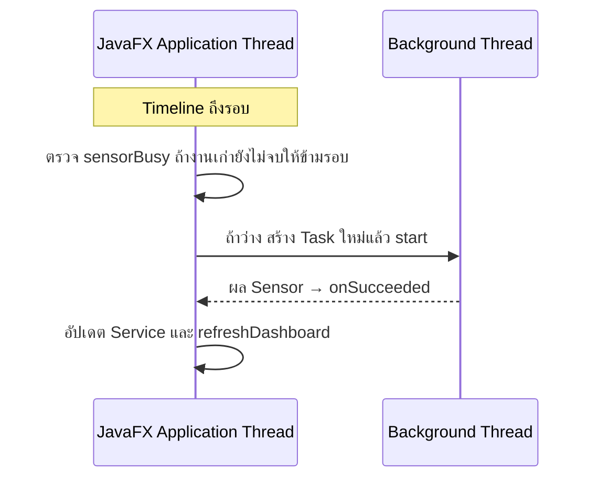

# EP 3.10 ตอนที่ 4 — เริ่มและหยุด Auto Sensor ด้วย Timeline

เป้าหมาย: เรียกงาน Sensor เดิมประมาณทุก 2 วินาที และกดเริ่ม–หยุดได้ โดยไม่สร้างงานซ้อน

ใช้โปรเจกต์จาก [ตอนที่ 3B](ep10c2-sensor-task-safety.md) ต่อ ปิดโปรแกรมก่อนแก้ ไม่ต้องสร้างไฟล์ใหม่

ไฟล์ทั้งสองอยู่ใน `practice/smart-factory-dashboard/src/main/java/smartfactory/desktop/`:

- `DashboardApp.java` — เริ่มที่ไฟล์นี้ เพิ่ม Timeline ปุ่มเริ่ม–หยุด และการจัดการตอนปิดหน้าต่าง
- `SensorSimulationTask.java` — เปลี่ยนมาที่ไฟล์นี้เมื่อหัวข้อ 3 ให้เพิ่มการตรวจยกเลิกใน `call()`

ก่อนเริ่ม ตรวจว่าใน `SensorSimulationTask.call()` คืน `return results;` แล้ว และนำ `Thread.sleep(3000);` กับ `throws Exception` ที่ใช้ทดลองใน 3B ออก จากนั้นเปิด `DashboardApp.java` เพื่อเริ่มหัวข้อ 1 โดยใช้ `sensorBusy`, `simulateInBackground()` และ `finishSensorTask()` ที่มีจาก 3B ต่อ ไม่สร้างซ้ำ



## 1. เตรียมตัวตั้งเวลาใน DashboardApp.java

ใน `DashboardApp.java` เพิ่ม Import ด้านบนไฟล์ ต่อจาก Import เดิม หากมีแล้วไม่เพิ่มซ้ำ:

```java
import javafx.animation.Animation;
import javafx.animation.KeyFrame;
import javafx.animation.Timeline;
import javafx.util.Duration;
```

ใน `DashboardApp.java` เพิ่มสอง Field นี้ทันทีหลัง `private boolean sensorBusy;` ภายใน Class `DashboardApp` ให้อยู่ระดับเดียวกันและนอกทุก Method:

```java
private Timeline sensorTimeline;
private final Button autoSensorButton = new Button("เริ่ม Auto Sensor");
```

ใน `DashboardApp.java` ภายใน `start(Stage stage)` เพิ่มหลัง `stage.show();` ก่อนปีกกาปิด Method ไม่แทนที่โค้ดสร้างหน้าต่างเดิม:

```java
sensorTimeline = new Timeline(
        new KeyFrame(Duration.seconds(2), event -> simulateInBackground())
);
sensorTimeline.setCycleCount(Timeline.INDEFINITE);
```

ตอนนี้ยังไม่เรียก `play()` โปรแกรมจึงรอให้ผู้ใช้กดเริ่มก่อน ส่วน `sensorBusy` ใน Method เดิมป้องกันทั้งงานจากปุ่มและงานจาก Timer ซ้อนกันอยู่แล้ว

## 2. เพิ่มปุ่มเริ่ม–หยุดใน DashboardApp.java

ยังอยู่ใน `DashboardApp.java` เพิ่ม `toggleAutoSensor()` หลังปีกกาปิดของ `simulateInBackground()` และก่อนบรรทัดประกาศ `finishSensorTask()` ให้ทั้งสาม Method อยู่ระดับเดียวกัน ไม่วางซ้อนใน Method เดิม:

```java
private void toggleAutoSensor() {
    if (sensorTimeline.getStatus() == Animation.Status.RUNNING) {
        sensorTimeline.stop();
        autoSensorButton.setText("เริ่ม Auto Sensor");
        statusLabel.setText("หยุด Auto Sensor แล้ว");
    } else {
        sensorTimeline.play();
        autoSensorButton.setText("หยุด Auto Sensor");
        statusLabel.setText("เริ่ม Auto Sensor แล้ว");
    }
}
```

ใน `DashboardApp.java` ภายใน `buildMachineForm()` เพิ่มสองบรรทัดนี้ทันทีหลัง `actionButtons.getChildren().add(sensorButton);` โดยเก็บปุ่มเดิมไว้ และเพิ่ม `autoSensorButton` เพียงครั้งเดียว:

```java
autoSensorButton.setOnAction(event -> toggleAutoSensor());
actionButtons.getChildren().add(autoSensorButton);
```

`Timeline` แค่เรียก Method ตามเวลาบน Thread ของหน้าจอ งาน Sensor ยังทำบน Background Thread ส่วน `stop()` หยุดรอบใหม่ งานที่เริ่มไปแล้วอาจส่งผลกลับมาอีกหนึ่งรอบ

## 3. หยุดงานเมื่อปิดหน้าต่าง

### เก็บ Task ปัจจุบันไว้ขอยกเลิก

ใน `DashboardApp.java` เพิ่ม Field นี้ถัดจากบรรทัดประกาศ `autoSensorButton` ที่เพิ่มในหัวข้อ 1 ให้อยู่ระดับเดียวกันและนอกทุก Method ไม่เพิ่ม Import `Task` ซ้ำ เพราะมีจากตอนที่ 2 แล้ว:

```java
private Task<?> activeSensorTask;
```

ใน `DashboardApp.java` ภายใน `simulateInBackground()` เพิ่มหลัง `});` ที่ปิด `task.setOnFailed(...)` และก่อน `Thread worker = ...` ไม่ใส่ไว้ภายในตัวรับเหตุการณ์ `setOnFailed`:

```java
task.setOnCancelled(event -> finishSensorTask());
activeSensorTask = task;
```

`setOnCancelled` คืนสถานะเมื่อถูกยกเลิก เป็นอีกกรณีแยกจากสำเร็จและล้มเหลว ส่วน `<?>` หมายถึงไม่เจาะจงชนิดผลลัพธ์ของ Task ใน Field นี้

ใน `DashboardApp.java` ภายใน `finishSensorTask()` เพิ่มบรรทัดนี้หลัง `sensorButton.setDisable(false);` ก่อนปีกกาปิด Method โดยเก็บสองบรรทัดเดิมไว้:

```java
activeSensorTask = null;
```

### หยุด Timer และขอยกเลิกงาน

ใน `DashboardApp.java` กลับไปที่ `start(Stage stage)` เพิ่มหลัง `sensorTimeline.setCycleCount(Timeline.INDEFINITE);` ที่เพิ่มในหัวข้อ 1 ก่อนปีกกาปิด Method:

```java
stage.setOnHidden(event -> {
    sensorTimeline.stop();
    if (activeSensorTask != null) {
        activeSensorTask.cancel();
    }
});
```

`stop()` หยุดรอบใหม่ ส่วน `cancel()` ขอยกเลิก Task ที่กำลังทำ ไม่ได้บังคับฆ่า Thread

ตอนนี้สลับไปไฟล์ `SensorSimulationTask.java` ในโฟลเดอร์เดียวกัน ภายใน `call()` เพิ่มโค้ดนี้ทันทีหลังบรรทัด `for (String id : machineIds) {` ก่อน `double temperature = ...` เก็บโค้ดสุ่มค่าและ `return results;` เดิมไว้:

```java
if (isCancelled()) {
    break;
}
```

เมื่อถูกยกเลิกจะไม่เริ่มคำนวณเครื่องถัดไป และ Task ที่ถูกยกเลิกจะไม่ส่งผลผ่าน `setOnSucceeded`

### ไม่ให้ Worker เป็นเหตุให้โปรแกรมอยู่ต่อ

สลับกลับไฟล์ `DashboardApp.java` ภายใน `simulateInBackground()` เพิ่มบรรทัดนี้หลัง `Thread worker = new Thread(task, "sensor-worker");` และก่อน `worker.start();`:

```java
worker.setDaemon(true);
```

ปิดหน้าต่างไม่ได้แปลว่า Thread ทุกตัวจบแล้ว การตั้งเป็น Daemon ทำให้ Worker นี้ไม่รั้ง JVM เมื่อไม่มี Thread แบบ non-daemon เหลืออยู่ แต่ไม่ใช่การยกเลิกงานแทน `cancel()`

## 4. รันและตรวจผล

บันทึก `DashboardApp.java` และ `SensorSimulationTask.java` แล้วเปิด Terminal ที่โฟลเดอร์หลักของ Repository รัน:

```powershell
.\mvnw.cmd -f .\practice\smart-factory-dashboard\pom.xml javafx:run
```

ทดลองตามลำดับ:

- เปิดโปรแกรม ค่า Sensor ยังไม่เปลี่ยนเอง
- กดเริ่ม Auto Sensor รอประมาณ 2 วินาที ค่าจะเริ่มอัปเดตเป็นรอบ หน้าจอยังเลือกแถวและพิมพ์ได้
- กดหยุด แล้วรอให้งานที่เริ่มไปแล้วจบ ค่าและชั่วโมงต้องหยุดเปลี่ยน
- ขณะหยุด Auto กดจำลองหนึ่งครั้ง ยังอัปเดตได้หนึ่งรอบ แล้วกดเริ่ม Auto ใหม่ได้
- ปิดหน้าต่าง โปรแกรมหยุด Timer และขอยกเลิก Task ที่ค้างอยู่

ถ้าจะทดสอบบำรุงรักษา ให้หยุด Auto และรอรอบที่ค้างจบก่อน มิฉะนั้นค่า Sensor รอบใหม่อาจเปลี่ยนสถานะ OFFLINE ทันที ชั่วโมงที่เพิ่มยังเป็นค่าจำลอง ไม่ใช่เวลาจริง

ถัดไป: [EP 3.11 — FXML และ Controller](ep11-fxml-controller.md)
