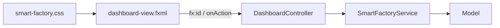

# EP 3.11 — แยก View ด้วย FXML และ Controller

## สิ่งที่จะทำ

ย้ายโครงสร้างหน้าจอออกจาก Java ให้ `FXML` ดูแล View และให้ `DashboardController` ประสาน Event กับ Service



## 1. เพิ่ม FXML Dependency

ใน `practice/smart-factory-dashboard/pom.xml` เพิ่มใต้ `javafx-controls`:

```xml
<dependency>
    <groupId>org.openjfx</groupId>
    <artifactId>javafx-fxml</artifactId>
    <version>${javafx.version}</version>
</dependency>
```

## 2. ใช้ Checkpoint สำหรับเริ่มแยกชั้น

Source ฉบับสมบูรณ์บน Branch หลักมี Search, Filter และ Edit จาก EP หลัง ๆ อยู่แล้ว จึงไม่ควรคัดลอกไฟล์ปัจจุบันมาใช้ตรง ๆ ใน EP นี้ ให้ใช้ Checkpoint เดียวกับ EP 3.9 ซึ่งมีความสามารถถึง Background Task แต่ยังไม่มีเนื้อหา EP 3.13–EP 3.15

รันจากโฟลเดอร์หลักของ Repository:

```powershell
$checkpointArchive = Join-Path $env:TEMP "javafx-ep311-checkpoint.tar"
git archive --format=tar --output=$checkpointArchive 3da3c5d `
    src/main/java/smartfactory/ui `
    src/main/resources/smartfactory/ui
tar -xf $checkpointArchive -C .\practice\smart-factory-dashboard
Remove-Item -LiteralPath $checkpointArchive
```

คำสั่งนี้นำไฟล์จาก Git Commit ที่ระบุเวอร์ชันแน่นอนมาไว้ใน `practice` จึงไม่เขียนทับ Source ฉบับสมบูรณ์ของ Repository และไม่ดึงความสามารถจาก EP ในอนาคตเข้ามาก่อนเวลา

ใน `practice/smart-factory-dashboard/pom.xml` หา `<mainClass>` ภายใน `javafx-maven-plugin` แล้วแทนที่ด้วย:

```xml
<mainClass>smartfactory.ui.DesktopApp</mainClass>
```

ไฟล์สำคัญที่ได้:

- `dashboard-view.fxml` — โครงสร้าง Component, `fx:id` และ Event
- `DashboardController.java` — รับ Event, Validation, Binding และ Refresh
- `DesktopApp.java` — โหลด FXML และสร้าง Stage
- `smart-factory.css` — Theme ของหน้าจอ

## 3. รักษาชื่อ Summary จาก EP 3.8

Checkpoint นี้สร้างก่อนปรับถ้อยคำ Summary จึงยังใช้ชื่อ `runningMachines` และข้อความ `กำลังทำงาน` อยู่ ให้เปลี่ยนชื่อโดยไม่เปลี่ยน Logic ดังนี้:

ใน `DashboardController.java` เปลี่ยนชื่อทุกตำแหน่ง:

```text
runningMachines -> normalMachines
runningValue    -> normalValue
```

ใน `dashboard-view.fxml` เปลี่ยน Card เดิมเป็น:

```xml
<VBox alignment="CENTER" HBox.hgrow="ALWAYS" styleClass="summary-card,card-normal">
    <Label fx:id="normalValue" text="0" styleClass="summary-value"/>
    <Label text="สถานะปกติ" styleClass="summary-label"/>
</VBox>
```

ใน `smart-factory.css` เปลี่ยนชื่อ Style Class แต่เก็บสีเดิม:

```css
.card-normal { -fx-border-color: #20c77a; }
```

หลังเปลี่ยนชื่อ `refreshDashboard()` ยังคงนับ `MachineStatus.RUNNING` เหมือนเดิม จึงรักษาความหมายจาก EP 3.8 และไม่ทำให้ Binding หาย

## 4. ดูจุดเชื่อม FXML กับ Controller

ส่วนนี้ใช้เปิดไฟล์ที่ได้จาก Checkpoint แล้วดูจุดเชื่อม ไม่ต้องคัดลอกโค้ดตัวอย่างไปเพิ่มซ้ำ

ใน FXML:

```xml
<Button text="เพิ่มเครื่องจักร" onAction="#handleAddMachine"/>
<TableView fx:id="machineTable"/>
```

ใน Controller:

```java
@FXML private TableView<Machine> machineTable;

@FXML
private void handleAddMachine() {
    // อ่าน Form -> เรียก Service -> Refresh View
}
```

ชื่อหลัง `#` ต้องตรงกับชื่อ Method และ `fx:id` ต้องตรงกับ Field ที่มี `@FXML`

## 5. ดูการส่ง Service เข้า Controller

`DesktopApp` ใช้ Controller Factory เพื่อไม่ให้ Controller สร้าง Service เอง:

โค้ดนี้มีอยู่ใน `practice/smart-factory-dashboard/src/main/java/smartfactory/ui/DesktopApp.java` จาก Checkpoint แล้ว ให้เปิดดูโดยไม่ต้องเพิ่มซ้ำ:

```java
SmartFactoryService service = SmartFactoryService.createWithSampleData();
loader.setControllerFactory(type -> {
    if (type == DashboardController.class) {
        return new DashboardController(service);
    }
    throw new IllegalArgumentException("Unknown controller: " + type.getName());
});
```

จุดนี้ทำให้ Dependency ชัดและเปลี่ยน Service สำหรับการทดสอบได้ง่ายขึ้น

## 6. ตรวจ Event ที่เปลี่ยนข้อมูล

ทั้งการอัปเดต Sensor และการบำรุงรักษาต้องเรียก `refreshDashboard()` หลัง Service เสมอ:

เปิด `DashboardController.java` แล้วตรวจใน `handleUpdateSensor()` และ `handleMaintenance()` โค้ดต่อไปนี้มีอยู่จาก Checkpoint แล้ว ไม่ต้องเพิ่มซ้ำ:

```java
service.updateSensor(selected.getId(), temperature, vibration);
refreshDashboard();

service.performMaintenance(selected.getId());
refreshDashboard();
```

การ์ด `สถานะปกติ` นับเฉพาะสถานะ `RUNNING` จึงแสดง `2` จาก `M-001` และ `M-003` โดยไม่ได้สื่อว่าเครื่องสถานะ `WARNING` หยุดทำงาน ส่วนการ์ด `Sensor ผิดปกติ` แสดง `1` จาก `M-002` และการ์ด `ต้องบำรุงทั้งหมด` แสดง `2` จาก `M-002` กับ `M-003`

`M-003` แสดงสถานะ `RUNNING` ได้อย่างถูกต้อง เพราะค่า Sensor ปกติ ขณะเดียวกันคอลัมน์บำรุงรักษาแสดง `ต้องบำรุง` เพราะทำงานเกิน 500 ชั่วโมง

## 7. รัน

```powershell
.\mvnw.cmd -f .\practice\smart-factory-dashboard\pom.xml javafx:run
```

ผลที่ต้องเห็น: Dashboard ฉบับเต็มทำงานเหมือนเดิม แต่ View, Controller, Service และ Model แยกหน้าที่กันแล้ว

ทดลองบำรุง `M-002` แล้วอัปเดต Sensor เป็นอุณหภูมิ `65` และแรงสั่น `3` ตัวเลขต้องยังเป็น `1` จากนั้นบำรุง `M-003` และอัปเดต Sensor เป็นค่าปกติ ตัวเลขจึงเปลี่ยนเป็น `0`

## Challenge

หา `fx:id="statusMessage"` ใน FXML และชี้ให้ได้ว่าเชื่อมกับ Field ใดใน Controller

ถัดไป: [EP 3.12 — ภาษาไทย Runtime Image และ IoT](ep12-thai-package-iot.md)
