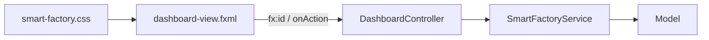

# EP 3.11 — แยก View ด้วย FXML และ Controller

## สิ่งที่จะทำ

ย้ายโครงสร้างหน้าจอออกจาก Java ให้ `FXML` ดูแล View และให้ `DashboardController` ประสาน Event กับ Service



## 1. เพิ่ม FXML Dependency

ใน `practice/smart-factory-dashboard/pom.xml` เพิ่มใต้ `javafx-controls`:

```xml
<dependency>
    <groupId>org.openjfx</groupId>
    <artifactId>javafx-fxml</artifactId>
    <version>${javafx.version}</version>
</dependency>
```

## 2. นำโครงฉบับสมบูรณ์มาแยกชั้น

รันจากโฟลเดอร์หลักของ Repository:

```powershell
$javaTarget = ".\practice\smart-factory-dashboard\src\main\java\smartfactory\ui"
$resourceTarget = ".\practice\smart-factory-dashboard\src\main\resources\smartfactory\ui"
New-Item -ItemType Directory -Force $javaTarget, $resourceTarget
Copy-Item .\src\main\java\smartfactory\ui\*.java $javaTarget -Force
Copy-Item .\src\main\resources\smartfactory\ui\* $resourceTarget -Force
```

เปลี่ยน `mainClass` ใน `pom.xml` เป็น:

```xml
<mainClass>smartfactory.ui.DesktopApp</mainClass>
```

ไฟล์สำคัญที่ได้:

- `dashboard-view.fxml` — โครงสร้าง Component, `fx:id` และ Event
- `DashboardController.java` — รับ Event, Validation, Binding และ Refresh
- `DesktopApp.java` — โหลด FXML และสร้าง Stage
- `smart-factory.css` — Theme ของหน้าจอ

## 3. ดูจุดเชื่อม FXML กับ Controller

ใน FXML:

```xml
<Button text="เพิ่มเครื่องจักร" onAction="#handleAddMachine"/>
<TableView fx:id="machineTable"/>
```

ใน Controller:

```java
@FXML private TableView<Machine> machineTable;

@FXML
private void handleAddMachine() {
    // อ่าน Form -> เรียก Service -> Refresh View
}
```

ชื่อหลัง `#` ต้องตรงกับชื่อ Method และ `fx:id` ต้องตรงกับ Field ที่มี `@FXML`

## 4. ดูการส่ง Service เข้า Controller

`DesktopApp` ใช้ Controller Factory เพื่อไม่ให้ Controller สร้าง Service เอง:

```java
SmartFactoryService service = SmartFactoryService.createWithSampleData();
loader.setControllerFactory(type -> {
    if (type == DashboardController.class) {
        return new DashboardController(service);
    }
    throw new IllegalArgumentException("Unknown controller: " + type.getName());
});
```

จุดนี้ทำให้ Dependency ชัดและเปลี่ยน Service สำหรับการทดสอบได้ง่ายขึ้น

## 5. รัน

```powershell
.\mvnw.cmd -f .\practice\smart-factory-dashboard\pom.xml javafx:run
```

ผลที่ต้องเห็น: Dashboard ฉบับเต็มทำงานเหมือนเดิม แต่ View, Controller, Service และ Model แยกหน้าที่กันแล้ว

## Challenge

หา `fx:id="statusMessage"` ใน FXML และชี้ให้ได้ว่าเชื่อมกับ Field ใดใน Controller

ถัดไป: [EP 3.12 — ภาษาไทย Runtime Image และ IoT](ep12-thai-package-iot.md)
