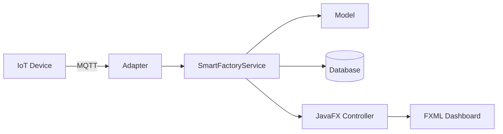

# EP 3.12 — ภาษาไทย Runtime Image และ IoT Roadmap

## สิ่งที่จะทำ

- ตรวจ UTF-8 และ Font ภาษาไทย
- เพิ่ม Java Module สำหรับ FXML
- สร้าง Runtime Image ด้วย `jlink`
- เห็นเส้นทางเชื่อม MQTT, Database และ IoT Device



## 1. ตรวจ UTF-8

จากโฟลเดอร์หลักของ Repository:

```powershell
powershell -ExecutionPolicy Bypass -File .\scripts\check-encoding.ps1
```

ถ้า Source เป็น UTF-8 แต่ตัวอักษรยังเป็นสี่เหลี่ยม ให้ตรวจ Font ด้วย `ThaiUiSupport` ซึ่งเลือก `Leelawadee UI`, `Tahoma` หรือ `Noto Sans Thai` ตามที่เครื่องมี

ไม่ควรแก้ปัญหาด้วยการใส่ `-Dfile.encoding=UTF-8` เพียงอย่างเดียว เพราะ FXML, CSS, Source และ Font ต้องถูกต้องร่วมกัน

## 2. เพิ่ม `module-info.java`

สร้าง `practice/smart-factory-dashboard/src/main/java/module-info.java`:

```java
module smartfactory.dashboard {
    requires javafx.controls;
    requires javafx.fxml;

    exports smartfactory.model;
    exports smartfactory.oop;
    exports smartfactory.service;
    exports smartfactory.ui;
    opens smartfactory.ui to javafx.fxml;
}
```

`opens` อนุญาตให้ `FXMLLoader` เข้าถึง Field และ Method ที่มี `@FXML` ผ่าน Reflection

## 3. ตั้งค่า Runtime Image

เปิด `practice/smart-factory-dashboard/pom.xml` แล้วหา `<configuration>` ภายใน Plugin `javafx-maven-plugin` จากนั้นแทนที่ `<mainClass>` เดิมและเพิ่มค่าที่เหลือไว้ใน `<configuration>` เดียวกัน:

```xml
<mainClass>smartfactory.dashboard/smartfactory.ui.DesktopApp</mainClass>
<launcher>smart-factory</launcher>
<jlinkImageName>smart-factory</jlinkImageName>
<stripDebug>true</stripDebug>
<noHeaderFiles>true</noHeaderFiles>
<noManPages>true</noManPages>
```

สร้าง Runtime Image:

```powershell
.\mvnw.cmd -f .\practice\smart-factory-dashboard\pom.xml clean javafx:jlink
```

รันไฟล์ที่ได้:

```powershell
.\practice\smart-factory-dashboard\target\smart-factory\bin\smart-factory.bat
```

Runtime Image รวม Java Runtime และ Module ที่แอปใช้ เหมาะเป็นฐานก่อนสร้าง Installer ในขั้นต่อยอด

## 4. ขอบเขตต่อยอด IoT

ให้สร้าง Adapter ใหม่สำหรับ MQTT หรือ Database แล้วเรียก `SmartFactoryService` แทนการเขียน Network Code ไว้ใน Controller โดยตรง วิธีนี้รักษา OOP และทำให้เปลี่ยน Broker หรือ Database ได้ง่ายกว่า

## ตรวจงาน EP 3.12

- ภาษาไทยใน Label, Table และ Alert แสดงถูกต้อง
- เพิ่ม ลบ อัปเดต Sensor และบำรุงรักษาได้
- ข้อมูลเริ่มต้นแสดง `Sensor ผิดปกติ = 1` และ `ต้องบำรุงทั้งหมด = 2`
- หยุด Auto Sensor ก่อนตรวจ แล้ว Summary ลดจาก `2 -> 1 -> 0` เมื่อบำรุง `M-002` และ `M-003` ตามลำดับ
- Auto Sensor ทำงานโดยหน้าต่างไม่ค้าง
- `SmartFactoryTest` ใน Checkpoint ของบทนี้ยังเป็น `PASS: 6 tests` ส่วน Test ลำดับที่ 7 จะเพิ่มพร้อมความสามารถแก้ไขเครื่องจักรใน EP 3.15
- Runtime Image เปิดได้บน Windows

ซอร์สฉบับเต็ม: [`src/main/java/smartfactory/ui`](../../src/main/java/smartfactory/ui)

ถัดไป: [EP 3.13 — ค้นหาแบบทันทีด้วย FilteredList](ep13-search-filter.md)

กลับไป: [README ของ Playlist 3](README.md) หรือ [README หลัก](../../README.md)
