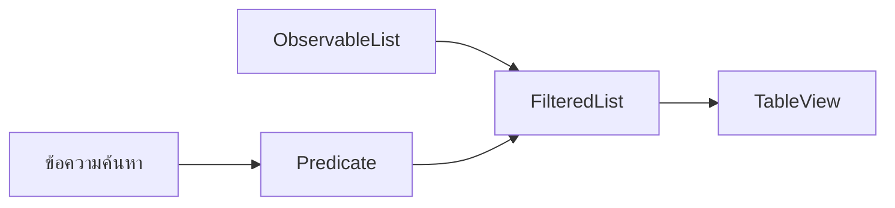

# EP 3.13 — ค้นหาแบบทันทีด้วย FilteredList

## สิ่งที่จะทำ

- เพิ่มช่องค้นหาเหนือ TableView
- ค้นหาจากรหัส ชื่อ หรือตำแหน่ง
- ค้นหาโดยไม่สนใจตัวพิมพ์เล็กและตัวพิมพ์ใหญ่
- แสดงจำนวนรายการที่พบ



EP นี้เพิ่มเฉพาะการค้นหาด้วยข้อความ ส่วนการกรองสถานะและการบำรุงรักษาจะเพิ่มใน EP 3.14

## 1. เพิ่มช่องค้นหาใน FXML

เพิ่ม `HBox` ระหว่างหัวข้อ `ข้อมูลเครื่องจักร` กับ `TableView`:

```xml
<HBox alignment="CENTER_LEFT" spacing="8" styleClass="filter-row">
    <TextField fx:id="searchField" promptText="ค้นหารหัส ชื่อ หรือตำแหน่ง..."
               maxWidth="Infinity" HBox.hgrow="ALWAYS"/>
    <Label fx:id="filterResultLabel" text="แสดง 0 จาก 0 เครื่อง"
           styleClass="filter-result"/>
</HBox>
```

## 2. สร้าง FilteredList

เพิ่ม Import ใน `DashboardController.java`:

```java
import javafx.collections.transformation.FilteredList;
```

ต่อจาก `machineItems` เพิ่ม:

```java
private final FilteredList<Machine> filteredMachines =
        new FilteredList<>(machineItems, machine -> true);
```

`machineItems` ยังเป็นข้อมูลหลัก ส่วน `filteredMachines` เป็นมุมมองที่เลือกเฉพาะรายการซึ่งผ่านเงื่อนไข

เพิ่ม Field ที่เชื่อมกับ FXML:

```java
@FXML private TextField searchField;
@FXML private Label filterResultLabel;
```

## 3. ให้ TableView ใช้รายการที่กรองแล้ว

ใน `initialize()` เปลี่ยนจาก:

```java
machineTable.setItems(machineItems);
```

เป็น:

```java
machineTable.setItems(filteredMachines);
searchField.textProperty().addListener(
        (observable, oldValue, newValue) -> applySearch()
);
```

Listener จะเรียกค้นหาใหม่ทุกครั้งที่ข้อความเปลี่ยน จึงไม่ต้องมีปุ่มค้นหา

## 4. สร้าง Predicate สำหรับค้นหา

เพิ่ม Method ต่อไปนี้ใน Controller:

```java
private void applySearch() {
    String keyword = normalize(searchField.getText());

    filteredMachines.setPredicate(machine ->
            keyword.isBlank()
                    || normalize(machine.getId()).contains(keyword)
                    || normalize(machine.getName()).contains(keyword)
                    || normalize(machine.getLocation()).contains(keyword)
    );

    filterResultLabel.setText(
            "แสดง " + filteredMachines.size() + " จาก " + machineItems.size() + " เครื่อง"
    );
}

private static String normalize(String value) {
    return value == null ? "" : value.trim().toLowerCase(Locale.ROOT);
}
```

`Predicate` คือเงื่อนไขที่คืน `true` หรือ `false` ถ้าคืน `true` รายการนั้นจะแสดงในตาราง

`normalize()` ทำให้ `m-001` และ `M-001` ให้ผลเหมือนกัน และตัดช่องว่างส่วนเกินที่ต้นหรือท้ายข้อความ

## 5. ค้นหาใหม่หลังข้อมูลเปลี่ยน

ใน `refreshDashboard()` เรียก `applySearch()` หลังนำข้อมูลจาก Service มาใส่ในรายการ:

```java
machineItems.setAll(service.getMachines());
applySearch();
machineTable.refresh();
```

Summary Card ยังคงเป็นยอดรวมของเครื่องจักรทั้งหมด ส่วน `filterResultLabel` แสดงจำนวนแถวที่ค้นพบ

## 6. เพิ่ม CSS ของจำนวนผลลัพธ์

เพิ่มใน `smart-factory.css`:

```css
.filter-result {
    -fx-text-fill: #a9bfd8;
    -fx-font-weight: 700;
    -fx-min-width: 135;
    -fx-alignment: CENTER_RIGHT;
}
```

## 7. รันและตรวจผล

```powershell
.\mvnw.cmd -f .\practice\smart-factory-dashboard\pom.xml javafx:run
```

ทดลองค้นหา:

1. `line a` ต้องพบ `M-001` และ `M-002`
2. `utility` ต้องพบ `M-003`
3. `m-002` ต้องพบเครื่องสายพาน
4. `ไม่พบ` ต้องแสดง `0 จาก 3 เครื่อง`
5. ลบข้อความทั้งหมด ต้องกลับมาแสดง `3 จาก 3 เครื่อง`

## Challenge

เพิ่มชื่อสถานะเข้าไปใน Predicate เพื่อให้ค้นหาคำว่า `กำลังทำงาน` ได้

ถัดไป: [EP 3.14 — กรองหลายเงื่อนไขและเรียงข้อมูล](ep14-multi-filter-sort.md)

ย้อนกลับ: [EP 3.12 — ภาษาไทย Runtime Image และ IoT](ep12-thai-package-iot.md)
