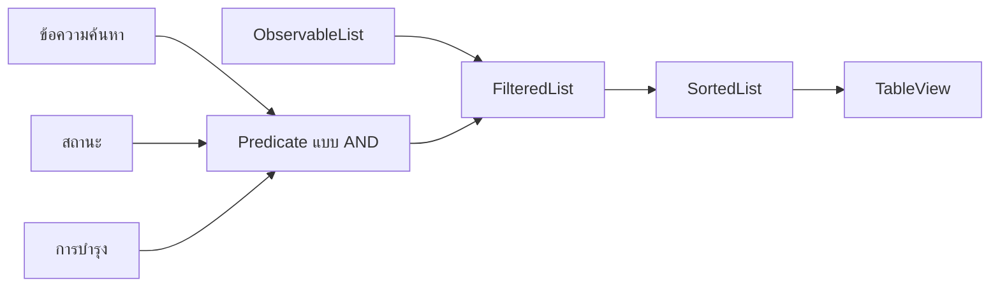

# EP 3.14 — กรองหลายเงื่อนไขและเรียงข้อมูล

## สิ่งที่จะทำ

- กรองตามสถานะของเครื่องจักร
- กรองตามกำหนดบำรุงรักษา
- ใช้ตัวกรองร่วมกับข้อความค้นหา
- ล้างทุกเงื่อนไขด้วยปุ่มเดียว
- เรียงผลลัพธ์ด้วยการกดหัวตาราง



## 1. เพิ่ม ComboBox และปุ่มล้าง

เพิ่ม Import ด้านบน `dashboard-view.fxml`:

```xml
<?import javafx.scene.control.ComboBox?>
```

ใน `filter-row` ของ EP 3.13 เพิ่ม Component ต่อจากช่องค้นหาและก่อน `filterResultLabel`:

```xml
<ComboBox fx:id="statusFilter" promptText="ทุกสถานะ" prefWidth="180"/>
<ComboBox fx:id="maintenanceFilter" promptText="ทุกเงื่อนไขบำรุงรักษา" prefWidth="210"/>
<Button text="ล้างตัวกรอง" onAction="#handleClearFilters"/>
```

## 2. เตรียมค่าของตัวกรอง

เพิ่ม Import ใน `DashboardController.java`:

```java
import javafx.collections.transformation.SortedList;
import javafx.scene.control.ComboBox;
```

เพิ่ม Constant ใต้บรรทัดประกาศ Class:

```java
private static final String ALL_STATUSES = "ทุกสถานะ";
private static final String ALL_MAINTENANCE = "ทุกเงื่อนไขบำรุงรักษา";
private static final String MAINTENANCE_REQUIRED = "ต้องบำรุง";
private static final String MAINTENANCE_NORMAL = "ปกติ";
```

เพิ่ม Field:

```java
private final SortedList<Machine> sortedMachines =
        new SortedList<>(filteredMachines);

@FXML private ComboBox<String> statusFilter;
@FXML private ComboBox<String> maintenanceFilter;
```

## 3. ตั้งค่าตัวเลือกและ Listener

เพิ่ม Method:

```java
private void configureFilters() {
    statusFilter.getItems().add(ALL_STATUSES);
    for (MachineStatus status : MachineStatus.values()) {
        statusFilter.getItems().add(status.getDisplayName());
    }
    statusFilter.setValue(ALL_STATUSES);

    maintenanceFilter.getItems().setAll(
            ALL_MAINTENANCE,
            MAINTENANCE_REQUIRED,
            MAINTENANCE_NORMAL
    );
    maintenanceFilter.setValue(ALL_MAINTENANCE);

    searchField.textProperty().addListener((observable, oldValue, newValue) -> applyFilters());
    statusFilter.valueProperty().addListener((observable, oldValue, newValue) -> applyFilters());
    maintenanceFilter.valueProperty().addListener((observable, oldValue, newValue) -> applyFilters());
}
```

ใน `initialize()` เรียก Method นี้ และเปลี่ยนให้ TableView ใช้ `sortedMachines`:

```java
configureTable();
configureFilters();
bindSummaryCards();

sortedMachines.comparatorProperty().bind(machineTable.comparatorProperty());
machineTable.setItems(sortedMachines);
```

ลบ Listener ของ `applySearch()` จาก EP 3.13 เพราะ `configureFilters()` สร้าง Listener ชุดใหม่ให้แล้ว

## 4. รวมเงื่อนไขใน Predicate เดียว

เปลี่ยน `applySearch()` เป็น `applyFilters()`:

```java
private void applyFilters() {
    String keyword = normalize(searchField.getText());
    String selectedStatus = statusFilter.getValue();
    String selectedMaintenance = maintenanceFilter.getValue();

    filteredMachines.setPredicate(machine -> {
        boolean matchesKeyword = keyword.isBlank()
                || normalize(machine.getId()).contains(keyword)
                || normalize(machine.getName()).contains(keyword)
                || normalize(machine.getLocation()).contains(keyword);
        boolean matchesStatus = selectedStatus == null
                || ALL_STATUSES.equals(selectedStatus)
                || machine.getStatus().getDisplayName().equals(selectedStatus);
        boolean matchesMaintenance = switch (selectedMaintenance == null
                ? ALL_MAINTENANCE
                : selectedMaintenance) {
            case MAINTENANCE_REQUIRED -> machine.requiresMaintenance();
            case MAINTENANCE_NORMAL -> !machine.requiresMaintenance();
            default -> true;
        };
        return matchesKeyword && matchesStatus && matchesMaintenance;
    });

    filterResultLabel.setText(
            "แสดง " + filteredMachines.size() + " จาก " + machineItems.size() + " เครื่อง"
    );
}
```

เงื่อนไขใช้ `&&` จึงทำงานแบบ `AND` เครื่องจักรต้องผ่านทุกเงื่อนไขที่เลือกจึงจะแสดงในตาราง

การกรองบำรุงรักษาเรียก `requiresMaintenance()` จาก Model โดยตรง จึงไม่ต้องเขียนกฎ 500 ชั่วโมงซ้ำใน Controller

ใน `refreshDashboard()` เปลี่ยน `applySearch()` เป็น:

```java
applyFilters();
```

## 5. เพิ่ม Event ล้างตัวกรอง

```java
@FXML
private void handleClearFilters() {
    searchField.clear();
    statusFilter.setValue(ALL_STATUSES);
    maintenanceFilter.setValue(ALL_MAINTENANCE);
    applyFilters();
    showStatus("ล้างการค้นหาและตัวกรองแล้ว");
}
```

## 6. เพิ่ม CSS ให้ ComboBox

```css
.combo-box {
    -fx-background-color: #f7fbff;
    -fx-background-radius: 6;
}

.combo-box .list-cell {
    -fx-background-color: #f7fbff;
    -fx-text-fill: #102033;
}

.combo-box-popup .list-cell:hover,
.combo-box-popup .list-cell:selected {
    -fx-background-color: #dbeafe;
}
```

## 7. รันและตรวจผล

```powershell
.\mvnw.cmd -f .\practice\smart-factory-dashboard\pom.xml javafx:run
```

ทดลองตามลำดับ:

1. เลือกสถานะ `Sensor ผิดปกติ` ต้องเหลือ `M-002`
2. ล้างตัวกรอง แล้วเลือก `ต้องบำรุง` ต้องพบ `M-002` และ `M-003`
3. ค้นหา `utility` ร่วมกับ `ต้องบำรุง` ต้องเหลือ `M-003`
4. เลือก `ปกติ` ในตัวกรองบำรุงรักษา ต้องเหลือ `M-001`
5. กดหัวคอลัมน์รหัสหรือชั่วโมงเพื่อเรียงข้อมูล
6. กด `ล้างตัวกรอง` ต้องกลับมาแสดง `3 จาก 3 เครื่อง`

Summary Card ยังคงนับเครื่องจักรทั้งหมด ส่วนข้อความ `แสดง x จาก y เครื่อง` เป็นจำนวนผลลัพธ์ในตาราง

## Challenge

เพิ่มตัวเลือก `ชั่วโมงตั้งแต่ 500` โดยตรวจจาก `getOperatingHours()` แยกจากกฎ `requiresMaintenance()` แล้วอธิบายว่าตัวกรองสองแบบให้ผลต่างกันเมื่อ Sensor ผิดปกติแต่ชั่วโมงยังไม่ถึง 500

ย้อนกลับ: [EP 3.13 — ค้นหาแบบทันทีด้วย FilteredList](ep13-search-filter.md)

กลับไป: [README ของ Playlist 3](README.md)
