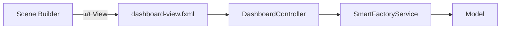

# EP 3.16 Optional — Scene Builder Workflow

## เป้าหมายของ Mini Lab

ใช้ Scene Builder ปรับ Layout ของ Form เพิ่มและแก้ไขเครื่องจักร โดยไม่เปลี่ยน Model, Service หรือ Business Logic



Scene Builder เป็นเครื่องมือเสริมสำหรับออกแบบ FXML แบบลากวาง แอปยัง Build และ Run ได้โดยไม่ต้องติดตั้งเครื่องมือนี้

## 1. ติดตั้ง Scene Builder

ดาวน์โหลดจากเว็บไซต์ทางการ:

- [Gluon Scene Builder](https://gluonhq.com/products/scene-builder/)

เลือกตัวติดตั้งให้ตรงกับ Windows, macOS หรือ Linux ที่ใช้งาน แล้วเปิดโปรแกรมหลังติดตั้งเสร็จ

## 2. เปิดไฟล์ FXML

ใน Scene Builder เลือก `Open` แล้วเปิด:

```text
practice/smart-factory-dashboard/
└─ src/main/resources/smartfactory/ui/dashboard-view.fxml
```

หน้าจอหลักที่ใช้ใน Lab:

| ส่วน | ใช้ทำอะไร |
|---|---|
| Library | เลือก Control และ Layout Pane |
| Hierarchy | ดูโครงสร้าง Parent–Child ของ Scene Graph |
| Content | ลาก วาง และจัดตำแหน่ง Component |
| Inspector | แก้ Properties, Layout และ Code |

## 3. หา Form จาก Hierarchy

เปิดตามลำดับ:

```text
BorderPane
└─ bottom
   └─ VBox
      └─ GridPane
         ├─ idField
         ├─ nameField
         ├─ locationField
         └─ HBox
            ├─ addMachineButton
            ├─ editMachineButton
            └─ cancelEditButton
```

การเลือกผ่าน Hierarchy แม่นยำกว่าคลิกบน Canvas เมื่อ Component อยู่ชิดกัน

## 4. ปรับ Layout แบบ Drag & Drop

ทดลองปรับค่าต่อไปนี้ใน Inspector:

- `GridPane` กำหนด `HGap = 10` และ `VGap = 8`
- Column ของรหัสใช้ประมาณ 18%
- Column ชื่อและตำแหน่งใช้ประมาณ 26% ต่อช่อง
- Column ปุ่มจัดการใช้ประมาณ 30%
- `HBox` ของปุ่มกำหนด `Spacing = 6`
- ปุ่มทั้งสามกำหนด `Max Width = Infinity`
- กำหนด `HBox.hgrow = ALWAYS` ให้ปุ่มขยายเท่ากัน

ใช้ Preview ตรวจว่าข้อความ `บันทึกแก้ไข` ไม่ถูกตัดเมื่อหน้าต่างมีขนาดเริ่มต้น

## 5. ตรวจ fx:id และ onAction

เลือก Component แล้วเปิดส่วน `Code` ใน Inspector ตรวจค่าเหล่านี้:

| Component | fx:id | onAction |
|---|---|---|
| ช่องรหัส | `idField` | — |
| ช่องชื่อ | `nameField` | — |
| ช่องตำแหน่ง | `locationField` | — |
| ปุ่มเพิ่ม | `addMachineButton` | `#handleAddMachine` |
| ปุ่มบันทึก | `editMachineButton` | `#handleUpdateMachine` |
| ปุ่มยกเลิก | `cancelEditButton` | `#handleCancelEdit` |

ชื่อเหล่านี้ต้องตรงกับ Field และ Method ใน `DashboardController` ทุกตัว

## 6. Preview CSS และภาษาไทย

เปิด Preview แล้วตรวจ:

- Theme สีเข้มยังแสดงครบ
- ปุ่มบันทึกเป็นสีเขียวจาก `.button-success`
- ข้อความภาษาไทยไม่เป็นสี่เหลี่ยมหรือเครื่องหมายคำถาม
- Form ด้านล่างไม่ชิดด้านใดด้านหนึ่ง

ถ้า Preview ไม่แสดง Theme ให้เลือก `smart-factory.css` ผ่านตัวเลือก Style Sheet สำหรับ Preview ไม่ต้องเพิ่ม CSS ซ้ำใน FXML หาก `DesktopApp` โหลดไฟล์นี้อยู่แล้ว

## 7. บันทึกและอ่าน FXML ที่ได้

กด Save แล้วเปิด `dashboard-view.fxml` ใน Editor ตรวจสามจุด:

1. `fx:id` ยังครบ
2. `onAction` ยังขึ้นต้นด้วย `#`
3. Scene Builder แก้เฉพาะ View และไม่ได้เพิ่ม Business Logic ลงใน FXML

การอ่าน Diff หรือ FXML หลังบันทึกช่วยให้ยังควบคุม Source Code ได้ แม้จะออกแบบหน้าจอด้วยเครื่องมือ Visual

## 8. รันผลลัพธ์

```powershell
.\mvnw.cmd -f .\practice\smart-factory-dashboard\pom.xml javafx:run
```

ทดสอบทั้งสองโหมด:

1. ไม่เลือกแถว ต้องใช้ปุ่ม `เพิ่ม` ได้
2. เลือก `M-002` ปุ่ม `เพิ่ม` ต้องปิดใช้งาน
3. เปลี่ยนชื่อเป็น `สายพานลำเลียง` แล้วบันทึกได้
4. เลือกอีกครั้งแล้วกด `ยกเลิก` ได้
5. Search, Filter, Sensor และ Maintenance ยังทำงานเหมือนเดิม

## Challenge

ใช้ Scene Builder จัดปุ่มเป็นสองแถวสำหรับหน้าต่างที่แคบลง โดยห้ามเปลี่ยนชื่อ `fx:id` และ `onAction`

ย้อนกลับ: [EP 3.15 — แก้ไขข้อมูลเครื่องจักรและ Complete CRUD](ep15-edit-machine-crud.md)

กลับไป: [README ของ Playlist 3](README.md)
